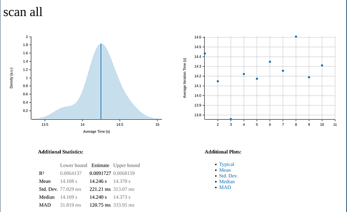

{{ page.date | date_to_string }}

## Abstract

The initial synchronization of a wallet with the Zcash blockchain is one of the most often mentioned issues with light clients.

In some cases, users have to wait for several minutes or even hours before the application is entirely up to date.

It is a strong deterrent for many users.

We introduce a new method of synchronization that leverages parallel execution and several properties of the note commitment tree. The result is an initial synchronization time of a few seconds.

Our synchronization method does not incrementally update the wallet state block per block. Instead, it directly computes the state at the current block height. Therefore it reduces the amount of calculation immensely.

## Intro

For light wallets, the initial sync time is a big issue. Depending on how many notes a shielded wallet has, it can take several minutes to hours to completely scan the blockchain. 

Today, I'd like to introduce a technique that can scan from sapling activation height in **less than 15 seconds** (on a desktop machine) even for big wallets.

Besides the speed benefits, warp sync creates the same outputs as normal sync (byte for byte). It allows you to mix different strategies: warp to recent block then incrementally sync the remaining ones. 
Or, Warp sync for the initial sync then incrementally sync afterward.

Roughly speaking, it calculates the final state (at the current height) without applying every block one by one. Most of the processing is also done in parallel.

Example of a run:

```text
[2021-06-19T02:22:34Z INFO  sync::scan] Download chain: 5751 ms
[2021-06-19T02:22:40Z INFO  sync::scan] Decrypt Notes: 5983 ms
[2021-06-19T02:22:40Z INFO  sync::chain] Build CMU list: 53 ms - 675844 nodes
[2021-06-19T02:22:43Z INFO  sync::chain] Tree State & Witnesses: 2234 ms
[2021-06-19T02:22:43Z INFO  sync::scan] # Witnesses 9
[2021-06-19T02:22:43Z INFO  sync::scan] Total: 14024 ms
```

- Downloading the compact blocks from lightwalletd took 5751 ms. It's from a server that runs locally. Network speed matters a lot here.
- Looking for our notes took 5983 ms. It has to trial decrypt every output using our IVK and it is performed in parallel across all CPUs. 
- It built the list of note commitments, i.e. the leaves of the commitment tree. It took 53 ms. The tree has 675844 nodes, i.e. that's the total number of spend outputs since activation.
- It calculated the current tree state and the witness for each of our received notes in 2234 ms. This is where the massive gains come from. This step could have taken hours. We will describe how Warp Sync performs this step differently.

At this point, we are completely synced. There is no additional data or computation done in the background. The wallet is ready.

Here's a chart of running time with 10 runs. It looks pretty consistent.



As mentioned earlier, the most time-consuming step is the maintenance of the tree state and the witness data. That's required if you want to spend. 

## Commitment Tree

The commitment tree contains all the output note commitments (basically a hash value). There are 675844 of them and they are 32 bytes long. They form the leaves. Then you hash two of them at a time to build the 2nd layer. And repeat until there is a single value, the root.

Here's a nice explanation: 
https://en.wikipedia.org/wiki/Merkle_tree

**Hash calculations in zcash are relatively expensive** because it uses Pedersen Hash that involves elliptic curve computation.

Our goal is to do the minimum number of hash calculations possible.

The commitment tree is incremental and new nodes are always appended to the end. Nodes are never removed or updated. As such, the insertion of a new note requires *one hash calculation*. 

> A tree of N nodes can be built with about N hash calculations.

That's very good and it's hard to do better than that. 

`librustzcash` has an object called `CommitmentTree` which supports appending a node in about constant time. It is used to compute the tree state at the end of each block. 

## Witness Data

Our notes are in the tree as well and we know where they are. When we spend a note, we have to use the Merkle path of the note to build the transaction. The path of a given note remains the same (since a note never moves) but the values of the nodes that the path goes through, can change. For example, the value of the root node will always change. The process of updating the path values is called "updating the incremental witness". `librustzcash` has a class `IncrementalWitness` which keeps care of it.

In the end, we have a `CommitmentTree` and a bunch of `IncrementalWitness` (one per note we received). On seeing a new transaction output, i.e. a new note, we use `.append` on `CommitmentTree` and `IncrementalWitness` and they update. 

In itself, adding a note is fast. But when we have to do ~675k hashes multiplied by the number of notes we received it becomes very slow. The more notes we receive, the worse it gets.

(You could avoid updating witnesses if you know that the note has been spent but the scalability issue remains.)

## Warp Sync

From a very high level, Warp Sync uses the fact that the Incremental Witnesses are paths of the same tree. When we build the tree state and combine nodes to form each level, we can simultaneously update the Commitment Tree state and all the Witnesses without computing any hashes for the Witnesses. The algorithm reuses the work done when the Merkle Tree is built and is interleaved with its creation. 

The name "Warp Sync" comes from the idea that we don't travel through the path made by each modification to the Tree but we "warp" to the final state. It takes longer than a single incremental change but is much faster than applying them cumulatively.

> Also, the number of witnesses has little impact on the run time. 

Having 1 000 witnesses only increased the run time by less than 1 sec. In traditional sync, the runtime would be x1000.

Lastly, another optimization comes from the calculation of the Merkle tree. It combines two nodes independently from other nodes and therefore is a prime candidate for parallelization.

# Conclusion

This was an interesting investigation and I'm glad that we could find a method that speeds up the synchronization of a large number of blocks especially when the workflow is straightforward.
Warp Sync doesn't need advanced multitasking. I use `rayon` to do parallel iteration. That's all, no locks, no spawning tasks, workers, etc. The big gain comes from the algorithm itself.

## More Info

- [Merkle Tree](./merkle.md)
- Commitment Tree
- Witness Data
