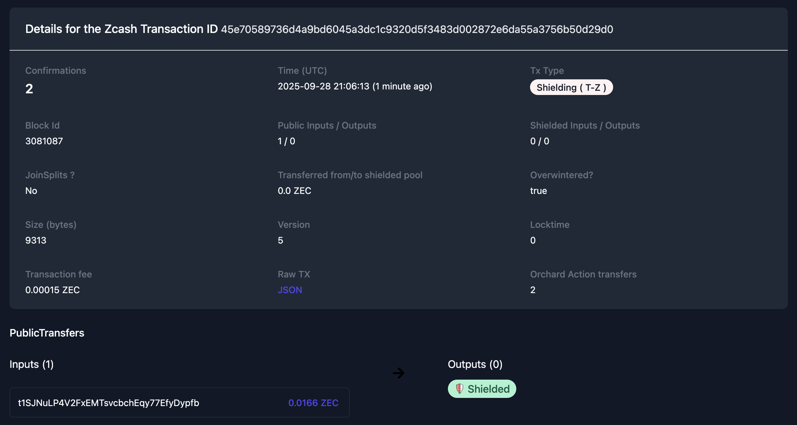

# A Step-by-Step Demonstration of Capabilities 

**⚠️ IMPORTANT DISCLAIMER ⚠️**
This project was created for the [**2025 ZecHub Hackathon**](https://hackathon.zechub.wiki/) and is intended **ONLY** for educational purposes, blockchain functionality testing, and hackathon demonstration.

## Screenshots of the Home Page 


## Making An Account

Let's make a new user!


Success! 


But do they have a wallet with valid addresses? 


Are those addresses real? 

T-Address:

```bash
curl --user rpcuser:password --data-binary '{"jsonrpc": "1.0", "id":"curltest", "method": "z_validateaddress", "params": ["t1SJNuLP4V2FxEMTsvcbchEqy77EfyDypfb"] }' -H 'content-type: text/plain;' http://84.32.151.95:8232/
```

Results:

```bash
{"result":{"isvalid":true,"address":"t1SJNuLP4V2FxEMTsvcbchEqy77EfyDypfb","address_type":"p2pkh","ismine":true},"error":null,"id":"curltest"}
```

Unified Address:

```bash
curl --user rpcuser:password --data-binary '{"jsonrpc": "1.0", "id":"curltest", "method": "z_validateaddress", "params": ["u1yvde4d53qp5wnhm843nxj3ayu8ev8l3fmna8yqkzk9weczw3q2fucf8yrtugqtdacjrjvvracszcy0ggesc7jrtklecv3rjeqtsjh453eqte8s486zksg3k5m44g03mdwqnlra8cexyh0xky5xw4x9yj065rvwan4zd64cjn622nthl90halsttvd7d09k7n8pfcjue356rhuzvglea"] }' -H 'content-type: text/plain;' http://84.32.151.95:8232/
```

Results:

```bash
{"result":{"isvalid":true,"address":"u1yvde4d53qp5wnhm843nxj3ayu8ev8l3fmna8yqkzk9weczw3q2fucf8yrtugqtdacjrjvvracszcy0ggesc7jrtklecv3rjeqtsjh453eqte8s486zksg3k5m44g03mdwqnlra8cexyh0xky5xw4x9yj065rvwan4zd64cjn622nthl90halsttvd7d09k7n8pfcjue356rhuzvglea","address_type":"unified"},"error":null,"id":"curltest"}
```
Success, a user with an account with real addresses. 

## Adding ZEC to the account 
Let's add some ZEC to test2. From my personal Zashi account, let's send to test2. 

> **Transaction hash:** 425fdebbe283a5231fa422354cdafae316f5ee3bed926d4619cb5af11f6cb60e


But did we get it back in Banana Betting test2 account?

```bash
curl --user rpcuser:password --data-binary '{"jsonrpc": "1.0", "id":"curltest", "method": "getaddressbalance", "params": [{"addresses": ["t1SJNuLP4V2FxEMTsvcbchEqy77EfyDypfb"]}] }' -H 'content-type: text/plain;' http://84.32.151.95:8232/
```

Results: 

```
{"result":{"balance":10000,"received":10000},"error":null,"id":"curltest"}
```
Yes, we see a new balance in test2's account on the blockchain. But does Banana betting see it? 


Turns out I need more than 0.0001 to play with...adding 0.0166 ZEC or ~$1. 

> Transaction Hash: 56eb59f3f6f01e6d052ebef871234bc06d556c2c7555b728a4b4fd40744788e7

## Shielding Transparent Funds 
Just like Zashi, we need the ability to shield our t-address unshielded funds. Since the shielded fund is a common pool for this multi-user custodial accounting system, we want all funds here to process bets in and out of. 


We see that the first 0.0001 transaction I made was public (so I could confirm it all worked). Let's shield that. 


Let's check that OPID into a transaction hash. 
> OPID: opid-4bc8e0c7-a315-4364-9a9e-b0b3ed140cb2


And now to check on ZEC block explorer, although we won't see much. 

> Transaction hash: 0b1cf9e8d4536c68c52246e334504c296c5658bb07a45674cb9eb292d45dc909


Yay, we have fully shielded funds with a backend bookkeeping system. (Yes I know it's not full defi, this is a hackathon and custodial wallets make this easier.)

## Submitting a Charity
Let's submit a new charity as well as its zcash addresses. We ask for both transparent and shielded addresses so that if people want to make donations in either one that is an option. All betting distributions will be made to the transparent address. We do not create custodial accounts for the non-profits, they get the distributions automatically.


Here is our new charity listing, as well as a place to find other charities that accept cryptocurrency.


## Making a Betting Event

Take a look at the form for making a new betting event.


## Placing Bets
If a user tries to make a bet but they don't have enough in their wallet to cover their bets:


If they have enough ZEC in their account to cover the bet: 


Now the bet is recorded in the database, since all funds are in the shielded pool to start, this bet doesn't require a blockchain transaction. We just see it in the updated wallet balance.


Great, we have made a private bet (not on the blockchain) on the outcome of the event with the amount deduced from the bettor's account and added to the pool address.

## Validating the Outcome of Other Events 
Let's vote on the outcome of an event that we didn't bet in. 


Then we can see results of other validators. 


## [Admin] Payouts

Now that the event is settled, and the consensus reached it's time to payout the winners. In a real system, this would be automated. In this hackathon system, I have to push the buttons. The event is processed in a single, z_sendmany transaction.

(Yes, you can see some mock addresses for my fake validators. It's not a problem.)


Success! We paid out the betting event. 


Going from OPID to transaction hash:

>Transaction hash ID::b51575a20aba5ac028aef1869d8a1143e84fcb311bdc03afe9071d2c320cd4fd


Checking "The House"'s Zashi account: 


Since I'm friends with [Tech learning Collective](https://techlearningcollective.com/) I asked them to check their wallet, and send over a screenshot. Grainy, but here it is. No banana for scale. 


Wait a minute...why are there only 2 blockchain transactions (1 private, 1 public) if we really have 7? Since this is a custodial situation, the Event Creator and Validators get the money deposited into their Banana Betting accounts. This is an internal database update, and not a blockchain transaction. They would need to cash out their balance from Banana Betting's wallet to their own self-custody wallet. 

## Cashing out Balances


**Private Operation ID**::opid-11e9f74d-0b54-4911-8598-fe5dcf34e495

>**Private Transaction Hash** :: 45e70589736d4a9bd6045a3dc1c9320d5f3483d002872e6da55a3756b50d29d0



But where did my funds go? I had 0.0167 in transparent ZEC and then sent 0.00001 to a shielded address. Where did the change go? Of course, it returned to the shielded pool.

```bash
curl --user rpcuser:password --data-binary '{"jsonrpc": "1.0", "id":"curltest", "method": "z_gettotalbalance", "params": [5] }' -H 'content-type: text/plain;' http://84.32.151.95:8232/
```
Results:
```
{"result":{"transparent":"0.0001","private":"0.01644","total":"0.01654"},"error":null,"id":"curltest"}
```

