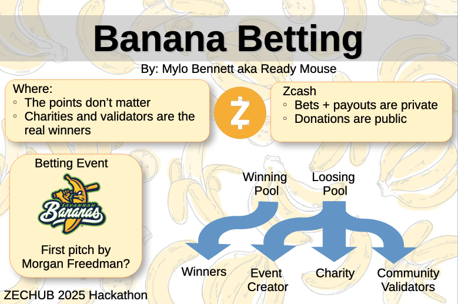
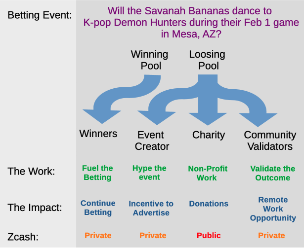

# 🍌 BananaBetting - Hackathon Sports Betting App for Charity

Inspired by the Savannah Bananas and Banana-ball, the dancing alternative to baseball. BananaBetting is a fun, Zcash-powered sports betting platform, all to benefit charities. Sports betting for the rest of us. Find Screenshots and Demonstrations at [DEMO.md](DEMO.md)

Ready Mouse zcash address: u18k2wk6dk9qarekd03v8qgy29qhxp9jag6mmkvvspwrszp0sd48mv043nsfha8vx763432x2gymnu7pvzku6n6ptve5tlvfa7wgq9vf6vzwkt7q3wweju3th2y3ldkjxdst78hlww38en64zljse55gz37s2dkxxqn8p0q3xxf5jj9rqk

Github Project: [BananaBetting](https://github.com/ReadyMouse/BananaBetting)

**⚠️ IMPORTANT DISCLAIMER ⚠️**

This project was created for the [**2025 ZecHub Hackathon**](https://hackathon.zechub.wiki/) and is intended **ONLY** for educational purposes, blockchain functionality testing, and hackathon demonstration.

## 🎯 Project Overview

**BananaBetting** transforms traditional fundraising and charity donations into an interactive, sports betting experience while also providing remote work opportunities for community validators:



- **Charities** -> Join our database of crypto-accepting 501(c)(3) Non-profits
- **Organizations + Influencers** -> Create events to bet on
- **Betters** -> Bet on the outcome of fun events 
- **Validators** -> Manually determine the outcome of events 
- **BananaBetting** -> Resolves all transactions, pays out Charities, event creators, and validators 

## Transparent + Shielded Transactions
- **Private transaction** -> to pay the individual validators and event creators
- **Public transaction** -> to pay the charities with a clear paper trail 

## 🚀 Core Features
- **Charity Betting**: A pari-mutuel betting system for charity and remote work opportunities
- **User Authentication**: Secure JWT-based authentication system
- **Zcash Integration**: Direct integration with Zcash node via RPC
- **Transaction Management**: Send Zcash public + private transactions with validation
- **Wallet Operations**: Check balances, validate addresses, manage accounts
- **RESTful API**: Clean, documented API endpoints
- **Security**: Password hashing, token-based authentication



## 🛠️ Prerequisites

- **Python 3.8+**
- **Zcash Node**: Running Zcash daemon with RPC enabled (zcashd)
- **Git**

## 🚀 Quick Start

### 0. Have a Zcash Node Running
This functional demonstration used zcashd for server operations. 
- [General docs for running nodes](https://github.com/zecrocks/zcash-stack)
- [Example zcashd docker compose file](https://github.com/fabacab/zcash-stack/blob/35b14dc847f5af8c889ad257c1749efcf123fde2/docker/compose.zcashd.yaml) 
- [Pending PR to zcash-stack](https://github.com/fabacab/zcash-stack/commit/35b14dc847f5af8c889ad257c1749efcf123fde2)

Ensure your `zcashd` node is configured with JSON RPC access, including `disable-wallet=0` and synchronized before using the transaction features. This may require turning on `--exportdir` to save out the recovery keys of the wallet features in the node. This can be turned off once the keys have been saved, and the acknowledgement of the keys is complete. 

Note: Lightwallets (lightwalletd, zebrad) do not allow the wallet account features needed for this betting system. At the time of writing, Zaino was not ready for production. 

### 1. Clone the Repository

```bash
git clone git@github.com:ReadyMouse/BananaBetting.git
cd BananaBetting
```
### 2. Update configs
Update the credentials in:
`zbet/backend/app/zcash_mod/__init__.py`

```python
ZCASH_RPC_USER = "your_rpc_username"
ZCASH_RPC_PASSWORD = "your_rpc_password"
ZCASH_RPC_URL = "http://127.0.0.1:8232/"
```

Set pool and house addresses in: 
`zbet/backend/.env` (copy from `env.example`)

### 3. Launch the API

```bash
./launch.sh
```

The frontend will be available at: **http://localhost:3000**
The API will be available at: **http://localhost:8000**

## 🏗️ Architecture 

BananaBetting follows a **full-stack web architecture** with **blockchain integration** for transparent charity betting:

### System Overview
```
┌─────────────────┐    ┌─────────────────┐    ┌─────────────────┐
│   Next.js       │    │    FastAPI      │    │   Zcash Node    │
│   Frontend      │◄──►│    Backend      │◄──►│   (RPC API)     │
│                 │    │                 │    │                 │
│ • React 19      │    │ • Authentication│    │ • Wallet Ops    │
│ • TypeScript    │    │ • Betting Logic │    │ • Transactions  │
│ • Tailwind CSS  │    │ • REST API      │    │ • Validation    │
│ • Framer Motion │    │ • Database ORM  │    │ • Balance Check │
└─────────────────┘    └─────────────────┘    └─────────────────┘
                                │
                       ┌─────────────────┐
                       │   SQLite        │
                       │   Database      │
                       │                 │
                       │ • Users         │
                       │ • Events        │
                       │ • Bets          │
                       │ • Payouts       │
                       │ • Charities     │
                       └─────────────────┘
```

### Data Flow
1. **User Registration** → Automatic Zcash wallet creation
2. **Event Creation** → Anyone creates betting events with charity beneficiaries
3. **Bet Placement** → Users bet Zcash on event outcomes
4. **Event Settlement** → Manual validation determines winners
5. **Automated Payouts** → Batch Zcash transactions to winners and charities
6. **Transparency** → Public transactions for charity payments, private for users

Note: There are many things that require button clicks at the moment, but would otherwise be automated systems running at regular intervals. Things like:
- Auto-shielding funds in t-addresses into the shielded pool
- Processing the payouts once the consensus threshold is met by a betting event
- Automatically setting the settlement date 
- Scaling the # of validators based on pool side (low value betting event needs less validators)
- Incentivizing betting events close to settlement but below consensus threshold with bonus rewards

### Key Architectural Decisions
- **Pari-Mutuel Betting**: Winners split losers' pot proportionally
- **Dual Transaction Types**: Private payments to users, public to charities
- **Batch Processing**: Efficient `z_sendmany` for multiple payouts
- **JWT Authentication**: Stateless session management
- **RESTful API**: Clean separation between frontend and backend

Why isn't it completely defi? Because Zcash doesn't have smart contracts. 

The absence of smart contracts fundamentally prevents this charity betting application from achieving true DeFi architecture because it requires centralized custody and trusted execution at every critical stage. Without smart contracts, user funds must be held by a centralized custodian rather than locked in trustless escrow, bet settlement relies on off-chain computation by a trusted operator rather than autonomous on-chain execution, and payout distribution cannot be cryptographically enforced — users must trust the operator to correctly calculate and distribute winnings. The betting rules, odds calculations, and payout formulas exist only in off-chain application logic instead of being transparently encoded and immutably verifiable on-chain. This results in a Web2 application with blockchain payment rails rather than a genuine DeFi protocol, as the core financial logic—escrow, settlement, and distribution—remains centralized, permissioned, and trust-dependent instead of trustless, permissionless, and autonomously executable through verifiable on-chain code.

## 💻 Tech Stack

### Frontend (Next.js Application)
| Technology | Version | Purpose |
|------------|---------|---------|
| **Next.js** | 15.5.3 | React framework with App Router |
| **React** | 19.1.0 | UI component library |
| **TypeScript** | ^5 | Type safety and development experience |
| **Tailwind CSS** | ^4 | Utility-first CSS framework |
| **Framer Motion** | ^12.23.13 | Smooth animations and transitions |
| **React Hook Form** | ^7.62.0 | Form validation and management |
| **Zod** | ^4.1.9 | Schema validation |
| **Axios** | ^1.12.2 | HTTP client for API communication |
| **Lucide React** | ^0.544.0 | Icon library |
| **Headless UI** | ^2.2.8 | Accessible UI components |

### Backend (FastAPI Application)
| Technology | Version | Purpose |
|------------|---------|---------|
| **FastAPI** | 0.111.1 | Modern Python web framework |
| **SQLAlchemy** | 2.0.31 | Database ORM and migrations |
| **Pydantic** | 2.8.2 | Data validation and serialization |
| **bcrypt** | 4.2.0 | Password hashing |
| **python-jose** | 3.3.0 | JWT token management |
| **uvicorn** | 0.30.3 | ASGI server |
| **httpx** | 0.27.0 | HTTP client for external APIs |
| **python-dotenv** | 1.0.1 | Environment variable management |

### Blockchain Integration
| Technology | Purpose |
|------------|---------|
| **Zcash Node** | Direct RPC integration for wallet operations |
| **JSON-RPC** | Communication protocol with Zcash daemon |
| **z_sendmany** | Efficient batch transactions for payouts |
| **Transparent Addresses** | Public charity transactions |
| **Shielded Addresses** | Private user transactions |

### Database & Storage
| Technology | Purpose |
|------------|---------|
| **SQLite** | Local database for development/hackathon |
| **Alembic** | Database migration management |


## 🗂️ Project Structure

```
BananaBetting/
├── zbet/                       # Main application directory
│   ├── backend/                # FastAPI backend server
│   │   ├── app/
│   │   │   ├── zcash_mod/      # Zcash blockchain integration
│   │   │   │   ├── zcash_wallet.py # Wallet operations
│   │   │   │   ├── zcash_utils.py  # Address validation
│   │   │   │   └── __init__.py     # RPC configuration
│   │   │   ├── main.py         # Main API application
│   │   │   ├── main_transactions.py # Transaction endpoints
│   │   │   ├── transaction_service.py # Transaction service layer
│   │   │   ├── auth.py         # JWT authentication
│   │   │   ├── models.py       # SQLAlchemy database models
│   │   │   ├── schemas.py      # Pydantic request/response schemas
│   │   │   ├── crud.py         # Database operations
│   │   │   ├── betting_utils.py # Betting logic utilities
│   │   │   ├── config.py       # Application configuration
│   │   │   ├── database.py     # Database configuration
│   │   │   ├── serializers.py  # Data serialization
│   │   │   └── cleaners.py     # Data cleaning utilities
│   │   ├── tests/              # Backend test suite
│   │   ├── scripts/            # Utility scripts
│   │   ├── migrations/         # Database migration scripts
│   │   ├── requirements.txt    # Python dependencies
│   │   └── venv/               # Virtual environment
│   └── frontend/               # Next.js frontend application
│       ├── src/
│       │   ├── app/            # Next.js App Router pages
│       │   │   ├── betting/    # Betting interface pages
│       │   │   ├── payouts/    # Payout management
│       │   │   ├── make-event/ # Event creation
│       │   │   ├── login/      # Authentication
│       │   │   ├── profile/    # User profile
│       │   │   └── ...         # Other pages
│       │   ├── components/     # Reusable React components
│       │   │   ├── Navigation.tsx
│       │   │   ├── LoginForm.tsx
│       │   │   ├── NonProfitDropdown.tsx
│       │   │   └── ...
│       │   ├── hooks/          # Custom React hooks
│       │   ├── lib/            # Utility libraries
│       │   └── types/          # TypeScript type definitions
│       ├── public/             # Static assets
│       ├── package.json        # Node.js dependencies
│       └── tsconfig.json       # TypeScript configuration
├── screenshots/                # Application screenshots
├── launch.sh                   # Full application launch script
├── BananaBetting.md            # Project documentation
├── tech_notes.md               # Technical notes
└── README.md                   # This file
```

## 📄 License

This project is a proof-of-concept for development purposes. It leveraged some functions from 2024 Hackathon project: zchat.

**⚠️ IMPORTANT DISCLAIMER ⚠️**

This project was created for the [**2025 ZecHub Hackathon**](https://hackathon.zechub.wiki/) and is intended **ONLY** for educational purposes, blockchain functionality testing, and hackathon demonstration.

**🚨 DO NOT USE IN PRODUCTION 🚨**

- This application could potentially constitute an illegal betting/gambling site in many jurisdictions
- Gambling laws vary significantly by location and this software does not comply with any regulatory requirements
- This is a proof-of-concept built for fun and to explore Zcash blockchain functionality
- The developers assume no responsibility for any legal issues arising from the use of this software
- Users are solely responsible for ensuring compliance with their local laws and regulations
- Since winning bets are refunded and loser bets are redistributed to charities, this is potentially not under gambling restrictions


