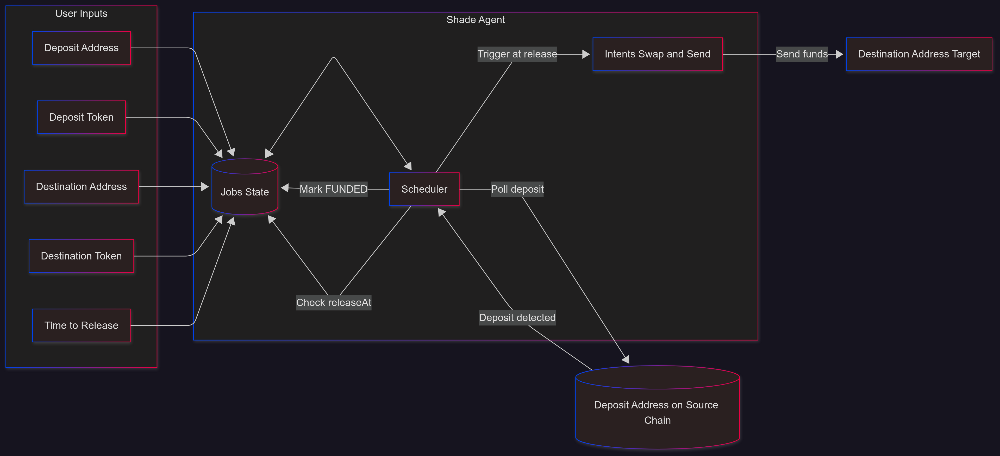

# ZecRotor Agent (MVP)

# Demo Transaction during video

- https://explorer.near-intents.org/transactions/6d54835b5333e9b1f66364c140caed9a85e0d027f4fa77726a7043b527e99dbd

# Demo Video

-  https://www.loom.com/share/3310c166cc2d455a9d7ee65ed8217bdc?sid=f93cfc00-2c04-4484-9579-85f89cd2901d

## Purpose & Scope
ZecRotor is an experimental **Shade Agent–powered job scheduler** for automated token rotation.  
It solves the problem of **scheduled, private fund movement** across blockchains by combining:
- Privacy through Zcash shielded transactions
- Automation through NEAR Shade Agents

This MVP demonstrates that real swaps, deposits, and scheduled releases can happen on **mainnet**, with transparent lifecycle tracking.  
It is intended for research and experimentation and is **not production-ready**.

---

## Core Features
- REST API for job creation and tracking
- In-memory job storage (simple JS/TS array, [state.ts](https://github.com/prakhar728/ZecRotor/blob/main/src/state.ts#L29))
- Background scheduler running every minute ([scheduler.ts](https://github.com/prakhar728/ZecRotor/blob/main/src/scheduler.ts#L8))
- Lifecycle management: `PENDING_DEPOSIT → FUNDED → PROCESSING → COMPLETED | FAILED`
- Event log per job for transparency
- Real execution on NEAR mainnet with intent swaps into Zcash

---

## Architecture



---

## Technology Stack
- **Backend**: Node.js + TypeScript, Hono server
- **Blockchain SDKs**: NEAR Intents, Zcash node integration, Shade Agnet Library
- **Frontend**: React + TailwindCSS (Next.js)
- **Scheduler**: Custom cron loop in TypeScript
- **Storage**: In-memory state (array)

---

## How It Works
1. **User submits a job** with:
   - `sender_address` → the origin of funds  
   - `sending_token` → token being deposited  
   - `destination_address` → final recipient  
   - `destination_token` → token to send out  
   - `execute_at_epoch` → when the transaction should execute  
   See [jobs.ts](https://github.com/prakhar728/ZecRotor/blob/main/src/routes/jobs.ts#L58).

2. **Agent generates a deposit address** and stores the job in memory ([state.ts](https://github.com/prakhar728/ZecRotor/blob/main/src/state.ts#L29)).

3. **Background scheduler** (runs every minute, [scheduler.ts](https://github.com/prakhar728/ZecRotor/blob/main/src/scheduler.ts#L8)):
   - Watches deposit address for incoming funds  
   - If funds confirmed → status changes from [PENDING_DEPOSIT](https://github.com/prakhar728/ZecRotor/blob/main/src/scheduler.ts#L20) to [PENDING](https://github.com/prakhar728/ZecRotor/blob/main/src/scheduler.ts#L42)  
   - Waits until `execute_at_epoch` → processes the job ([logic](https://github.com/prakhar728/ZecRotor/blob/main/src/scheduler.ts#L59))  
   - Executes a [full-swap](https://github.com/prakhar728/ZecRotor/blob/main/src/scheduler.ts#L68) and disperses funds to the destination

4. **Job lifecycle tracking**:  
   - State transitions are logged with timestamps and context

---

## Example Usage

### 1. Create a Job
```http
POST /api/jobs
Content-Type: application/json

{
  "sender_address": "0xSENDER",
  "sending_token": "USDC",
  "destination_address": "zcash_or_any_addr",
  "destination_token": "ZEC",
  "execute_at_epoch": 1696156800
}
```

**Response**
```json
{
  "job_id": "uuid-1234",
  "deposit_address": "demo-deposit-xxxx-123456",
  "execute_at_epoch": 1696156800,
  "status": "PENDING_DEPOSIT"
}
```

### 2. Check Job Status
```http
GET /api/jobs/{job_id}
```

**Response**
```json
{
  "job_id": "uuid-1234",
  "status": "COMPLETED",
  "events": [
    { "ts_epoch": 1696156700, "type": "JOB_CREATED" },
    { "ts_epoch": 1696156750, "type": "DEPOSIT_CONFIRMED" },
    { "ts_epoch": 1696156800, "type": "TX_SUBMITTED_FAKE", "payload": { "tx_id": "fake_uuid_1696156800" } }
  ]
}
```

---

## Roadmap
- Add persistent storage (DB)
- Improve time detection / epoch accuracy
- Integrate full Zcash shielding/unshielding with NEAR Shade Agents
- Security audits before production deployment

---

## License
This project is a prototype intended **for research and experimental use only**.  
It is unaudited and should not be used with significant funds.
