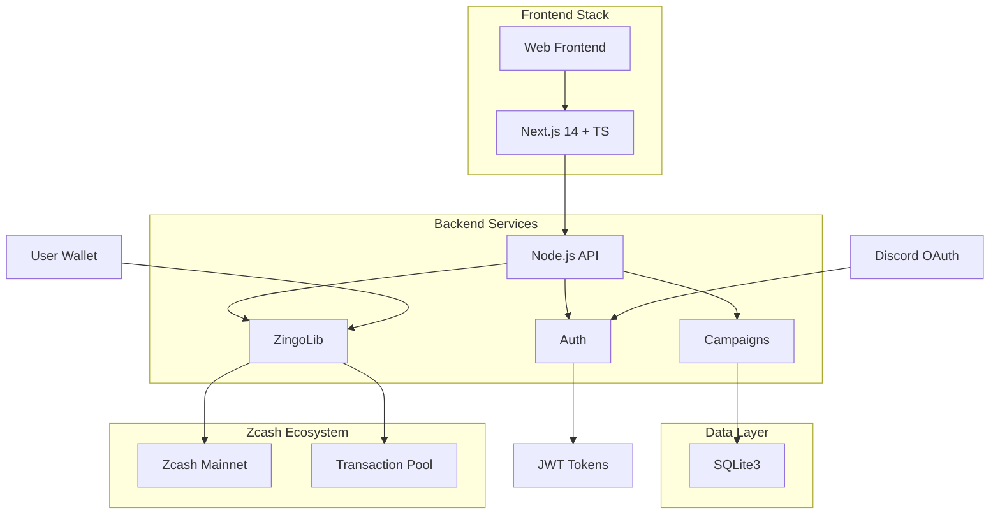

# 🌟 ZecDonations - Zcash Donation Platform


> A fully-featured Zcash donation platform with native wallet integration using ZingoLib for secure, private transactions.

**Live Demo:** [https://zecdonations.vercel.app](https://zecdonations.vercel.app)  
**Github ZingoLib** [https://github.com/teslasdev/zingolib](https://github.com/teslasdev/zingolib)
**Api ZingoLib** [https://zingoteslasdev.com/health](https://zingoteslasdev.com/health)

---

## 🎯 Purpose & Scope

### The Problem with Traditional Donation Platforms
- 🔒 **Privacy Concerns**: Donor and recipient identities exposed
- 💸 **High Fees**: Up to 10-15% taken by intermediaries  
- 🌐 **Geographic Restrictions**: Limited global accessibility
- 📊 **Opaque Tracking**: Lack of transparent fund allocation

### Our Zcash-Powered Solution
ZecDonations revolutionizes charitable giving with:
- **Zero-Knowledge Privacy**: U-shielded transactions via ZingoLib
- **Micro-Fee Structure**: Near-zero transaction costs
- **Borderless Access**: Global donations without intermediaries
- **Transparent Yet Private**: Campaign progress visible, identities protected

### Target Users
| User Type | Use Case |
|-----------|----------|
| **Non-Profits** | Transparent fundraising with donor privacy |
| **Content Creators** | Fan support with reduced platform fees |
| **Community Projects** | Local initiative funding with global reach |
| **Crisis Relief** | Rapid fundraising with immediate payouts |

---

## ✨ Core Features

### 🎪 Campaign Management
```typescript
// Campaign creation with Zcash integration
const campaign = {
  title: "Community Garden Project",
  goalZec: 50, // ZEC target amount
  address: "u1...", // U-shielded receiving address
  status: "active",
  realTimeUpdates: true
}
```

### 🔐 Advanced Authentication
- **Discord OAuth 2.0** - Social login integration
- **JWT Session Management** - Secure token-based auth
- **Role-Based Access** - Donor vs Campaign creator permissions

### 💰 Native Zcash Integration
| Feature | ZingoLib Implementation |
|---------|-------------------------|
| **Address Validation** | Real-time U-shielded address verification |
| **Transaction Building** | Secure ZTX construction |
| **Balance Management** | Live wallet balance updates |
| **Privacy Protection** | Zero-knowledge proofs |

### 📊 Real-Time Analytics
- **Live Donation Tracking** - Instant campaign progress updates
- **Donor Analytics** - Privacy-preserving insights
- **Goal Monitoring** - Visual progress indicators
- **Transaction History** - Transparent yet private records

---

## 🏗️ System Architecture



### Data Flow Architecture
```
User Request → Next.js Middleware → API Route → ZingoLib Processing
      ↓              ↓                 ↓            ↓
  Tailwind UI   JWT Validation    SQLite Query   Zcash TX
```

---

## 🛠️ Technology Stack Deep Dive

### Frontend Layer
| Technology | Implementation Details |
|------------|------------------------|
| **Next.js 14** | App Router, Server Components, API Routes |
| **TypeScript** | Full type safety, strict mode enabled |
| **Tailwind CSS** | Utility-first, responsive design system |
| **shadcn/ui** | Accessible component library |

### Backend & Integration
| Component | Technology Stack |
|-----------|------------------|
| **Runtime** | Node.js 18+ with ES modules |
| **Database** | SQLite3 with better-sqlite3 driver |
| **ORM** | Drizzle ORM or raw SQL queries |
| **Authentication** | JWT + Discord OAuth2 |


## 📊 Performance & Scalability

### SQLite3 Optimization
- **WAL Mode**: Write-Ahead Logging for concurrent reads
- **Proper Indexing**: Fast campaign searches and filters
- **Connection Pooling**: Efficient database handling

### Next.js 14 Advantages
- **Server Components**: Reduced client-side JavaScript
- **Edge Runtime**: Fast API response times
- **Static Generation**: Optimized campaign pages

---

## 🔮 Roadmap & Future Enhancements

### Short Term (v1.1)
- [ ] **Multi-language Support** - Internationalization
- [ ] **Advanced Analytics** - Donation insights dashboard
- [ ] **Mobile PWA** - Progressive Web App capabilities

### Medium Term (v1.5)  
- [ ] **Recurring Donations** - Subscription-based support
- [ ] **NFT Badges** - Donor recognition system
- [ ] **API Marketplace** - Third-party integrations

### Long Term (v2.0)
- [ ] **DAO Governance** - Community-led platform decisions
- [ ] **Cross-chain Support** - Multi-asset donations
- [ ] **DeFi Integration** - Yield-generating donation pools


**Empowering transparent giving with Zcash privacy**

*Built with ❤️ using Next.js, Tailwind, SQLite3, and ZingoLib*

</div>

---

## 🔗 Useful Links

- [Zcash Official Website](https://z.cash)
- [ZingoLib Documentation](https://github.com/ZingoLib/zingolib)
- [Next.js Documentation](https://nextjs.org/docs)
- [Tailwind CSS](https://tailwindcss.com)
