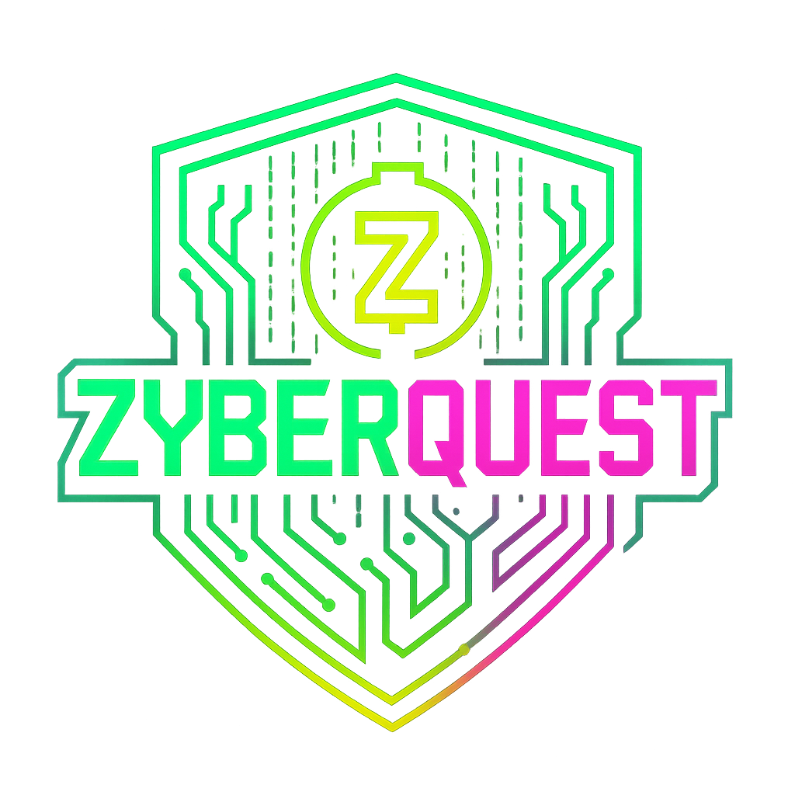

# 🕹️ ZyberQuest — Cypherpunk Arcade

> Connect nodes. Break ciphers. Master the maze.  
> An off-chain arcade game to learn privacy, ZK, and encryption with a neon, Matrix-like vibe.

<p align="center">
  
</p>

<div align="center">

[**Live Demo**](https://zyberquest.vercel.app)
[**Video Demo**](https://youtu.be/e4WqcuG2BzE)

</div>

---

## ✨ Overview

ZyberQuest is a **2D cypherpunk arcade** with two modes:

- **DEMO (off-chain)**  
  - Enter freely. All logic is local; no blockchain required.

- **TOURNAMENT (on-chain)**  
  - “Insert Coin”: player pays **0.001 ZEC** to our **Unified Address (UA)** with a **unique memo**.  
  - Backend verifies the payment on Zcash mainnet and marks **CONFIRMED** after **1 confirmation**.  
  - Frontend enables **PLAY** and grants access.  
  - Network metrics are exposed from the Zcash CLI (via REST).

> This README is organized for **judges and contributors**. It includes **architecture**, **folder structure**, **flows**, and **on-chain setup** (light client + Express REST API) while preserving the project’s original structure and wording.
---

## 🧭 High-level architecture

```bash
:root {
+----------------------+ HTTPS (REST) +---------------------------+
| Frontend (Next.js) | <-----------------------> | Backend (Node/Express) |
| /tournament/pay | | zecwallet-cli wrapper |
| - requests memo | +---------------------+ | /api/* endpoints |
| - shows UA + QR | | public lightwalletd | | CORS + (optional) tunnel |
| - polls status | +---------------------+ +-------------+-------------+
| - enables PLAY | |
+----------+-----------+ | stdio to CLI
| v
| memo + 0.001 ZEC +------------------------+
+-------------------------------------------> | zecwallet-cli (light) |
| data-dir: ~/zyberquest |
+------------------------+
|
| mainnet sync, memos,
| balances, list, info
v
+------------------------+
| Zcash Mainnet |
+------------------------+
```

---

## 🚀 Features

- **Replayable**: Randomized questions/levels, difficulty presets, persistent highscores.  
- **Educational**: Tooltips (“Why?”), micro-capsules, and in-game portals explaining ciphers.  
- **Fluid UX**: 60 FPS targets, responsive layout, keyboard shortcuts everywhere.  
- **Inclusive**: High contrast, visible focus, reduced-motion support, ARIA labels.  
- **Production-ready**: Strong typing (TS/Zod), modular state (Zustand), clean file layout.

---

## 🛠 Tech Stack

- **Framework**: Next.js 14 (App Router), TypeScript  
- **UI/Styling**: Tailwind CSS (custom tokens), shadcn/ui, Radix UI  
- **Animation**: Framer Motion (respects `prefers-reduced-motion`)  
- **Game Engine (Mazes)**: Phaser 3 (Arcade Physics)  
- **State**: Zustand (lightweight, predictable)  
- **Validation**: Zod (schema-first content)  
- **Icons/Fonts**: Lucide React, Inter + IBM Plex Mono via `next/font`  
- **SEO**: Next Metadata API, `next-sitemap` for `sitemap.xml`/`robots.txt`

---

## 🎨 Design System

**Color tokens** (in `globals.css`):

```bash
:root {
  --zx-green:   #00FF9C;  /* primary */
  --zx-cyan:    #00E5FF;  /* secondary */
  --zx-yellow:  #F4B728;  /* Zcash accent */
  --zx-magenta: #FF3DBE;  /* alerts/glitches */
  --zx-ink:     #0A0D0A;  /* deep bg */
  --zx-mid:     #0E1A16;  /* panels */
  --zx-grid:    rgba(0,255,156,0.08); /* ornaments */
```

- Fonts: Inter (UI), IBM Plex Mono (headings/monospace).
- Effects: Subtle scanline overlay, neon borders, optional code-rain particles.
- Layout: Grid-based cards, soft shadows, generous spacing.

## ♿ Accessibility

- Visible focus outlines; keyboard navigation across all controls.
- Shortcuts: documented per mode (numbers, Enter/Space, Esc, P, arrows/WASD).
- Reduced motion: fallbacks for intro/menu and micro-interactions.
- ARIA & labels: tooltips, timers, and interactive elements are labeled and announced.

## 📂 Repository Structure

```bash
zyberquest/
├── backend/
│   ├── server.js                        # Express API + zecwallet-cli integration
│   ├── .env                             # backend config
│   ├── backend.out                      # logs if run with nohup
│   └── zecwallet-light-wallet.dat -> /real/path   # symlink to actual wallet
│
├── src/
│   ├── components/
│   │   ├── tournament/PayPanel.tsx      # Insert Coin (tournament)
│   │   └── Trivia/
│   │       ├── IntroPanel.tsx
│   │       ├── TriviaScreen.tsx
│   │       └── SummaryModal.tsx
│   ├── data/trivia-zcash.json           # question bank
│   └── lib/
│       └── tournament.ts                # code helpers (build URIs, session, result)
│
├── app/
│   ├── page.tsx                         # Landing + RPC footer (NetworkBar)
│   ├── start/page.tsx                   # mode entry
│   └── trivias/page.tsx                 # gameplay UI (demo/tournament via query)
│
├── public/
│   ├── qr/zyberquest-qr.jpg
│   └── og/zyberquest-banner.png
│
├── .env.local
└── README.md

```

---

## 🧩 App Routes & Flows

Global flow (Intro → Menu → Modes):

```bash
┌──────────┐
│  /intro  │  type-in + code-rain (skip: Esc)
└────┬─────┘
     v
┌──────────┐
│  /menu   │  choose [1]Trivia [2]Mazes [3]Simulators
└─┬───┬───┬┘
  v   v   v
 /trivias  /laberintos  /simulators

```

Keyboard: 1/2/3 to select · Enter/Space to open · Esc back · M mute toggle.
---

## 🎮 Game Modes

## Trivias (Zcash Privacy Arcade)

- Play: /trivias → Intro (difficulty + explainer) → 10 shuffled questions → Summary.
- Difficulty: Beginner (35s/Q), Intermediate (30s), Advanced (25s).
- Scoring: Streak multiplier (1.00 / 1.10 / 1.25).
- Persistence:
1. zyberquest_trivia_record (high score)
2. zyberquest_trivia_history (last 10 runs)

Hotkeys: 1–4 select option · Enter confirm/next · P pause · Esc back.

Data schema (src/lib/triviaSchema.ts):
```bash
export type TriviaQuestion = {
  id: string;
  category: string;
  type: "mcq";
  question: string;
  choices: [string, string, string, string];
  answerIndex: number; // index into choices
  explain: string;     // 1–3 lines
  difficulty: "Beginner" | "Intermediate" | "Advanced";
  tags?: string[];
};
```

Add questions: edit src/data/trivia-zcash.json (validated by Zod).
UI: Radix Tooltip “Why?”, decrypt-glow (correct) / glitch-shake (wrong), neon panel.

-

## Laberintos (Exploration Mazes)

- Play: /laberintos (mode picker + “Caesar Capsule”)
1. /laberintos/play?mode=tutorial — sandbox, keys/door, portal demo (“SHIELD”).
2. /laberintos/play?mode=mission — timed run with keys, portal (“PRIVACY”), laser, slow zone, drone, exit.

**Controls**: WASD/Arrows move · E interact · Space dash (3s CD) · P pause · Esc menu
**HUD**: countdown, keys, score, minimap (events: hud:minimap:init, hud:minimap:update)

**Maps & tiles**: JSON from Tiled (16×16 or 32×32).
Layers: floors, walls (index 1 collides), door tile index 2 (opens → set to 0).
Laser toggles every ~900ms; slow zones reduce speed to 60%; drone patrol via waypoints array.

**Educational nodes**: src/game/labyrinth/data/nodes.json (2–3 lines each).
**Performance**: 60 FPS targets; scene‐local timers/tweens cleaned on restart; minimal collisions.

-

## Simulators — Visual XOR

- Play: /simulators → Intro (difficulty + explainer) → Visual XOR → Summary.
- Objective: Illuminate all letter cells (A XOR B).
- Grades:
1. Perfect Clean (100%) — letters on & background clean.
2. Decrypted (70%) — all letters on, extra cells allowed.
- Difficulties:
1. Easy → “ZC” (16×8, 90s)
2. Medium → “ZEC” (24×12, 75s)
3. Hard → “ZCASH” (32×16, 60s)

**Scoring**: 100 + (timeLeft * 2) then × 1.0 (Perfect) or 0.7 (Decrypted) + streak * 10.
**Hints**: reveal a correct row (−10 pts).
**State (Zustand)**: start, decreaseTime, solve, endRound, useHint, reset (persist last 10 runs + high score).
**Add words**: extend 5×5 glyphs or rasterize custom text in lib/simGenerators.ts.
**A11y**: focus ring per cell, aria-label per grid cell, keyboard navigation (arrows, Space/Enter, P, Esc).

---
## 🔗 On-Chain Integration (Zcash)

This section adds the light client + REST backend details while keeping your original structure intact.

Prerequisites (Ubuntu 22/24 LTS)
```bash
# System & build tools
sudo apt update && sudo apt upgrade -y
sudo apt install -y build-essential git pkg-config libssl-dev curl tmux htop jq

# Light client (zecwallet-cli)
# We use a public lightwalletd (Route A): https://zec.rocks:443 (mainnet)
# Create/restore wallet (interactive):
zecwallet-cli --server https://zec.rocks:443 --data-dir "$HOME/zyberquest"
# commands: new | seed | addresses | balance | list | sync | rescan | quit

Tips
- UA printed in addresses.
- Incoming memos appear in list ("memo").
- Force sync via sync/rescan or POST /api/wallet/refresh.

Backend (Node/Express)

Environment (backend/.env)

PORT=3001

# Lightwalletd (single URL or failover list)
LIGHTWALLETD_URL=https://zec.rocks:443
# or:
# LIGHTWALLETD_URLS=na.zec.rocks:9067,mainnet.lightwalletd.com:9067,lightwalletd.com:9067

# CLI
ZEC_CLI=zecwallet-cli
ZEC_DATA_DIR=/home/<user>/zyberquest
CLI_TIMEOUT_MS=15000

# Tournament pricing & UI expiry
COIN_PRICE_ZEC=0.001
COIN_EXPIRE_SEC=900

# Admin override for live demos
FORCE_CONFIRM_KEY=ad6b9b1f0c2c4d0b9f3e2f7c8a1b6d2e

# CORS
CORS_ORIGINS=http://localhost:3000,https://zyberquest.vercel.app

Install & Run
cd ~/zyberquest/backend
npm install
node server.js
# API up on :3001

Optional tunnel (Cloudflare)
curl -L https://github.com/cloudflare/cloudflared/releases/latest/download/cloudflared-linux-amd64 -o cloudflared
chmod +x cloudflared
./cloudflared tunnel --url http://localhost:3001
# copy https://<sub>.trycloudflare.com into NEXT_PUBLIC_API_BASE

REST Endpoints (summary)
GET  /health                                # API status

# Wallet
GET  /api/wallet/address                     # UA (list + primary)
GET  /api/wallet/balance                     # CLI balance (zats/ZEC)
GET  /api/wallet/balance/derived             # Fallback: sum by list
POST /api/wallet/refresh                     # sync; sync
POST /api/wallet/rescan                      # rescan → (fallback) sync

# Transactions & network
GET  /api/tx/list?limit=50                   # normalized tx history
GET  /api/tx/:txid                           # tx detail
GET  /api/network/metrics                    # raw CLI info (height, chain)
GET  /api/lwd/active                         # active LWD + pool (if failover)

# Tournament / Insert Coin
POST /api/coin/new                           # { code, address, zcashURI, expiresAt }
GET  /api/coin/status?code=ZQ-...            # PENDING | CONFIRMED | EXPIRED (+confirmations)
GET  /api/coin/inspect?memo=ZQ-...&minZec=0.001  # stateless by memo/amount (debug/manual)
POST /api/coin/force-confirm                 # admin override (X-Admin-Key)

# Tournament results (phase 1)
GET  /api/tournament/validate-code?code=...  # verify confirmed ticket
POST /api/tournament/result                  # { code, levelsPassed, score, playedAt } → tier
POST /api/tournament/payout                  # staged (UI shows “in progress”)

```
**Robustness**

- ANSI stripping + tolerant JSON parsing (take last valid JSON).
- Derived balance fallback and /inspect stateless check.
- /wallet/refresh mitigates “invalid consensus branch id”.

**Tournament “Insert Coin” flow (user)**
```bash
/tournament/pay
  ├─ POST /api/coin/new → { code, address, zcashURI, expiresAt }
  ├─ Player pays 0.001 ZEC to UA with memo=code
  ├─ Poll GET /api/coin/status?code=... every 10s
  └─ When confirmations >= 1 → status=CONFIRMED → enable PLAY

Sequence diagram (ASCII)
Frontend                Backend                   zecwallet-cli            Zcash Mainnet
   |  POST /coin/new      |                            |                           |
   |--------------------->|                            |                           |
   |  {code, UA, URI}     |                            |                           |
   |<---------------------|                            |                           |
   | (user pays 0.001ZEC + memo=code)                  |<===== tx + memo =========|
   |  GET /coin/status    | run('list')                |---- list ---------------->|
   |--------------------->|<---------------------------|                           |
   |                      | run('info')                |---- info ---------------->|
   |                      |<---------------------------|                           |
   |  {CONFIRMED,1}       |                            |                           |
   |<---------------------|                            |                           |
   |  PLAY                |                            |                           |

```

**Frontend wiring**
```bash
# .env.local
NEXT_PUBLIC_API_BASE=http://<ubuntu-ip>:3001
# or trycloudflare URL:
# NEXT_PUBLIC_API_BASE=https://<sub>.trycloudflare.com

# /tournament (animated intro) → CTA: INSERT COIN
# /tournament/pay (PayPanel)
#   - POST {API}/api/coin/new on mount
#   - Show UA, Memo, QR: zcash:<UA>?amount=0.001&memo=<code>
#   - Poll {API}/api/coin/status?code=... every 10s
#   - On CONFIRMED → enable PLAY

Judge quick commands
# 1) Health
curl -s http://<host>:3001/health

# 2) Address & balances
curl -s http://<host>:3001/api/wallet/address | jq .
curl -s http://<host>:3001/api/wallet/balance | jq .
curl -s http://<host>:3001/api/wallet/balance/derived | jq .

# 3) New ticket (memo)
curl -s -X POST http://<host>:3001/api/coin/new | jq .

# 4) Pay 0.001 ZEC with memo=<code> from any wallet

# 5) Status
curl -s "http://<host>:3001/api/coin/status?code=ZQ-XXXX-YYYY" | jq .

# 6) Stateless inspect (debug/manual)
curl -s "http://<host>:3001/api/coin/inspect?memo=ZQ-XXXX-YYYY&minZec=0.001" | jq .

# 7) History & metrics
curl -s "http://<host>:3001/api/tx/list?limit=10" | jq .
curl -s "http://<host>:3001/api/network/metrics" | jq .

# 8) Force refresh (mitigate lag/reorgs)
curl -s -X POST http://<host>:3001/api/wallet/refresh | head

Reproducibility checklist (for judges)
# 1) Backend up
node server.js
curl /health → { ok: true }

# 2) Show UA
curl /api/wallet/address → UA displayed

# 3) Create session
curl -X POST /api/coin/new → { code, address, zcashURI }

# 4) Pay 0.001 ZEC with memo=code

# 5) Confirm
curl /api/coin/status?code=<code> → CONFIRMED (>=1 conf)

# 6) UI
/tournament/pay → “Coin inserted ✓” → PLAY button enabled

# 7) Metrics
curl /api/network/metrics → height/chain info

```
---

## 🧑‍💻 Getting Started

Prerequisites
```bash
Node.js 20+ and npm 10+
Git, a modern browser with WebGL (for Phaser)

Install & Run
# clone
git clone https://github.com/your-username/zyberquest
cd zyberquest

# install deps
npm install

# dev server
npm run dev
# → http://localhost:3000


Build & start:

npm run build
npm start

Backend (recap)
cd ~/zyberquest/backend
cp .env.example .env
npm i
node server.js

```

---

## 📦 Scripts

```bash
npm run dev        # Start Next dev server
npm run build      # Production build
npm run start      # Run production server
npm run lint       # ESLint
npm run postbuild  # Generate sitemap.xml/robots.txt (via next-sitemap)

```

---

## 🧪 Development Guide

**Add a 4th mode**

Edit lib/modes.ts and push a new item to MODES:
```bash
{
  id: "new-mode",
  title: "New Mode",
  desc: "Short description",
  href: "/new-mode",
  accent: "green" // or "cyan" | "magenta" | "#HEX"
}
```

**Customize intro**

- app/intro/page.tsx → introLines content
- <CodeRain density={0.6} speed={1.0} /> for visuals
- Shortcuts: Enter (Play), M (Mute), Esc (Skip)

**Trivia content**
- Add items in src/data/trivia-zcash.json (Zod schema enforced)
- Loader shuffles questions and options, recalculating answerIndex

**Mazes content** 
- Replace the tilemap JSON and tiles in src/game/labyrinth/assets/
- Adjust scaling (SCALE = 2) and collisions in LabPlay.ts

**Visual XOR tweaks**
- Palettes: tokens in :root
- Hint penalty / time bonus: store/simStore.ts
- Copy: /simulators intro + “What is XOR cipher?” card

---
## 📎 Environment Samples (Appendix)

backend/.env.example

```bash
PORT=3001
ZEC_DATA_DIR=/home/USER/zyberquest/backend
ZECWALLET_BIN=/home/USER/.cargo/bin/zecwallet-cli
# OR alias
ZEC_CLI=/home/USER/.cargo/bin/zecwallet-cli

# Use either single URL or list for failover
# LIGHTWALLETD_URL=https://zec.rocks:443
LIGHTWALLETD_URLS=na.zec.rocks:9067,mainnet.lightwalletd.com:9067,lightwalletd.com:9067

CLI_TIMEOUT_MS=15000
COIN_PRICE_ZEC=0.001
COIN_EXPIRE_SEC=1800
FORCE_CONFIRM_KEY=ad6b9b1f0c2c4d0b9f3e2f7c8a1b6d2e

# CORS
CORS_ORIGINS=http://localhost:3000,https://zyberquest.vercel.app

frontend/.env.local.example

NEXT_PUBLIC_API_BASE=http://192.168.100.12:3001
# or:
# NEXT_PUBLIC_API_BASE=https://<subdomain>.trycloudflare.com

```
## 🧩 Appendix — Insert Coin Flowchart (detailed)


```bash
            ┌──────────────────────────────┐
            │   /tournament/pay (front)   │
            └───────────────┬─────────────┘
                            POST /api/coin/new
                                 │
                                 ▼
                         ┌──────────────┐
                         │  Generate    │
                         │  code (memo) │
                         └──────┬───────┘
                                │
                      UA ← CLI addresses
                                │
                                ▼
                    { code, UA, zcashURI, exp }
                                │
                                ▼
   [User sends 0.001 ZEC + memo=code to UA from any wallet]
                                │
                         (every 10s poll)
                                ▼
                      GET /api/coin/status?code
                                │
                                ▼
                         CLI list + info
                                │
             ┌──────── confirmed? (>=1 conf) ────────┐
             │                                        │
            NO                                       YES
             │                                        │
             ▼                                        ▼
        PENDING (or EXPIRED)                     CONFIRMED
             │                                        │
             └────── polling continues ───────────────┘


```

---

## 👥 Team 

Developed by BlockBears 🐻

- 📈 Zula — PM & Marketing
- 👩‍💻 Mafer Lopez — Dev & UX/UI Designer
- 🚀 Mary — Researcher & BizDev

Inspired by classic cryptography puzzles, cypherpunk aesthetics, and the Zcash ecosystem.

---

## 📜 License

MIT © BlockBears Team