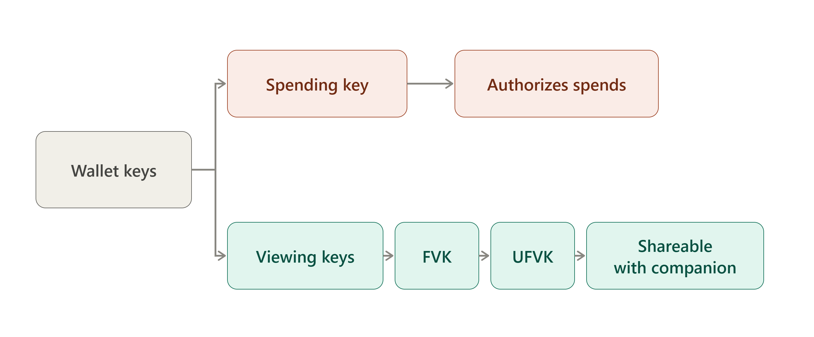
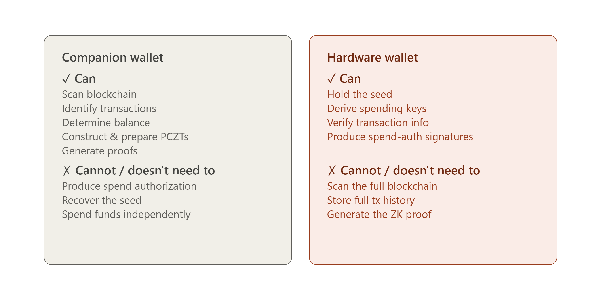
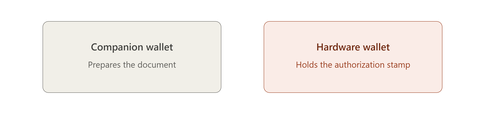

# Shielding in Zcash

Shielding in Zcash involves moving funds from a public, transparent address into a private, shielded address. This uses Zcash's privacy features to prevent transaction details from being publicly revealed.

### What changes when you shield ZEC?

With a transparent Zcash transaction, information such as:

* Sender address
* Recipient address
* Amount transferred

can be observed on the blockchain.

When you shield ZEC, your funds move into a **shielded pool**, such as Orchard. The blockchain can still verify that the transaction is valid without publicly revealing your private transaction details.

# Components of a Shielded Transaction

### 1. The Note (The Shielded Balance Record)

A note is a private, cryptographic record representing an unspent amount of ZEC owned by a user.

Unlike a public blockchain, where balances are listed in cleartext, a shielded note encrypts the value and ownership details so that on-chain observers cannot see who owns the funds.

When initiating a transaction, the companion wallet scans the ledger, identifies the user's unspent notes, and selects which notes to spend.

### 2. The Nullifier (The Anti Double Spend Detector)

Because the details of a note are hidden from the public ledger, the network needs a mechanism to detect doubles pending without revealing which note is being spent.

A nullifier is a unique cryptographic marker derived from a specific note. When a note is spent, its nullifier is published to the blockchain.

The network verifies that the nullifier has not been recorded previously. If it has not, the spend can be accepted. Crucially, an outside observer cannot use the nullifier to determine which specific note it came from.

The companion wallet derives and constructs the appropriate nullifier as part of assembling the transaction data.

# Keys in a Shielded Wallet

Keys are cryptographic pieces of information that control access to your funds and allow your wallet to perform operations such as receiving, viewing, and spending ZEC.

A wallet holds several different keys, each serving a different purpose, similar to how a single account might have separate credentials for read access and write access.

Keys are central to the relationship between the companion wallet and the hardware wallet because different keys serve different purposes, and only the spending authority needs to remain protected from the companion wallet.

### The Key Hierarchy

**1. Spending Key**

This is the most security sensitive key. It provides the cryptographic ability to authorize the spending of ZEC.

This is the key referred to whenever "the hardware wallet holds the key" comes up elsewhere in this report.

In a cold signing architecture, the spending key remains inside the hardware wallet and is never exposed to the companion wallet. The companion wallet should not need to possess this key.

**2. Viewing Keys**

Zcash separates the ability to *see* shielded activity from the ability to *spend* funds. A viewing key allows a wallet or other authorized party to view information about shielded transactions without granting spending authority.

* **Full Viewing Key (FVK), wrapped as a Unified Full Viewing Key (UFVK):** A viewing key is derived from the spending key and allows software to detect and decrypt the wallet's shielded activity, identify relevant transactions, and compute balances without being able to authorize a spend. It is best described as a **less secret derivative of the spending key**, rather than a weaker copy of the seed.

Because these keys grant fundamentally different levels of authority, they do not need to be handled in the same way during a cold signing workflow.

#### The Critical Distinction: UFVK vs. Spending Key

This distinction forms the security boundary on which the cold signing architecture rests.

The **UFVK** is intentionally designed to be shared with a less trusted companion wallet, while the **spending key** is not. The companion wallet needs viewing information to monitor funds, identify notes, and prepare transactions, but it does not need the private spending key to do so.

This separation allows the companion wallet to construct and prepare a transaction without having the cryptographic authority required to spend the funds.

*Figure: What the companion wallet and hardware wallet can and cannot do in a shielded cold signing architecture.*

#### What the Companion Wallet Actually Does With Key Information

Using the viewing key material, the companion wallet can:

* identify the user's funds and notes
* determine which notes can be spent
* derive or identify relevant addresses
* construct the transaction
* generate or coordinate the required proofs
* prepare the transaction for signing

It is important to understand that **constructing a transaction is not the same as having the private spending key**. The companion wallet can perform the computational work required to prepare a transaction while the security critical spending authority remains isolated within the hardware wallet.

This decoupling is one of the core security ideas behind hardware wallet integration.

*Figure: The companion wallet prepares the document; the hardware wallet holds the authorization stamp.*

# Shielded Transaction Construction and Authorization

These are the main processes involved in creating and authorizing a shielded transaction. In simple terms, they describe what the wallet does with the transaction data when sending ZEC.

### Transaction Construction (Assembling the Shielded Transaction)

Transaction construction is the process of assembling the information required to create a valid Zcash transaction from the user's intended payment.

The transaction construction process combines the selected notes, recipients, amounts, fees, nullifiers, and other required transaction data into a transaction structure. For shielded transactions, it also prepares the information required to generate the necessary zero knowledge proofs and signatures.

The companion wallet generally performs this stage. It:

* Selects the notes to spend
* Determines the transaction's inputs and outputs
* Calculates the necessary values
* Prepares the transaction data that will later be proved and signed

In a cold signing setup, the resulting transaction data can be packaged into a **PCZT (Partially Constructed Zcash Transaction)** and passed to the hardware wallet for the security critical signing step.

### Proving (Demonstrating Protocol Validity)

Proving refers to the generation of zero knowledge proofs, such as **Halo 2** or **Groth16**, that demonstrate that a transaction follows Zcash's protocol rules.

The proof allows the network to verify that:

* The spender is authorized to spend the notes
* The notes satisfy the required validity conditions
* The corresponding nullifiers are valid and prevent double-spending
* The transaction's value balance is correct, including fees

It does this without revealing the underlying private information protected by the shielded protocol.

Proof generation can be computationally intensive. Performing this work on the companion device reduces the computational and memory requirements placed on the hardware wallet.

### Signing (Authorizing the Spend)

Signing is fundamentally distinct from proving.

A digital signature acts as an explicit authorization produced using the private spending authority. While a zero knowledge proof demonstrates that the transaction satisfies the required protocol conditions, the signature authorizes the spend.

The signing process uses the protected key material to authorize the specific transaction data. Because signing generally requires significantly fewer computational resources than generating zero knowledge proofs, it is well suited to a hardware wallet.

### What Is Shielded Cold Signing?

Shielded cold signing is a method of authorizing a Zcash shielded transaction while keeping the private spending key isolated from the companion wallet which is connected to the internet.

The transaction can be constructed and prepared on the companion computer, while a separate hardware wallet, kept offline or otherwise isolated, uses its protected key material to authorize the transaction.

The process can be simplified as:

**Companion Wallet → Transaction Construction → Proving → PCZT → Hardware Wallet → Signing → Signed Transaction**

The companion wallet sends the structured transaction data to the hardware device. The hardware wallet performs the security critical signing operation internally, without releasing the private spending key to the host machine.

# Companion and Hardware Wallets

Shielded transactions can involve both a companion wallet and a hardware wallet, with each serving a distinct function.

### Companion Wallet

#### What Is a Companion Wallet?

A companion wallet runs on a computer or mobile device and performs most of the tasks involved in creating a transaction, such as:

* Selecting the notes to be spent
* Constructing the transaction
* Calculating the necessary transaction data
* Coordinating the generation of the required zero-knowledge proofs

#### Why Is a Companion Wallet Useful?

The companion wallet handles the transaction creation process. However, if the computer or phone is compromised by malware, an attacker might be able to:

* See what you are doing
* Modify an unsigned transaction
* Attempt to trick you into approving an unintended transaction

The companion wallet does not need access to the private spending key stored on the hardware wallet. It can therefore handle transaction construction and other computational tasks while the hardware wallet provides the security boundary for the private key.

### Hardware Wallet

A hardware wallet is a dedicated physical device designed to isolate sensitive private keys from connected phones or computers. It acts as a secure environment for the cryptographic key material used to authorize transactions.

#### Why Is a Hardware Wallet Useful?

If the companion computer or phone is compromised, an attacker might be able to:

* See what you are doing
* Modify an unsigned transaction
* Try to trick you into approving an unintended transaction

The private spending key is designed to remain inside the hardware wallet rather than being exposed to the host device. This allows the hardware wallet to act as a security boundary around the key.

The separation between these two components is particularly important for shielded transactions because they are more complex than transparent transactions and involve components such as shielded notes, nullifiers, commitments, zero knowledge proofs, and transaction signatures.

It would be impractical for the hardware wallet to perform every computational operation. Instead, the companion wallet prepares the transaction and provides the necessary information to the hardware wallet for signing, while the private spending authority remains isolated within the hardware device.

# Key Isolation

Key isolation refers to keeping the private key material required to authorize a transaction separate from the companion wallet and the device on which it runs.

In a shielded cold signing setup, the companion wallet can construct the transaction and coordinate the required proofs, while the hardware wallet keeps the sensitive spending authority isolated.

If the companion computer or phone is compromised, an attacker may be able to interact with the transaction before it is signed, but ideally cannot extract the private spending key from the hardware wallet. The key therefore remains within the security boundary of the hardware device.

This separation allows the companion wallet to perform transaction construction and computational tasks without giving it direct access to the key material required to authorize the spend.

### Viewing Key vs. Spending Key

The key distinction to make is that a **viewing key does not mean the companion application receives a weaker version of the seed**.

In Zcash, a **Full Viewing Key (FVK)**, or a **Unified Full Viewing Key (UFVK)** when represented within the Unified Address/key system, is derived from spending key material and provides the ability to detect and decrypt relevant shielded activity without providing the ability to authorize spends.

The FVK is therefore a **less secret derivative of the spending key**, rather than a copy of the spending key itself.

> **Privacy caveat:** A UFVK is not harmless public information. It gives its holder access to private information about the shielded wallet's activity. In Orchard, viewing key material also has capabilities relevant to proof creation.

Therefore, an application that has only the UFVK cannot use it by itself to authorize the spending of the wallet's funds, but it can gain significant visibility into the wallet's private shielded activity.

For this reason, it is more accurate to describe the companion application as having **viewing authority**, rather than simply saying that it has "public information."

### The Key Isolation Model

The simplest way to state the whole idea is:

**The companion wallet gets enough key material to know what is happening to the wallet, but not enough key material to authorize what happens to the wallet's funds.**

The hardware wallet, however, keeps the spending authority isolated and uses it only when the user approves a transaction.

This is the core key isolation model behind shielded Zcash hardware wallet designs. The same general separation appears, with implementation-specific differences, in systems such as **Ledger, Keystone, and Hito**, which are examined in the following sections.

# PCZT

**PCZT** stands for **Partially Created Zcash Transaction**.

It is a package that carries a Zcash transaction and the information needed to complete it as it moves from one stage of the transaction process to another.

It provides a standardized format for a Zcash transaction while it is still being constructed. This allows different participants or devices to perform different parts of the transaction-creation process and pass the partially completed transaction between them.

In zero knowledge cryptocurrency protocols such as Zcash, constructing a transaction is significantly more complex than signing a simple public transfer. Shielded transactions require computationally intensive zero knowledge proofs, such as Halo 2 or Groth16. Low power devices such as hardware wallets generally have limited memory and processing capacity, making it impractical for them to handle the entire workflow.

To address this, **PCZT** provides a standardized intermediate data format that supports a modular transaction workflow. It allows a powerful companion computer to handle transaction assembly and computationally intensive proving while restricting the hardware wallet to the security critical authorization and signing operations.

The use of PCZT addresses several core challenges in shielded-transaction architecture:

### Hardware and Cold Storage Limitations

While hardware wallets provide a secure environment for protecting private spending keys, they typically have limited RAM, computing power, and data transfer capabilities compared with companion computers.

These constraints can make it impractical for hardware wallets to perform computationally intensive zero knowledge proof generation or maintain the complete transaction state required during transaction construction.

As a result, the companion wallet can handle computationally demanding tasks, while the hardware wallet remains focused on the security critical operation of authorizing the transaction with its protected spending authority.

### PCZT Enables the Split Architecture

The **Partially Created Zcash Transaction (PCZT)** format serves as the structured data layer connecting the different stages of transaction creation, including the companion wallet and hardware wallet.

The companion wallet can handle tasks such as note selection, transaction construction, and coordination of zero knowledge proof generation. The relevant transaction data and intermediate information can then be represented within a PCZT.

The PCZT is passed to the hardware wallet, which processes the information required for signing and uses its protected spending authority to authorize the transaction. The updated PCZT can then be returned to the companion device so that the remaining transaction creation steps can be completed.

This design establishes a security boundary: a powerful host computer can perform complex transaction construction and cryptographic computation without receiving the private spending key, while a hardware wallet can protect the spending authority without having to perform the entire computationally intensive workflow.

### Prover Privacy Trade-Offs

While delegating zero knowledge proof generation to the companion wallet or another prover keeps the spending keys isolated, the prover may still need access to sensitive transaction information, such as note values, recipient information, and commitments.

PCZT maintains the architectural separation by allowing the information required for transaction construction and proving to move between participants without transferring the private spending authority required for authorization.

This separates **proving authority from spending authority**. A prover can perform computationally intensive proof generation without gaining the cryptographic authority to spend the user's funds.

## The Lifecycle of a PCZT

## Real World Hardware Wallet Implementations

Several hardware wallet implementations have been developed to explore how Zcash shielded transactions can be supported while keeping sensitive spending authority isolated from the companion wallet. **Ledger, Keystone, and Hito** represent different approaches to integrating hardware based key protection with the Zcash transaction workflow.

To understand how they protect shielded funds, it is important to distinguish between **spending keys** and **viewing keys**. Across these implementations, the general architecture follows the same basic separation:

| **Device**   | **What the companion app can receive**                          | **What remains protected on device**      |
| ------------ | --------------------------------------------------------------- | ----------------------------------------- |
| **Ledger**   | UFVK / Orchard FVK, addresses and related public information    | Spending authority / private key material |
| **Keystone** | UFVK and Unified Address information                            | Seed / spending keys                      |
| **Hito**     | UFVK, Unified Address, seed fingerprint and network information | Seed and private spending keys            |

## Ledger as the Hardware Signing Environment

**Ledger** is a hardware wallet company. Its devices use a **Secure Element**, a dedicated security component designed to protect sensitive key material from the host environment.

A Ledger device also requires a software specific to cryptocurrency to understand and process the cryptographic operations associated with a particular blockchain. For Zcash, the **Zcash device application** provides the Zcash specific functionality on the Ledger.

**Zkool** acts as the companion wallet on the computer or phone. It constructs and prepares the transaction and communicates with the Ledger device, while the Zcash application on the Ledger performs the security-critical signing operations.

The relationship can therefore be simplified as:

**Zkool → Zcash transaction/PCZT → Ledger Zcash application → Signature**

### What Leaves the Ledger?

Ledger's Zcash software supports exporting viewing key information for use by companion software.

This can include:

* A **Unified Full Viewing Key (UFVK)**, which represents viewing key information across the wallet's supported pools
* An **Orchard Full Viewing Key (FVK)**

In either case, the exported information is viewing key material rather than the private spending authority.

The distinction is important: viewing key material allows companion software to detect and process relevant shielded activity, while the spending authority remains protected on the device.

Zcash's key hierarchy separates viewing capabilities from spending authority. For a key material derived from Orchard, the spending key gives rise to separate spending-authorizing and viewing capabilities. The viewing side of the hierarchy cannot be used to reconstruct the spending authority.

### Ironwood and the Viewing Key Model

Ironwood reuses the **Orchard protocol's underlying action structure, key constructions, and Halo 2 proof system**, while being a separate shielded value pool with its own state. In particular, Ironwood has its own note commitment tree and nullifier set.

This distinction matters when discussing a UFVK. A UFVK should not be thought of as one flat key corresponding to one pool. It represents unified viewing key information that can cover the wallet's supported receivers and shielded pools.

After NU6.3, wallets need to account for Ironwood as a separate pool while reusing the Orchard protocol machinery. NU6.3 introduced the Ironwood pool and directs newly created shielded value toward it, while existing Orchard pool value remains spendable.

### What Stays on the Ledger?

The **spending authority remains protected on the device**.

The Ledger signer receives the transaction data or PCZT from the host and performs the security critical signing operation on the device. The resulting signature is returned to the host, while the private spending key itself is not returned.

For Ironwood, this distinction is particularly important because Ironwood and Orchard are separate pools even though they reuse the same Orchard-protocol cryptographic machinery. NU6.3 supports separate Orchard and Ironwood transaction bundles and maintains separate pool state.

The overall architecture can therefore be represented as:

**Companion Wallet → PCZT / Transaction Data → Ledger → Spend Authorization Signature → Companion Wallet**

The companion wallet performs the computational and transaction construction work, while the Ledger performs the security critical authorization operation.

### What Does This Mean in Practice?

Suppose your Ledger protects **10 ZEC**.

The companion wallet can receive the wallet's viewing key information and use it to determine that the wallet has received 10 ZEC. It can scan relevant shielded activity and display transactions and balances.

However, possession of tUFVK alone does not give the companion wallet the spending authority required to authorize a spend.

If the companion wallet is compromised, an attacker may therefore be able to observe the wallet's shielded activity or interfere with transaction preparation, but the private spending authority remains protected on the hardware device.

The purpose of the separate spend-authorization signature is to allow the hardware wallet to authorize the shielded spend without requiring the device to perform the entire transaction construction and zero knowledge proof workflow.

### Zondax Ledger Application — The Hardware Wallet Side

#### What Is Zondax?

**Zondax** is a third party development firm that developed the Zcash application for Ledger hardware. The application runs on the Ledger device and provides the Zcash specific functionality needed to process Zcash transactions.

Ledger hardware does not inherently understand the cryptographic rules of every cryptocurrency. Instead, cryptocurrency specific applications provide the functionality required for each supported network. In the Zcash case, Zondax developed the Ledger Zcash application.

#### Original Zcash Ledger Implementation

Zondax's [Ledger Zcash app repository](https://github.com/Zondax/ledger-zcash) contains the software developed for Ledger hardware.

The earlier Zcash Ledger implementation focused on **Sapling**, the shielded pool used by Zcash before Orchard was introduced. Its architecture already demonstrated the basic separation between the host and the hardware device: the host handled transaction preparation, while the Ledger protected sensitive key material and performed security critical operations.

The important architectural principle was therefore already present:

**Transaction construction and proving → Host**

**Spending authorization and signing → Ledger**

#### Evolution Toward Orchard

Later Ledger development moved toward supporting **Orchard and PCZT**. This was a significant cryptographic transition rather than simply a minor firmware update.

Orchard introduced a different shielded-pool design and uses the **Halo 2** proving system rather than Sapling's **Groth16** system. Supporting Orchard therefore required additional cryptographic functionality on the hardware wallet side.

As Zcash's protocol continued to evolve toward **Ironwood**, the Ledger implementation also needed to account for Ironwood's relationship with the Orchard cryptographic architecture. Ironwood is a separate shielded pool while reusing important Orchard derived cryptographic machinery.

This makes the evolution of the Ledger implementation easier to understand as a progression:

**Sapling → Orchard/PCZT → Ironwood**

#### What Happens Inside the Ledger App?

The Ledger signing workflow can be simplified as follows:

1. The host or companion wallet constructs the transaction and prepares a **PCZT**.
2. The host sends the relevant transaction information to the Ledger.
3. The Ledger processes the information required for the security-critical signing operation.
4. The device produces the appropriate **spend-authorization signature**.
5. The host receives the signature and performs the remaining transaction-assembly steps.

The computationally intensive work, such as transaction construction and proof generation, remains on the host rather than being performed entirely inside the hardware wallet.

The important security property is that the **private spending authority remains on the Ledger**. The host receives the resulting authorization data, not the private key itself.

---

### YWallet Cold Signing — An Earlier Approach

**YWallet** is a companion wallet that independently explored shielded cold signing for Zcash.

YWallet is historically important because it demonstrated an approach in which the signing device could remain separated from the online wallet.

To implement this architecture with Ledger hardware, YWallet developed its own Ledger application. This was a separate application from the Zondax-built Zcash application discussed above.

This meant that YWallet's approach involved its own signing software running on the Ledger rather than relying on the existing Zondax implementation.

#### Why the Integration Mattered

Having the necessary cryptography and signing code is not, by itself, enough to create a practical hardware-wallet integration. A real integration also depends on several platform and distribution requirements, including:

* **Application approval and distribution** — whether the hardware manufacturer accepts and distributes the application through its official ecosystem
* **Firmware and application security** — whether the application meets the manufacturer's requirements for handling sensitive key material
* **Communication protocols** — how the companion wallet and hardware device exchange transaction information
* **Wallet compatibility** — whether the signing application's data formats and workflow match those expected by the companion wallet
* **Shielded-pool support** — which pools, such as Sapling, Orchard, or Ironwood, the application can actually support

YWallet's proprietary Ledger application explored the cryptographic and architectural requirements for shielded cold signing, but its distribution through Ledger's official ecosystem presented a separate challenge.

#### Transition Away From the Proprietary Ledger App

Because the application was not distributed through Ledger's official application ecosystem, using it required a less straightforward installation process. YWallet did not want to require users to install unofficial or unsigned firmware or applications merely to use its Zcash cold signing implementation.

YWallet therefore moved away from that particular Ledger integration rather than requiring users to accept that trade-off.

Later development through **Zkool**, which followed YWallet's work, moved toward using the official Zondax-built Ledger Zcash application instead of maintaining a separate proprietary Ledger application.

---

### Zkool + Ledger — Using the Official Zondax Application

As a successor to YWallet's work, **Zkool** continued the goal of supporting shielded Zcash cold signing while taking a different approach to the Ledger integration.

#### Zkool's Use of the Zondax Application

Zkool moved toward using the official Ledger Zcash application developed by Zondax rather than relying on YWallet's separate proprietary Ledger application.

The architecture can therefore be understood as:

**Zkool (Companion Wallet)**
↓
**Transaction Construction / PCZT Preparation**
↓
**Ledger + Zondax Zcash Application**
↓
**Spend-Authorization Signature**
↓
**Zkool**

This approach separates the roles clearly:

* **Zkool** operates on the companion device and handles transaction construction and coordination.
* **Zondax's Zcash application** provides the Zcash specific signing functionality on the Ledger.
* **Ledger hardware** protects the sensitive spending authority.
* **The companion wallet** receives the resulting signature rather than the private spending key.

Using the officially distributed Zondax application also avoids the need for users to install a separate, unofficial Ledger signing application simply to use the integration.

#### Supported Shielded Pools

According to the YWallet developer, Zkool's Ledger integration used the official Ledger application developed by Zondax and supported both transparent and shielded Zcash. At the time, however, its shielded support was limited to **Sapling** and did not support **Orchard**. Other integration limitations included a maximum of five inputs and outputs of each type and the absence of Ledger Live compatibility.

This limitation reflected the scope of the underlying Zondax Ledger implementation at the time. Zondax's earlier Ledger work provided Sapling support, while its subsequent 2024 release of the **Zcash Shielded Ledger App** initially excluded Orchard and Unified Addresses. An integration built around that application therefore inherited the capabilities and limitations of the hardware-wallet implementation on which it depended.

The situation subsequently evolved with the release of the dedicated **Zcash Shielded Ledger App** in November 2024. Zondax stated that the application had been officially released through Ledger Live and later published integration guidance, along with Rust and JavaScript packages, to enable other wallets to integrate with it. At launch, however, the application communicated exclusively with **Zecwallet Lite Desktop**, while broader wallet integrations were still being developed.

The next stage was the development of Ledger's newer **Rust-based Zcash application**. By June 2026, Ledger reported that **UFVK sharing** and **Orchard Unified Address generation** had been implemented, while **Orchard transaction signing** and **ClearSign** were still under development. Ledger also stated that this work would carry forward into the Ironwood transition as the protocol evolved.

Ironwood subsequently required updates across the Zcash wallet ecosystem. Zkool released support for **Orchard-to-Ironwood migration** beginning with version 6.24.0 and continued refining the migration and transaction pipeline in later releases.

Ledger separately merged **PCZT v2 signing** into its new application on July 27, although the implementation had not yet completed Ledger's review and Ledger Live rollout by August 20.

The evolution is therefore better understood as several related developments rather than a single Zondax-to-Ironwood upgrade:

**Original Sapling-focused Zondax implementation**
↓
**2024 Zcash Shielded Ledger App**
↓
**Newer Ledger Rust-based application**
↓
**Orchard and PCZT support**
↓
**Ironwood-related development**

---

# Keystone

#### What Is Keystone?

**Keystone** is an air gapped hardware wallet. Its signing device does not use a direct wired or wireless connection to the companion wallet during the signing process. Instead, transaction information is exchanged using **QR codes**.

For Zcash, Keystone can be paired with **Zashi**, the Zcash native companion wallet. This pairing makes the key isolation principle particularly easy to see because the companion wallet receives viewing information while the spending authority remains on the hardware device.

#### The Keystone/Zashi Flow

When Keystone is connected to Zashi, the **Unified Full Viewing Key (UFVK)** is transferred from Keystone to Zashi.

The flow can therefore be represented as:

**Keystone → UFVK → Zashi**

#### What Can Zashi Do With the UFVK?

Zashi can use the UFVK to:

* Identify incoming shielded transactions
* Determine wallet balances
* Obtain information about shielded activity
* Monitor the wallet without possessing spending authority

However, possession of the UFVK does **not** give Zashi the ability to spend the funds.

The UFVK provides viewing capability, allowing the companion wallet to access information about the wallet's shielded activity without receiving the private spending authority.

#### What Stays Inside Keystone?

The **seed and spending authority remain protected on Keystone**.

Zashi does not receive:

* The wallet seed
* The private spending key
* The private spending authority used to authorize transactions

Instead, it receives the UFVK and the information required to operate the wallet in a viewing and transaction preparation capacity.

Together, these two halves illustrate the key isolation model:

**What leaves Keystone:**
UFVK + address information + viewing information

**What stays on Keystone:**
Seed + private spending authority

The information leaving the device is sufficient for Zashi to monitor the wallet, but it does not provide the authority required to spend the funds.

This separation allows the Zashi/Keystone integration to provide **shielded cold storage**: the companion wallet can monitor and prepare transactions while the hardware wallet retains the authority required to authorize the spend.

#### When You Want to Spend

When the user wants to spend shielded ZEC, the workflow changes from **viewing** to **authorization**.

The companion wallet prepares the transaction and transfers the required transaction information to Keystone through the air gapped QR-code workflow. Keystone processes the transaction information and uses its protected spending authority to authorize the spend.

The resulting signature is then returned to the companion wallet through the QR-code communication channel, allowing the companion wallet to complete the remaining transaction workflow.

# Hito

Hito follows a similar key isolation model to Keystone, but its implementation uses its own Android companion wallet rather than relying on an existing wallet such as Zashi.

The Hito Android wallet handles transaction creation and coordination, while the Hito hardware device keeps the seed and private spending authority isolated and performs the security critical signing operation offline.

## Onboarding: What the Hito App Receives

When a hardware account is onboarded, the Android wallet receives:

* **Unified Full Viewing Key (UFVK)**
* **Unified Address**
* **ZIP-32 seed fingerprint**
* **Network information**

The Android application does **not** receive the hardware wallet's seed or private spending keys.

## What Does the Hito App Get?

The documented onboarding information includes:

* **UFVK**
* **Unified Address**
* **ZIP-32 seed fingerprint**
* **Network information**

The **UFVK** gives the Android wallet the viewing information it needs to identify and monitor the account without receiving the seed or private spending authority.

The **seed fingerprint** is a fixed length identifier derived from the seed. It allows companion software to identify and associate the correct hardware account without exposing the seed itself. Possessing the fingerprint does not provide spending authority.

Therefore, the presence of a seed fingerprint does not contradict the fact that the Android wallet never receives the hardware wallet's seed.

## What Stays on Hito?

The actual **seed and private spending authority remain on the hardware device**. Hito performs the signing operation offline.

Hito's development milestones document a complete workflow in which the Android wallet creates a transaction, transfers the signing data to the Hito device, the device reviews and signs the transaction offline, and the signed transaction is returned to the Android wallet.

The workflow can be represented as:

**Android Wallet → Create PCZT → Export → Hito → Review & Sign Offline → Signed PCZT → Android Wallet → Finalize & Broadcast**

The implementation supports **BLE transport** and **BBQr QR export of the signed PCZT**.

At no point does the seed or private spending authority need to cross the boundary between the Hito hardware device and the Android companion wallet.

### Hito's Evolution from Orchard to Ironwood

Hito's original Zcash grant focused on **Orchard shielded transactions**. The initial implementation supported offline signing of Orchard transactions, alongside Sapling and transparent transaction parsing and signing.

Following the activation of **Ironwood**, Hito extended its implementation to support the current shielded pool. By September 2026, Hito reported successful testnet and mainnet flows involving:

* Orchard → Ironwood
* Ironwood → Ironwood
* Transparent → Ironwood
* Ironwood → Transparent

This means the Hito implementation evolved from its original Orchard-focused scope to support the current Ironwood-based Zcash transaction environment.

The important architectural principle remains the same:

**Companion Wallet → Transaction Construction → PCZT → Hito → Offline Signing → Signed PCZT → Companion Wallet**

The companion wallet performs the computational and transaction-management work, while Hito keeps the sensitive spending authority isolated and performs the security-critical signing operation on the hardware device.

# Orchard to Ironwood: The Evolution of Hardware Wallet Support

**Orchard** is a shielded pool in the Zcash protocol that was introduced in **Network Upgrade 5 (NU5)**. It uses the **Halo 2** proving system and a redesigned cryptographic architecture to support shielded transactions without revealing sensitive transaction information such as the sender, recipient, or amount.

**Ironwood** is a new shielded pool introduced in **Network Upgrade 6.3 (NU6.3)**. It reuses important parts of the Orchard cryptographic design while introducing changes intended to improve the long term security and supply integrity of shielded ZEC, including a new approach to quantum recoverability.

It is important to clarify that **Ironwood did not replace the Orchard protocol with an entirely new cryptographic system**. Instead, Ironwood was built using the existing Orchard cryptographic machinery, including the Action structure, Halo 2 proving system, and related note and key constructions.

At the same time, Ironwood is a **separate shielded pool at the consensus level**. It has its own note commitment tree, nullifier set, anchor, and value pool.

In this sense, Ironwood is best understood as a **new shielded pool built from the Orchard protocol's cryptographic foundation**, rather than a completely new shielded protocol.

It was designed this way to:

1. **Improve supply integrity.** On May 29, 2026, security researcher Taylor Hornby discovered a critical soundness vulnerability in Orchard's zero knowledge proof circuit. The vulnerability could have allowed undetectable creation of counterfeit ZEC. Because Orchard transactions are shielded, there was no cryptographic way to determine with certainty whether the vulnerability had been exploited before it was fixed. The vulnerability was remediated in June, and Zcash subsequently introduced Ironwood as a new pool with additional measures intended to provide stronger assurances about supply integrity.

2. **Support quantum recoverability.** Ironwood incorporates design work intended to allow shielded funds to participate in a future recovery mechanism if the cryptographic assumptions underlying the existing system are broken.

3. **Minimize implementation changes.** Rather than designing an entirely new shielded protocol, the developers reused substantial parts of Orchard's existing architecture. This reduced the amount of new transaction, proving, wallet, and hardware wallet code that had to be developed from scratch.

## The Public Timeline

* **May 29:** Taylor Hornby discovers the Orchard soundness vulnerability and privately discloses it to Zcash Open Development Lab (ZODL).

* **June:** Zcash deploys an emergency remediation for the Orchard vulnerability. Orchard transactions were temporarily suspended during the coordinated response. Zcash reported that there was **no evidence of exploitation or unauthorized value creation**.

* **June–July:** Development shifts toward the Ironwood upgrade. Hardware wallet developers begin adapting their implementations to the new pool. Keystone, for example, confirmed that it intended to support Ironwood from activation.

* **July 10:** Zebra 6.0.0 is released ahead of the Ironwood activation.

* **July 27:** Ledger's PCZT v2 signing work for Ironwood is merged into its integration branch. At this stage, the implementation was still going through Ledger's review and release process.

* **July 28:** **NU6.3 activates at block 3,428,143**, introducing Ironwood. Orchard becomes a pool for exit only, while Ironwood becomes the new destination for newly created shielded value.

The transition does **not** mean that Orchard funds immediately disappear. Existing Orchard funds remain spendable, but users must eventually migrate them to Ironwood if they want to move those funds into the new pool.

Because Orchard and Ironwood use the same Unified Address receiver structure, users do not receive a completely different address format for Ironwood. The important change is how the wallet routes and accounts for shielded value internally.

### The Turnstile

Ironwood introduced a **turnstile** between the old Orchard pool and the new Ironwood pool.

The turnstile limits the amount of value that can leave Orchard and enter Ironwood to the amount of value that was legitimately available to migrate. This provides a mechanism for enforcing supply conservation across the pool transition.

The migration is therefore not simply a matter of copying Orchard balances into Ironwood. A transaction must actually move the value between the two pools.

## What Changed Technically?

Ironwood introduced **transaction version 6 (v6)**, which extends the previous transaction format rather than completely discarding it.

A v6 transaction can contain separate bundles for different pools, including:

* Transparent components
* Sapling components
* Orchard components
* Ironwood components

PCZT was extended alongside the transaction-format changes:

* **PCZT v1 → PCZT v2**
* A separate **Ironwood bundle** is represented alongside existing shielded bundles.
* **v6 transactions** use a new v6 signature hash construction.
* Note plaintexts received a new version.

The changes are particularly important for hardware wallets because the device cannot simply assume that an Ironwood transaction follows the same signing rules as an Orchard transaction.

### The New Sighash

The v6 signature hash construction changes how certain transaction fields contribute to the data that is authorized by the signer.

For hardware wallet implementations, this means the firmware must understand the new transaction format and calculate the appropriate signing data itself rather than blindly trusting a companion wallet to provide a precomputed value.

This is important to the security model established earlier in this report:

**The companion wallet prepares the transaction, but the hardware wallet independently processes the information required for security critical authorization.**

The isolation contract itself remains the same. The hardware device protects the spending authority and returns the appropriate spend-authorization signature. The host continues to handle transaction construction, proving, and the remaining computational work.

One signer rule also changed for v6 transactions: **dummy padding spends are handled by the IO Finalizer rather than the hardware Signer**, because the device cannot validate such dummy spends against actual note data.

Hardware wallet implementations must also account correctly for fees when transactions involve multiple pools. A v6 transaction can contain both Orchard and Ironwood value balances, so a signer cannot safely assume that all shielded inputs belong to the legacy Orchard pool.

This illustrates why hardware wallet firmware must independently understand the transaction structure rather than simply trusting the companion application.

## Where Each Signer Stands

### Ledger

Ledger's Zcash integration has undergone a significant transition during the move from Orchard to Ironwood.

The earlier **Zondax-developed Zcash Shielded application** used a companion wallet architecture for shielded transactions. During the Ironwood transition, Ledger's newer Zcash implementation moved toward native support for the new pool and PCZT v2 signing. Ledger's June 2026 update stated that the Orchard transaction work was being refactored toward Ironwood because the underlying cryptographic primitives and much of the transaction infrastructure could carry over.

By late September 2026, Ledger's Zcash integration had moved into a newer native wallet architecture. The older Zondax shielded application and the newer Ledger implementation should therefore be treated as **separate stages of Ledger's Zcash support**, rather than as one continuous application.

The important architectural change is that Ledger's newer implementation aims to reduce the dependence on a separate companion wallet while still keeping spending authority on the hardware device.

### Keystone

Keystone added Ironwood support through firmware **3.0.2**, which also introduced **batch PCZT signing**. Firmware **3.0.4**, released August 12, added further transaction parsing optimizations.

Batch signing is particularly relevant to Orchard-to-Ironwood migration because migration may require multiple transactions. Instead of requiring the user to manually approve every transaction independently, batch PCZT support allows multiple prepared transactions to be handled together by the signing device.

Keystone therefore represents an example of a hardware wallet implementation that adapted an existing PCZT-based signing architecture to the new Ironwood pool.

### Hito

Hito began with an **Orchard-focused** hardwar signing implementation, but its scope expanded when Ironwood became the active shielded pool.

By September 2026, Hito reported that its complete hardware wallet flow had been tested on both **testnet and mainnet**, including:

* Orchard → Ironwood
* Ironwood → Ironwood
* Transparent → Ironwood
* Ironwood → Transparent

The flow consists of creating the transaction in the Android wallet, transferring it to the physical Hito device, reviewing and signing it offline, returning the signed transaction to the Android wallet, combining it with the required proofs, and broadcasting it.

However, Hito stated that broader testing, stabilization, and an independent security audit were still outstanding. Therefore, it is more accurate to describe Hito as having **working mainnet transaction flows with further production hardening still in progress**, rather than saying that it has no mainnet support.

### Zondax and Zkool

The transition to Ironwood also affects the older Ledger ecosystem.

The **Zondax Zcash Shielded application** represents the earlier Ledger architecture, while **Zkool** served as a companion wallet for communicating with Ledger hardware through that application.

As Ledger's newer Ironwood implementation develops, the role of the older Zondax application and the Zkool-to-Ledger workflow is changing. Therefore, these should be presented as part of the **historical evolution of Ledger shielded support**, rather than assumed to be the long-term architecture for Ledger users.

## The Migration Problem

The Orchard-to-Ironwood transition creates an unusual requirement for hardware wallets: **existing Orchard funds have to be migrated into the new pool**.

The amount transferred through the Orchard-to-Ironwood transition is not completely hidden. The pool-to-pool value movement is subject to the turnstile's accounting rules, meaning that the migration amount can be observed even though the underlying shielded notes and recipients remain private.

This has practical consequences for hardware wallets.

A wallet may need to prepare and sign **multiple migration transactions**, rather than asking the user to authorize one simple transfer of their entire balance.

This is one reason **batch PCZT signing** became particularly important during the Ironwood transition. Keystone's implementation specifically added batch PCZT signing alongside Ironwood support.

## Hardware Constraints

Ironwood also exposed some of the practical limitations of implementing shielded signing on constrained hardware.

Ledger's development work encountered the computational and memory constraints associated with processing shielded transaction data on a hardware device. This reinforces the architectural reason for separating the transaction workflow:

**Companion Wallet → Construction & Proving → PCZT → Hardware Wallet → Independent Signing → Signed PCZT**

The companion computer can perform the computationally intensive work, while the hardware wallet performs the security critical operations that require access to the protected spending authority.

The hardware wallet therefore does not need to become a complete Zcash node, prover, or transaction construction engine. Its role is narrower but security critical: **understand enough of the transaction to authorize the correct spend without exposing the protected key material.**

## The Evolution in One Picture

**Orchard-era architecture**

`Companion Wallet → Orchard Transaction → PCZT → Hardware Wallet → Spend Authorization`

↓

**Ironwood transition**

`Orchard Funds → Migration Transactions → Turnstile → Ironwood`

↓

**Current architecture**

`Companion Wallet → v6 Transaction / PCZT v2 → Hardware Wallet → Independent Signing → Signed Transaction`

The key architectural principle remains unchanged throughout the evolution:

> **Transaction construction and proving can remain outside the hardware wallet, while the private spending authority remains isolated and the security-critical authorization operation is performed by the hardware device.**
