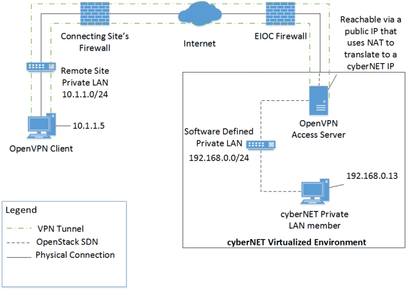

# Introduction

In the digital age, maintaining online privacy and security is of paramount importance. Virtual Private Networks (VPNs) and decentralized VPNs (dVPNs) play a crucial role in safeguarding your online activities and data. This wiki page explores the key differences between traditional VPNs and emerging dVPNs, security considerations when selecting a VPN, and a list of VPN services that accept the privacy-centric cryptocurrency, Zcash.

# VPN vs. dVPN: What's the Difference?

__Virtual Private Networks (VPNs)__: Traditional VPNs create a secure, encrypted tunnel between your device and a remote server controlled by the VPN provider. This tunnel conceals your online activities from prying eyes, such as hackers, ISPs, or government agencies. VPNs are widely used for purposes like anonymous browsing, accessing geo-restricted content, and protecting against cyber threats.

__Decentralized VPNs (dVPNs)__: In contrast, dVPNs leverage blockchain and peer-to-peer technology to create a decentralized network of nodes. Users' traffic is routed through these nodes, making it difficult for any single entity to monitor or control the entire network. dVPNs are typically more resistant to censorship, as there is no centralized authority overseeing the network. They are well-suited for users seeking enhanced privacy and security.

# Security Considerations When Selecting a VPN

When choosing a VPN service, it's important to consider the following security factors:

1. __Encryption__: Ensure the VPN uses strong encryption protocols like OpenVPN or WireGuard to protect your data from interception.

2. __No-Logs Policy__: Look for providers that have a strict no-logs policy, meaning they do not retain records of your online activities.

3. __Server Locations__: Consider the geographic distribution of server locations to access content from different regions and minimize latency.

4. __Kill Switch__: A kill switch will disconnect your internet if the VPN connection drops, preventing your data from being exposed.

5. __Privacy and Jurisdiction__: Research the VPN provider's privacy practices and its jurisdiction, as different countries have varying data retention laws.

6. __Leak Protection__: Ensure the VPN prevents DNS and WebRTC leaks to maintain your anonymity.

7. __Price and Features__: Evaluate the cost and features offered by different providers to find one that matches your needs and budget.

# VPNs that Accept Zcash

Zcash (ZEC) is a cryptocurrency designed for enhanced privacy, making it a favored choice for individuals seeking anonymity in their financial transactions. While not all VPN services accept Zcash directly, some may accept cryptocurrency payments through intermediary services. However, it's essential to check with the VPN provider directly for the most up-to-date payment options. Here are a few VPN services known to accept cryptocurrency payments:

1. [__Mullvad VPN__](https://mullvad.net/en)
   
   Mullvad VPN is a highly regarded VPN service known for its strong commitment to user privacy and security. It is one of the few VPN providers that accepts cryptocurrency, including 
   Zcash, as a payment method. Mullvad's core features include:

   __No-Logs Policy__: Mullvad follows a strict no-logs policy, meaning it does not store any data related to your online activities.

   __Strong Encryption__: The service employs robust encryption protocols, including WireGuard, to protect your data.

   __Multi-Hop VPN__: Mullvad offers the option for multi-hop connections, which route your traffic through multiple servers to enhance privacy and security.

   __Bridge Mode__: It has a bridge mode that can help bypass certain censorship measures.

   __Anonymous Account Creation__: Users are assigned a randomly generated account number, eliminating the need for personal information during signup.

   __Zcash Payment__: Mullvad accepts Zcash as a payment option, allowing users to pay for their subscription with enhanced privacy.Mullvad VPN.

3. [__Nym VPN (dVPN)__](https://nymtech.net/)
   
   Nym VPN is a decentralized VPN (dVPN) that focuses on enhancing user privacy and security through a privacy-centric network. Nym VPN operates differently from traditional VPNs by 
   utilizing a mixnet, where user traffic is routed through a network of nodes. Key features of Nym VPN include:

   __Decentralization__: Nym VPN is decentralized and open-source, reducing the risk of central control and censorship.

   __Privacy Mixnet__: The service routes user traffic through a mixnet, making it challenging for any single entity to monitor or analyze network traffic.

   __Node Operation__: Users can operate nodes to contribute to the network and earn rewards, further decentralizing the infrastructure.

   __Strong Privacy__: Nym VPN is designed with privacy in mind, and it does not require users to provide personal information during account creation.

## Other VPN's supporting zcash payment:-

 3. [__ExpressVPN__](https://www.expressvpn.com/)
 4. [__NordVPN__](https://nordvpn.com/)
 5. [__CyberGhost__](https://www.cyberghostvpn.com/en_US/)
 6. [__Private Internet Access (PIA)__](https://www.privateinternetaccess.com/)

Keep in mind that the availability of cryptocurrency payment options may change, so it's advisable to check the VPN provider's website or contact their customer support for the most current information on accepted payment methods, including Zcash.

