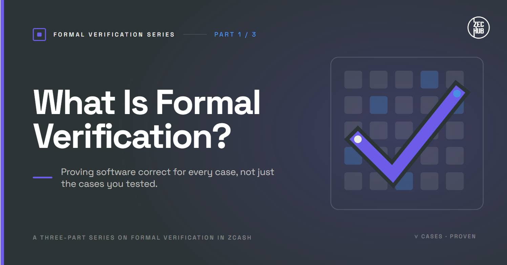
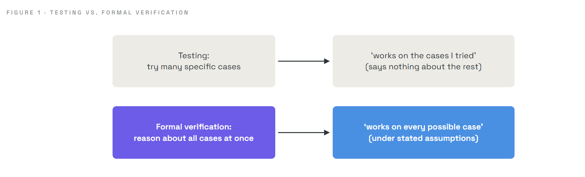
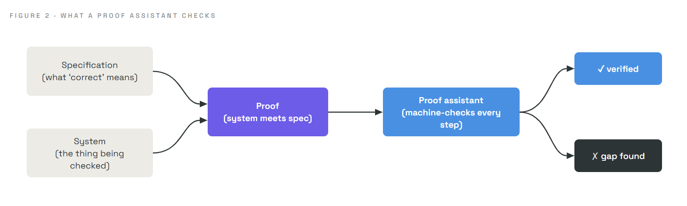
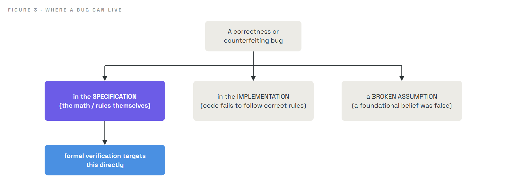
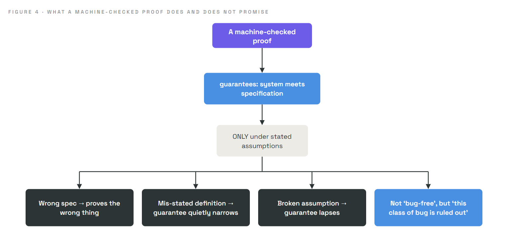

# What Is Formal Verification?

### How you prove a program is correct, instead of just hoping it is

> **Series:** *Formal Verification Series* · **Part 1 of 3**
> **Audience:** complete newcomers. No mathematics, programming, or cryptography background assumed.
> **What you'll leave with:** a clear understanding of what it means to *prove* software correct, why that is fundamentally different from testing it, what a machine-checked proof is, and the precise (and honest) limits of what such a proof can promise.

Most software is trusted because it has been *tested*: we run it on many inputs and watch it behave. Formal verification asks a bolder question. Can we *prove*, with mathematical certainty, that a system does what it should for **every** possible input, including the ones no one ever thought to try? This article builds that idea from the ground up. Intuition first, no symbols until they are earned.

---

## 1. Why should you care?

Here is a true story, and it is the reason this series exists.

In 2022, the privacy-focused cryptocurrency Zcash launched a new shielded pool named Orchard, letting people transact with the amounts hidden. For four years it worked flawlessly and passed repeated professional audits. Then, in May 2026, a security researcher reasoning carefully about the underlying mathematics (with help from AI tooling) found a single **under-constrained** spot in the system's math. That one gap could have let an attacker create an *unlimited* amount of counterfeit money, and because the amounts were hidden, nobody would have seen it happen. The flaw had been present the entire time.

It was not caught by testing. Every test had passed for four years. It was caught by someone *reasoning about the math*. And when the team fixed it, they did not simply patch and move on. They wrote a **machine-checked mathematical proof**, over 2,700 individual theorems, that the replacement could not contain that class of flaw at all.

That is formal verification, and this is what it buys you: not "we tried a lot of cases and they worked," but "we proved it holds for every case." For systems where one missed case is catastrophic (money, aircraft, medical devices, cryptography), that difference is everything.

The blind spot in testing was named decades ago by computer scientist Edsger Dijkstra, and it is still true:

> **Testing can show the *presence* of bugs, but never their *absence*.**

If a test passes, you have learned that the system works *on that input*. You have learned nothing about the inputs you did not try, and the dangerous bugs are almost always in the cases nobody tried.

---

## 2. The intuition: checking doors vs. proving the building

Imagine you are responsible for a building with a thousand doors, and your job is to guarantee every door is locked at night.

- **The testing approach:** walk around and try a sample of doors. Try fifty, a hundred, five hundred. Every one you try is locked, so your confidence grows. But you have not tried them all, and the one unlocked door might be one you skipped.
- **The formal-verification approach:** examine the *locking system itself* and prove, from its design, that pressing the "lock" button necessarily engages every door. Now you do not need to try individual doors at all. You have shown that *no possible door can be left unlocked*, because the mechanism makes it impossible.

The difference is between **sampling reality** and **proving a property of the design**. Testing samples. Formal verification proves. That is the whole idea, and everything else is machinery for doing it rigorously.

---

## 3. The three pillars of any formal verification

Every formal verification, no matter how advanced, is built from exactly three ingredients. Hold these clearly and the rest is detail.

| Pillar | Plain meaning | Building analogy |
|---|---|---|
| **Specification** | A precise statement of what "correct" *means* | "Every door must be locked at night" |
| **System** | The actual thing being checked (a program, a circuit, a protocol) | The building and its locking mechanism |
| **Proof** | A rigorous argument that the system always meets the specification | The logical demonstration that pressing "lock" locks all doors |

And a fourth, quieter ingredient makes the whole thing trustworthy:

- **A machine checker.** The proof is not written by a human and merely eyeballed. It is fed to a program (a **proof assistant**, also called a **theorem prover**) that checks *every single logical step*. A human can wave their hands or make a subtle error; the machine will not accept a step that does not strictly follow. This is why we say the result is **machine-checked**.

Proof assistants you may hear named include **Lean**, **Rocq** (formerly Coq), and **Isabelle**. They are, in effect, extraordinarily strict logic-checking engines. The Zcash proof in our opening story was written in **Lean**. Notably, modern AI models are increasingly used to help *write* these proofs, with humans guiding them, which has shortened efforts that once took years down to weeks. The machine still checks every step, so the speed-up does not cost any certainty.

---

## 4. What a proof actually is

The word "proof" can feel intimidating, so let's demystify it with a concrete, checkable example. No cryptography, just school arithmetic.

**Claim:** for every whole number `n`, the sum `0 + 1 + 2 + ... + n` equals `n(n+1)/2`.

You could *test* this. `n = 5` gives `0+1+2+3+4+5 = 15`, and `5 × 6 / 2 = 15`. ✓ It matches. Try `n = 10`: the sum is `55`, and the formula gives `10 × 11 / 2 = 55`. ✓ (These are computed and confirmed; the claim in fact holds for every `n` from 0 to 999 when checked directly.)

But testing values, even a thousand of them, never reaches "for **every** whole number." There are infinitely many. A **proof** closes that infinite gap in a finite argument, using a technique called **induction**:

1. **Base case:** for `n = 0`, the sum is just `0`, and the formula gives `0 × 1 / 2 = 0`. They agree. ✓
2. **Inductive step:** *assume* the formula holds for some number `k`. Now add the next number, `k+1`. The sum up to `k+1` is `(sum up to k) + (k+1) = k(k+1)/2 + (k+1)`. A line of algebra rearranges this to `(k+1)(k+2)/2`, which is exactly the formula with `k+1` in place of `k`. ✓

Since it holds at the start (0) and each step carries it to the next number, it holds for **all** whole numbers, forever, in one finite argument. That is a proof. A proof assistant does exactly this reasoning, but mechanically verifies that every step, including the "line of algebra," genuinely follows from what came before.

> The leap worth absorbing: a proof turns "infinitely many cases" into a **finite, checkable argument**. That is the superpower testing structurally lacks.

---

## 5. Where bugs actually live

Formal verification is powerful partly because of a clarifying insight about *where* bugs come from in the first place. Any flaw in a rule-checking system traces to one of three places:

| Source of a bug | What it means | Can we prove it away? |
|---|---|---|
| **The specification** | The math or rules themselves are wrong (a missing condition, a bad definition) | **Yes**, directly, this is formal verification's home turf |
| **The implementation** | The code fails to faithfully carry out a correct specification | Partly; often such failures leave detectable evidence |
| **A broken assumption** | Something the whole system relies on turns out to be false | No; assumptions are the irreducible foundation |

This taxonomy matters more than it looks, and Parts 2 and 3 turn on it. The deepest, most dangerous bugs, the ones that can hide forever, tend to live in the **specification**: the mathematical description of what the system is supposed to do. And the specification is exactly what a machine-checked proof can examine directly, all cases at once. That is why serious formal-verification efforts aim there first.

---

## 6. The most important caveat in the whole field

Formal verification is powerful, but its promise is precise, and misunderstanding it leads people astray. So state it carefully:

> **A proof guarantees that the *system* meets the *specification*, under stated *assumptions*. Nothing more.**

Four consequences follow, and each one matters:

- **If the specification is wrong, the proof is worthless.** If you prove "every door locks" but the real requirement was "every *window* locks," you have proven the wrong thing, perfectly. Verification checks that you built *what you specified*, not that you specified the right thing.
- **If a definition is subtly mis-stated, the guarantee quietly narrows.** A proof about a slightly-wrong definition of "balance" might establish less than you think while still passing every check. This is why the definitions at the heart of a verification must be short, standard, and openly reviewable by humans.
- **If the assumptions fail, the guarantee lapses.** Proofs rest on assumptions ("the lock hardware is not physically broken"). If an assumption is false in reality, the conclusion need not hold.
- **It does not mean "no bugs ever."** It means "no bugs of the kind ruled out by this specification, given these assumptions." A narrower, more honest, and far more useful claim.

Far from weakening formal verification, this precision is its strength. It tells you *exactly* what you are getting. As we will see in Part 3, the Zcash team stating their scope and assumptions plainly ("we proved supply soundness, under these named assumptions, and not privacy") is a model of that honesty.

---

## 7. An honest disclaimer

To keep this readable we simplified. Real specifications are written in precise formal languages, not English sentences; there are several *styles* of formal verification (interactive theorem proving, model checking, SMT-based methods) suited to different problems; and writing these proofs remains skilled, effortful work even with AI assistance. We also skipped how a proof assistant represents logic internally. None of this changes the core: a specification, a system, and a machine-checked proof that the two agree, under stated assumptions. The detail returns as we need it.

---

## 8. Summary

- **Testing** samples specific inputs and can show a bug is present, never that bugs are absent. The dangerous bugs hide in the cases nobody samples.
- **Formal verification** proves a property holds for **every** possible case, in a finite, checkable argument.
- Every verification has three pillars: a **specification** (what correct means), a **system** (the thing checked), and a **proof** that they agree, plus a **proof assistant** (like **Lean**) that machine-checks every step.
- A **proof** (for example, by **induction**) collapses infinitely many cases into one finite argument.
- Bugs live in the **specification**, the **implementation**, or a **broken assumption**. Formal verification targets the specification directly, which is where the deepest, most hidden bugs tend to live.
- The guarantee is precise: the system meets **the specification**, under **stated assumptions**. A wrong spec, a mis-stated definition, or a broken assumption voids it, and it never means "no bugs ever."

---

## Glossary

| Term | Plain-English meaning |
|---|---|
| **Formal verification** | Proving, mathematically, that a system meets a specification for all cases |
| **Specification** | A precise statement of what "correct behaviour" means |
| **System** | The actual program, circuit, or protocol being checked |
| **Proof** | A finite chain of logical steps establishing a claim for all cases |
| **Proof assistant / theorem prover** | Software (Lean, Rocq, Isabelle) that checks every step of a proof |
| **Machine-checked** | Verified step-by-step by a computer, not just by human reading |
| **Induction** | A proof technique: true at the start, and each step carries it to the next |
| **Assumption** | A condition the proof relies on; if false, the guarantee may not hold |

---

## FAQ

**Does formal verification replace testing?**
No. They complement each other. Testing catches practical issues and mistaken assumptions cheaply; verification rules out entire classes of bug that testing might never sample.

**If it is so powerful, why isn't everything formally verified?**
It is expensive and demands specialist skill, though AI assistance is lowering that cost. It is reserved for systems where a rare bug would be catastrophic, which is exactly where its cost pays off.

**Can a formally verified system still fail?**
Yes, if the specification was wrong, a definition was mis-stated, an assumption did not hold, or the failure lies outside what was specified. The proof only covers what it claims to cover.

**Is a machine-checked proof more trustworthy than a human one?**
For large, intricate proofs, generally yes. A machine will not overlook a subtle gap or accept a hand-wave, though it still trusts the specification and definitions it was given.

**If AI helps write the proof, why trust it?**
Because the proof assistant checks every step mechanically. The AI proposes steps; the machine verifies them. A wrong step is simply rejected, so AI speeds the work without weakening the guarantee.

---

### Test your intuition

You prove that a bank's software "never lets an account balance go negative." A year later, money still goes missing. How could both be true at once? *(Answer below.)*

Answer

The proof guaranteed exactly one property: balances never go negative. Money can go missing in ways that property never addressed, for example a bug that moves funds to the wrong (still non-negative) account, or a flaw in a part of the system that was never specified. The verification did precisely what it promised and nothing more. This is the Section 6 caveat in action: a proof covers the specification, not every conceivable notion of "correct."

---

### What's next

**Part 2 · The Orchard Bug:** we turn to the real 2026 story in full. A privacy system hid amounts using cryptographic proofs, and one under-constrained line in its math meant those proofs could be made to lie, allowing unlimited invisible counterfeiting. We will see exactly what "an under-constrained circuit" means, why this class of bug can hide forever, and why it has happened more than once.

*Part of the* Formal Verification *series for [ZecHub](https://zechub.org).*
