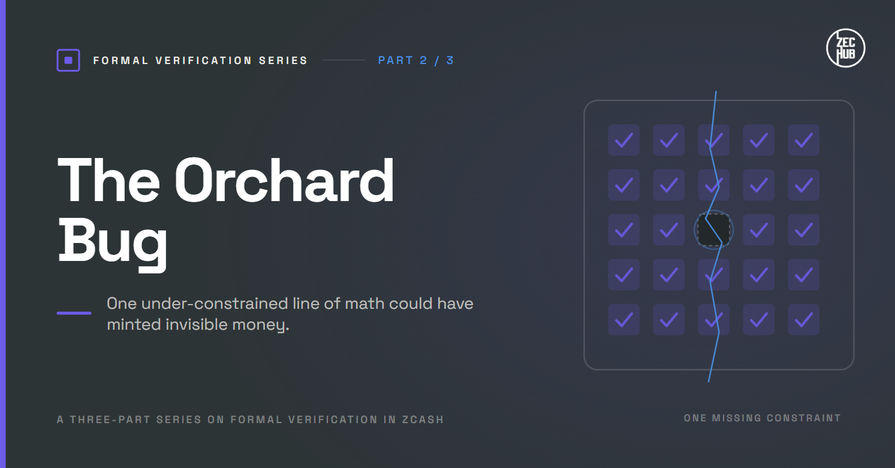
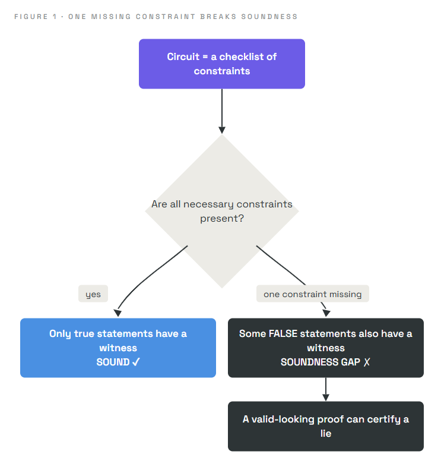
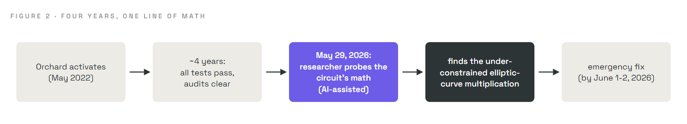

# The Orchard Bug: When a Proof System Has a Hole

### How one under-constrained line of math could have minted unlimited invisible money

> **Series:** *Formal Verification Series* · **Part 2 of 3**
> **Audience:** newcomers. Part 1 introduced formal verification; here we meet the real bug that made it urgent. Everything needed is explained from scratch.
> **What you'll leave with:** an intuitive but accurate picture of how a cryptographic proof system can contain a soundness hole, exactly what the 2026 Zcash "Orchard" bug was, why this class of bug can hide for years, and why it has happened before.

In Part 1 we said testing can show the presence of bugs but never their absence, and that the most dangerous bugs live in a system's *specification*, its underlying math. This article is the case study. In 2026 a flaw was found in Zcash's Orchard shielded pool that could have let an attacker create unlimited counterfeit money invisibly. It had survived four years and repeated audits. Understanding it, and its predecessors, is the clearest possible motivation for proving systems correct.

---

## 1. Why should you care?

Zcash is a cryptocurrency with a private mode. In its shielded pool, the amounts, senders, and receivers of transactions are **hidden**. This privacy is created using **zero-knowledge proofs**: cryptographic proofs that a transaction obeys all the rules, without revealing the transaction's contents.

That design has a double edge. On a transparent ledger like Bitcoin's, if someone conjured coins from nothing, the inflated numbers would be visible to everyone, and the network could catch it and roll it back. In a shielded pool, the numbers are hidden by design. So if the proof system itself had a flaw that let an invalid transaction look valid, the counterfeiting would be **undetectable**. You could not spot it by inspecting the ledger, because the ledger is deliberately opaque.

That is exactly the risk that materialized in Orchard. To understand it, we need to look inside what a zero-knowledge proof is actually checking.

---

## 2. The intuition: a proof is only as good as its checklist

Picture a border officer who must approve travelers without seeing their documents directly. Instead, each traveler fills in a **checklist**, and the officer approves anyone whose checklist is fully ticked. The checklist is designed so that *only a legitimate traveler can tick every box.*

Now suppose the checklist is missing one crucial box, say, "the passport is not expired." Almost everyone still fills it out honestly and nothing seems wrong. But a person with an expired passport can *also* tick every remaining box and sail through. The system looks fine in everyday use. The hole only matters to someone who goes looking for it.

A zero-knowledge proof works like that checklist. It does not reveal the private details; it checks that they satisfy a fixed set of conditions. And if one necessary condition is accidentally left out, then some invalid inputs can *also* pass, while everything continues to look normal.

Let's make "checklist of conditions" precise, because that is exactly where the bug lived.

---

## 3. The math: circuits, constraints, and soundness

Under the hood, the statement "this transaction is valid" is encoded as a **circuit**: a fixed collection of arithmetic conditions, called **constraints**, written as equations over numbers. To make a valid proof, the prover must supply secret values (the **witness**) that satisfy *every* constraint. The proof convinces a verifier that such a witness exists, without revealing it.

The property we need from this system has a name:

> **Soundness:** it must be impossible to produce a valid proof for a *false* statement. Only true statements should have witnesses that satisfy all the constraints.

Soundness is the anti-counterfeiting guarantee. If soundness holds, a valid proof genuinely means "a real, rule-obeying transaction happened." If soundness has a gap, a valid proof might mean nothing at all.

### What a missing constraint does (a verified example)

Constraints often need to force a value to be simple. A common example: force a value `b` to be a single **bit**, either `0` or `1`. The standard way to do this is one constraint:

```
b × (b − 1) = 0
```

Why does it work? A product is zero only when one of its factors is zero. So `b × (b − 1) = 0` forces `b = 0` or `b = 1`, and nothing else. Checking every value from 0 to 16 (in arithmetic that wraps around at 17), the *only* values satisfying it are exactly **0 and 1**. ✓

Now imagine that line is **accidentally left out** of the circuit. Suddenly `b` is unconstrained. A dishonest prover can set `b` to `5`, or `9`, or anything at all, and still satisfy the remaining constraints. That single missing line is a **soundness gap**: false statements now have satisfying witnesses.

This is not a hypothetical. A missing boolean constraint of exactly this kind was found in Zcash's very first shielded design, Sprout, during development, and fixed before launch. Under-constraining is one of the most common and dangerous mistakes in building these circuits.



This is the entire shape of the Orchard bug, on a small scale. Now the real thing.

---

## 4. What the Orchard bug actually was

Zcash's shielded proofs are built on **elliptic curves**, mathematical objects whose points can be combined and "multiplied" by numbers, operations the circuit has to enforce with constraints. The circuit contains gadgets that perform **elliptic-curve multiplication** and check that it was done correctly.

According to the disclosure by Shielded Labs and researcher Taylor Hornby, the Orchard flaw was precisely this:

> An **under-constrained element of the Orchard circuit** made it possible to feed **arbitrary false inputs into an elliptic-curve multiplication and still have the multiplication check pass.**

In plain terms, the circuit's checklist was missing the boxes that should have pinned down that multiplication. Because of the gap, a sufficiently expert attacker could construct a transaction proof that the system would accept even though the transaction created value from nothing. That is **counterfeiting**, and because amounts in the shielded pool are hidden, it would have been **undetectable** from the ledger. The Tachyon team later described the same flaw at the code level as missing lines in the circuit that quietly scrambled the underlying equations.

The parallels to our checklist story are exact:

| Checklist story | The Orchard bug |
|---|---|
| A missing "passport not expired" box | A missing constraint on an elliptic-curve multiplication |
| An expired-passport traveler passes anyway | Arbitrary false inputs pass the multiplication check |
| Everyone else is unaffected, so nothing looks wrong | Normal transactions worked perfectly, hiding the flaw |
| Only someone hunting for it finds the hole | It took an expert deliberately probing the circuit's math |

To be clear about how serious this was: the researcher, with AI assistance, wrote a *complete working exploit* and confirmed in a local test network that it produced unlimited, undetectable counterfeit coins. This was a real and exploitable flaw, not a theoretical worry.

---

## 5. Why it hid for four years

The bug lived in Orchard from its activation in **May 2022** until the emergency fix in **June 2026**, through repeated professional audits by some of the world's best cryptographers. How?

Because, as Part 1 warned, **testing samples cases, and this flaw lived in a case nobody sampled.** Ordinary transactions never exercised the missing constraint, so every test passed and every day of normal operation looked flawless. The flaw was reachable only by deliberately constructing an unusual witness aimed squarely at the gap. It was ultimately found not by running tests but by *reasoning about the circuit's mathematics*.

The discovery itself is a sign of where security is heading. In April 2026, Shielded Labs engaged security researcher **Taylor Hornby** specifically to hunt for exactly this kind of flaw. Shortly after a new frontier AI model (Anthropic's Claude Opus 4.8) was released in late May 2026, Hornby used it, together with a custom analysis harness and traditional methods, in a targeted review of the Orchard circuit. On **May 29, 2026**, the review found the vulnerability.

Two sober facts from the disclosure are worth stating plainly:

- The team found **no evidence** the bug was ever exploited, and considers prior exploitation unlikely (it had evaded years of expert scrutiny, and was found through a deliberate white-hat effort). But the very nature of an *undetectable* flaw means the ledger alone cannot fully prove it never happened.
- The discovery caused significant turmoil, including a sharp fall in the asset's price, precisely because the *possibility* of hidden counterfeiting is so serious for money.



---

## 6. This was not the first time

The Orchard bug belongs to a recurring family, and seeing that family is what makes formal verification feel not optional but inevitable. A counterfeiting flaw always traces to one of three sources (the taxonomy from Part 1): the **specification** (the math itself), the **implementation** (code failing to follow correct math), or a **broken assumption**. And crucially:

> A counterfeiting bug is **undetectable** only if it lives in the **specification**. Implementation bugs leave permanent public evidence, because every block records the full contents of every transaction, so replaying history through corrected software would expose any transaction the buggy code wrongly accepted.

Zcash's own history illustrates the pattern:

| Bug (year) | Source | Detectable? |
|---|---|---|
| Zerocash commitment flaw (2016, pre-launch) | Specification (a truncated hash broke a binding property) | Undetectable |
| Trusted-setup soundness flaw (2018) | Specification (a mistake in the underlying zk-SNARK paper) | Undetectable |
| Proving-system query collision (2025) | Specification (a missing check in the proof system) | Detectable |
| Curve-subgroup validation bug (2016) | Implementation (a missing subgroup check) | Detectable |
| **Orchard under-constrained multiplication (2026)** | **Specification (the circuit)** | **Undetectable** |

The through-line is stark: the flaws that could hide forever are the ones in the math. That is precisely the class a machine-checked proof of the specification can eliminate, all cases at once. Testing and auditing sample; only proving the math covers every input.

---

## 7. The response

Zcash's developers moved quickly and in stages:

1. **Emergency remediation (by June 1-2, 2026).** Within days of disclosure, an emergency network upgrade closed the window of vulnerability, adding the missing constraints so the circuit's math was sound again.
2. **A fresh, provable start ("Ironwood," activated July 28, 2026).** Rather than trust a patched version of the old pool indefinitely, the community launched a brand-new shielded pool, Ironwood, based on the corrected circuit but starting clean, and accompanied by a formal, machine-checked proof of correctness.

That second step is where formal verification enters the story, and it is the subject of Part 3. The realization the team acted on is worth previewing, because it ties this whole series together:

> An *undetectable* counterfeiting flaw can only live in the protocol's **specification**. So if you can **prove the specification** rules out counterfeiting, you eliminate the entire class of bug that hid here for four years.

That is exactly the pillar-one idea from Part 1: verify the specification, and you close the gap that testing never could.

---

## 8. An honest disclaimer

We simplified deliberately. The real circuit involves hundreds of regions and many thousands of constraints, and the actual flaw is more technically intricate than a single missing bit-check; we used the bit-check because it shows the *shape* of an under-constrained circuit exactly, and because that exact mistake is real in Zcash's history. The precise Orchard flaw was an under-constrained elliptic-curve multiplication, as stated in the official disclosure. We also compressed the disclosure and remediation timeline. For the authoritative technical account, consult the Shielded Labs disclosure and the Project Tachyon writeups.

---

## 9. Summary

- Zcash's shielded pool hides amounts using **zero-knowledge proofs**, so a flaw in those proofs could enable **invisible counterfeiting**.
- A proof system checks a fixed **circuit** of **constraints**; its crucial property is **soundness**: only true statements should have a satisfying **witness**.
- A **missing constraint** creates a **soundness gap**, letting false statements pass. (Verified toy case: `b(b−1)=0` forces `b` to 0 or 1; drop it and `b` can be anything. This exact class of bug is real in Zcash's history.)
- The **Orchard bug** was an **under-constrained elliptic-curve multiplication**: arbitrary false inputs could pass the multiplication check, enabling unlimited, undetectable counterfeiting. A working exploit was demonstrated in a test network.
- It hid for **four years** (May 2022 to June 2026) because testing samples cases and never sampled it; it was found by reasoning about the math, with AI assistance, on May 29, 2026.
- Undetectable counterfeiting can only live in the **specification**, and Zcash has seen this family of bug before. Zcash responded with an emergency fix and a new, formally verified pool, **Ironwood**, the subject of Part 3.

---

## Glossary

| Term | Plain-English meaning |
|---|---|
| **Shielded pool** | The private mode of Zcash where amounts and parties are hidden |
| **Zero-knowledge proof** | A proof that a hidden statement is valid, revealing nothing else |
| **Circuit** | The fixed set of arithmetic conditions a valid transaction must satisfy |
| **Constraint** | One condition (equation) inside the circuit |
| **Witness** | The secret values that satisfy the constraints |
| **Soundness** | The guarantee that only true statements can produce a valid proof |
| **Soundness gap** | A missing constraint that lets false statements pass |
| **Under-constrained** | A circuit missing a condition it needed, the root of the Orchard bug |
| **Detectable / undetectable** | Whether exploitation would leave evidence in the public ledger |

---

## FAQ

**Was counterfeit Zcash actually created?**
No evidence of exploitation was found, and the team considers it unlikely. But because the flaw would have been undetectable from the ledger, the ledger alone cannot fully prove it never happened, which is why the response was so thorough.

**Why does hiding amounts make a bug worse?**
On a transparent chain, minted coins are visible and can be caught and reversed. When amounts are hidden for privacy, a counterfeiting bug produces no visible anomaly, so it can persist unseen.

**Why didn't years of audits catch it?**
Audits and tests largely examine behaviour on realistic cases. This flaw only surfaced under a deliberately crafted, unusual input aimed at a mathematical edge case, which routine review did not exercise. It was found by targeted reasoning about the circuit, not by testing.

**Is a missing constraint really all it takes?**
Yes. A proof system is only as strong as its complete set of constraints. One necessary condition left out is enough to let invalid statements through.

**What role did AI play?**
A researcher used a frontier AI model together with a custom harness and traditional methods to review the circuit's math and find the flaw. AI is increasingly used on both sides of security, which is part of why proving systems correct now matters so much.

---

### Test your intuition

Suppose a shielded transaction is supposed to prove "money in equals money out," but the circuit forgets to constrain one output value. What could a dishonest prover do, and why would the public ledger look completely normal? *(Answer below.)*

<details><summary>Answer</summary>

With that output unconstrained, the prover could set it larger than the real inputs allow, creating value from nothing, a counterfeit. The proof would still verify, because the missing constraint is the only thing that would have caught the imbalance. And since the shielded pool hides amounts, the ledger shows only that "a valid transaction occurred," with no visible imbalance to raise an alarm. The forgery is real but invisible, which is exactly why soundness of the circuit matters so much, and exactly why it must be proven rather than tested.
</details>

---

### What's next

**Part 3 · Ironwood:** the fix was not just a patch. Zcash's engineers built a new shielded pool and accompanied it with a machine-checked mathematical proof, over 2,700 theorems written in the Lean proof assistant, that it cannot create counterfeit money under its stated assumptions. We will see what "balance integrity" and "knowledge soundness" mean, exactly what the proof does and does not cover, and how the old pool was safely retired.

*Part of the* Formal Verification  *series for [ZecHub](https://zechub.org).*
