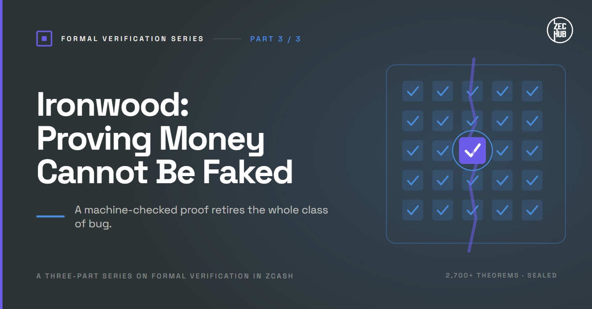
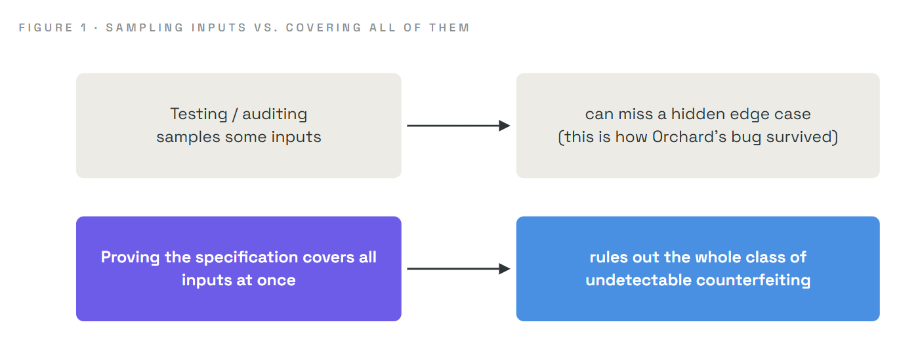
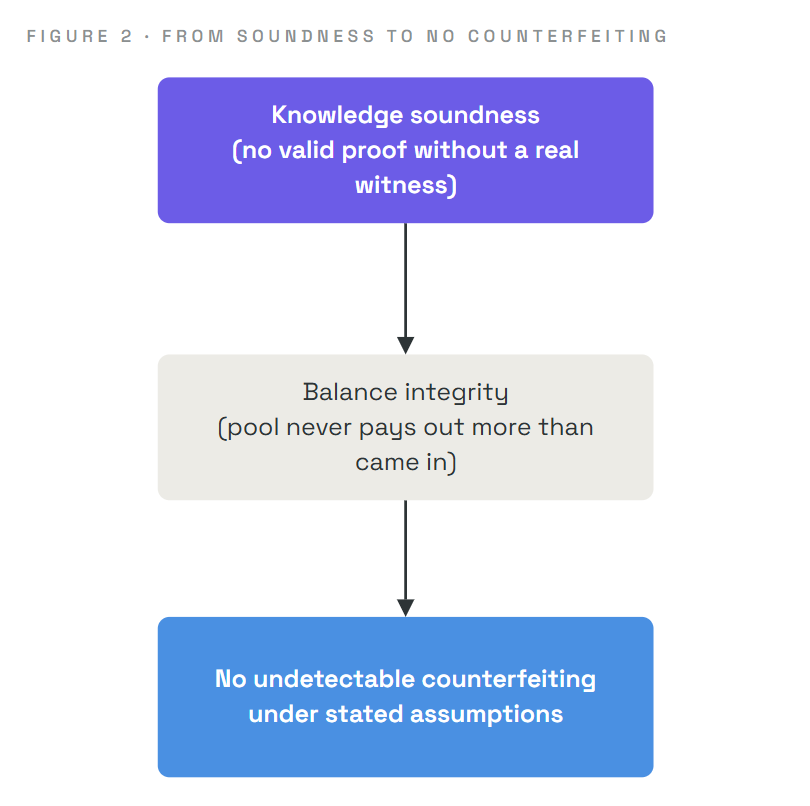
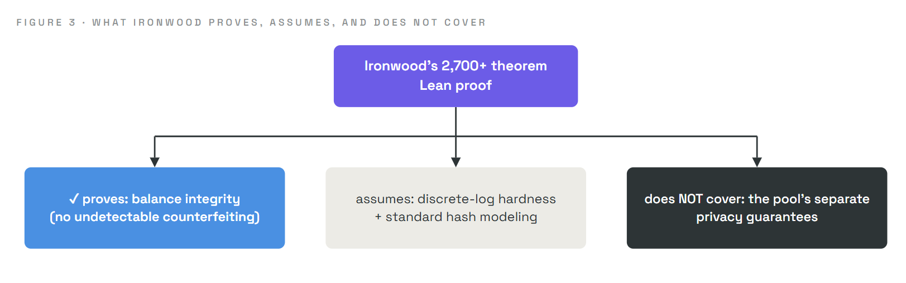
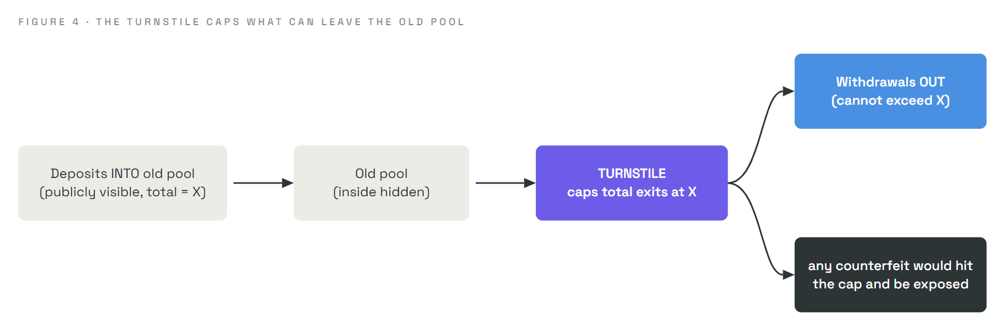

# Ironwood: Proving Money Cannot Be Faked

### How Zcash answered a bug with a machine-checked proof

> **Series:** *Formal Verification* · **Part 3 of 3**
> **Audience:** newcomers. Parts 1 and 2 set up formal verification and the Orchard bug; this finale shows the two ideas meeting in a real system. Everything needed is recalled as we go.
> **What you'll leave with:** an accurate understanding of what Zcash actually proved about its new "Ironwood" pool, how the proof is structured, what it does and does not cover, how the old pool was retired safely, and why this points to a new standard for building cryptographic money.

In Part 1 we learned what it means to *prove* a system correct. In Part 2 we saw a real flaw that testing missed for four years, an under-constrained elliptic-curve multiplication that could have allowed unlimited invisible counterfeiting. This article is the resolution: how Zcash responded not merely with a patch, but with a machine-checked proof that the entire class of bug is gone.

---

## 1. Why should you care?

When a bug threatens money, the usual response is to patch it and move on. Zcash did something more ambitious. Alongside a new shielded pool called **Ironwood**, activated on July 28, 2026, its engineers published a **machine-checked mathematical proof**, over **2,700 theorems** written in the **Lean** proof assistant, establishing that the new pool cannot create counterfeit coins under its stated assumptions. The proof is public, in the open-source `ironwood` repository, and took three teams of researchers and cryptographers well over a month to complete.

This matters beyond Zcash. It is one of the clearest real-world demonstrations that you can take a live financial system, write down precisely what "no counterfeiting" means, and *prove* it, rather than hope your tests were thorough. It turns a promise into a theorem.

---

## 2. The core idea: prove the specification, kill the class of bug

Part 2 ended on the insight that made this possible. Recall it, because everything here rests on it:

> An *undetectable* counterfeiting bug can only live in the protocol's **specification**, the mathematical description of what the circuit must enforce. Anything detectable would show up in the public accounting. So proving the specification sound eliminates the entire class of hidden-counterfeiting bug at once.

Why "only in the specification"? Because every block permanently records the full contents of every transaction, including its proofs. If the *software* wrongly accepted a bad transaction, anyone could replay history through corrected software and see it. That evidence is permanent and public. Only a flaw in the underlying *math* can hide forever, because there is no "correct version" to replay against. That is the flaw formal verification is aimed at.

Testing checks *behaviour on sampled inputs*, and the Orchard bug hid precisely because no sampled input hit it. A proof about the specification covers **all** inputs simultaneously, including the edge cases nobody would think to try. That is the only kind of guarantee strong enough to retire a four-year-old invisible flaw with confidence.

---

## 3. What exactly was proven

The proof establishes a single headline property, built from a deeper one underneath it.

### Balance integrity (the headline)

> **Balance integrity:** the hidden value stored in the shielded pool never exceeds the net public value that has flowed into it.

This is the anti-counterfeiting property in plain form. Money can enter the shielded pool (publicly visible) and leave it (publicly visible), but inside, where amounts are hidden, no value can be conjured. Let's make it concrete with a tiny ledger (verified arithmetic):

- **Honest transaction:** inputs worth `5 + 3 = 8` produce outputs worth `4 + 4 = 8`. Value in equals value out. Balance integrity holds. ✓
- **A counterfeit attempt:** the same inputs worth `8`, but outputs of `4 + 4 + 2 = 10`. That would mint `2` units from nothing. Balance integrity **forbids** this: the pool may never pay out more than entered it. ✗

Balance integrity is the mathematical statement that the second scenario can never produce a valid transaction.

### Knowledge soundness (the engine underneath)

To guarantee balance integrity, the researchers first had to prove a deeper and subtler property about the zero-knowledge proof system itself. Ordinary soundness (Part 2's "only true statements have a witness") turns out to be *not enough* for a shielded pool, for a fascinating reason: because a hidden transaction can contain anything, almost every statement technically *has* some witness. So the researchers proved a stronger property:

> **Knowledge soundness:** anyone who can produce a valid transaction proof must *actually possess* a valid witness, that is, real coins, correctly derived, at the right address.

The formal tool for this is an **extractor**: a procedure that, given any prover who can convince the verifier, can pull the actual witness out of them. If a witness can always be extracted, then a convincing prover must really have had one. In the language of Part 2, knowledge soundness is the formal promise that there is **no soundness gap**, no missing constraint that would let a false statement slip through. It is the exact property whose *absence* was the Orchard bug. Proving it present, for all possible provers, is what slams that door shut.

---

## 4. How the proof was built

The verification was a serious human effort, not a push-button result:

- Written in the **Lean** proof assistant (from Part 1: a machine that checks every logical step).
- Comprising **more than 2,700 theorems**, publicly available in the `ironwood` repository.
- Produced by **three teams** of researchers and cryptographers over **more than a month**, including work led by Project Tachyon's Tal Derei, with contributions from Gregor Mitscha-Baude of zkSecurity and Daira-Emma Hopwood of the Zcash Open Development Lab, plus an independent parallel soundness proof by other cryptographers.

To reason about the property, the Lean model describes an entire **ledger** as a list of transactions, each carrying its actions, its declared public value, and its signatures. A predicate the researchers call **ValidLedger** transcribes the network's consensus rules directly: every action's witness must satisfy the required conditions, no spend-marker (nullifier) may appear twice, every referenced tree state must be one the system genuinely reached, and every signature must verify. The theorems then quantify over **every** valid ledger. That phrase, "every valid ledger," is the whole point: not a sample, but all of them, a superset of anything a real attacker could ever assemble.

The balance-integrity result is assembled from several ledger-level theorems, each proving one route to counterfeiting is closed: that every spend corresponds to a real earlier output, that total value is conserved, that a received note stays spendable and cannot be stolen, and that spending requires proper authorization. A separate piece, the **binding signature**, ties each transaction's hidden values to the public amount it declares, so hidden and public accounting cannot silently disagree.

---

## 5. Where the math meets the software

A subtle and honest question: the proof is about a mathematical model, but the network runs *Rust code*. How do we know the code matches the model?

The team drew a careful boundary they call the verifier's **fingerprint**. Above the boundary, the Lean proofs reason about the verifier as a precise mathematical object. Below it sits the ordinary Rust implementation. The key argument is the same one from Part 2:

> Any way the real software could deviate from the proven model would be an *implementation* bug, and implementation bugs can only ever produce *detectable* counterfeiting, because every accepted proof is permanently recorded and can be replayed through corrected software.

So the proof handles the undetectable class (the specification), and the permanent public record handles the detectable class (the implementation). Between them, there is no place for an *undetectable* counterfeiting bug to hide. The team also cross-checked, by running the real verifier and confirming it reproduces the fingerprint exactly on captured cases.

---

## 6. The most important caveat: "under stated assumptions"

Part 1 insisted that a proof guarantees the system meets the specification *under stated assumptions*, and never means "no bugs ever." Zcash's team was admirably precise about exactly this, and honest educational writing must be too.

The proof reduces the security of Ironwood down to a small set of standard, clearly named assumptions. In particular, its soundness rests on the hardness of the **discrete logarithm problem** on the elliptic curve Ironwood uses (a well-studied assumption, where the best known attack would take on the order of `2^126` operations, far beyond any feasible computation), together with standard modeling assumptions for the hash function. Two boundaries are worth stating plainly:

- **It holds under those cryptographic assumptions.** If a foundational assumption were broken, the guarantee would lapse. This is standard and unavoidable; essentially all deployed cryptography rests on such assumptions.
- **It covers balance integrity, not privacy.** The proof is about supply soundness (no fake money). It does **not** claim to prove the pool's separate privacy guarantees, which are a different property with different arguments.

Far from undermining the achievement, naming these boundaries is what makes it trustworthy. The claim is exact: *under standard cryptographic assumptions, this pool cannot create undetectable counterfeit coins.* That is a theorem, not a hope, and its precise scope is stated openly.

---

## 7. Retiring the old pool safely: the turnstile

Proving the *new* pool sound still leaves a question: what about the *old* Orchard pool, where the flaw lived for four years? You cannot un-hide its past. But you can bound its future.

Zcash introduced a mechanism called the **turnstile**. The rule is simple and powerful:

> Value may only leave the old pool up to the amount that verifiably entered it.

Because money moving into and out of a shielded pool is publicly visible (only the activity *inside* is hidden), the turnstile lets the whole network check that no more comes out than ever went in. If counterfeit coins had been created inside the old pool, they would hit this cap and fail to exit. And as honest funds migrate out and no excess appears, the community gains strong public evidence that the flaw was never exploited. It is the closest thing to auditing a private pool's supply without breaking its privacy, and it brings supply integrity closer to the transparent model of a chain like Bitcoin while preserving Zcash's privacy.

Ironwood itself reuses the *corrected* proof circuit, starts fresh with an empty pool, and adds forward-looking protections (including provisions so funds could remain recoverable if future quantum computers ever threaten today's cryptography). New shielded activity now flows through Ironwood, while the old Orchard pool is restricted to withdrawals.

---

## 8. The bigger picture: high-assurance cryptography

Ironwood is part of a broader shift in how Zcash builds. Its next-generation scaling effort (an architecture called **Tachyon**, built on recursive proofs and a toolkit called **Ragu**) is being developed under a philosophy sometimes called **high-assurance cryptography**: treating machine-checked formal verification not as an afterthought, but as a standard part of shipping novel cryptographic systems.

The logic is compelling. Cutting-edge cryptography is exactly where human intuition is weakest and where a subtle, untested edge case can hide for years, as Orchard showed. Proving the specification is the one technique that scales to "all possible inputs" and closes those gaps by construction. The team has signaled it intends to extend this scrutiny further over time, toward the implementation and beyond. Expect to see this bar adopted more widely, in and beyond Zcash.

---

## 9. An honest disclaimer

We simplified for clarity. The real Lean development is far more detailed than the sketch here, with precise definitions of actions, statements, commitments, nullifiers, and signatures; "balance integrity" and "knowledge soundness" have exact formal definitions we stated only in words; the reduction to discrete-log hardness passes through several intermediate models (an algebraic model of the prover and a random-oracle model of the hash) that we compressed into "standard assumptions"; and we described the fingerprint and turnstile at a conceptual level. None of this changes the essential story: a specification of "no counterfeiting," a machine-checked proof over all valid ledgers, an explicit and honest statement of scope and assumptions, and a safe retirement of the flawed pool. For the authoritative account, consult Project Tachyon's published verification writeups and the `ironwood` proof repository.

---

## 10. Summary

- Zcash answered the Orchard bug not just with a patch but with a **machine-checked proof** (over **2,700 theorems** in **Lean**, publicly available) for its new **Ironwood** pool.
- The proof establishes **balance integrity** (the pool never pays out more than publicly entered it), built on **knowledge soundness** (a valid proof requires the prover to actually hold a genuine witness, verified via an **extractor**). Knowledge soundness is exactly the property whose gap was the Orchard bug.
- It reasons about **every valid ledger**, not sampled cases, which is what closes the class of hidden-counterfeiting bug that testing missed.
- The math-to-software gap is handled by a **fingerprint** boundary: undetectable bugs are ruled out by the proof, and any implementation deviation would be **detectable** in the permanent public record.
- The guarantee is stated precisely: it holds under **discrete-log hardness and standard hash assumptions**, and it covers **counterfeiting, not privacy**. This honesty is a feature, not a weakness.
- The **turnstile** safely retires the old pool by capping its exits at its verifiable deposits, exposing any counterfeit and building public evidence of supply integrity.
- Ironwood reflects a move toward **high-assurance cryptography**, where formal verification is a standard part of building novel cryptographic money.

---

## Glossary

| Term | Plain-English meaning |
|---|---|
| **Ironwood** | Zcash's new shielded pool (2026), replacing the flawed Orchard pool |
| **Balance integrity** | The pool never pays out more value than publicly entered it |
| **Knowledge soundness** | A valid proof requires the prover to hold a genuine witness |
| **Extractor** | A procedure that pulls the witness out of any convincing prover |
| **Lean** | The proof assistant used to machine-check the verification |
| **ValidLedger** | The formal model of consensus rules the theorems reason over |
| **Fingerprint** | The boundary between the proven math and the running Rust software |
| **Under stated assumptions** | The proof holds provided named cryptographic assumptions hold |
| **Turnstile** | A rule capping a pool's exits at its verifiable deposits |
| **High-assurance cryptography** | Building crypto with formal verification as a standard step |

---

## FAQ

**Does the proof mean Ironwood is bug-free?**
No, and it does not claim to be. It proves one precise property, balance integrity, under stated assumptions. That rules out undetectable counterfeiting, not every conceivable bug.

**Does the proof guarantee my transactions are private?**
No. The verification covers supply soundness (no fake money), not the pool's separate privacy guarantees. Those are argued differently.

**Why trust a proof written by humans (and AI)?**
Because it is machine-checked. The Lean proof assistant verifies every step mechanically, so trust rests on the specification and the named assumptions, not on any human's or AI's care in each step.

**What happens to coins still in the old Orchard pool?**
They can be withdrawn, but only up to the amount that verifiably entered, enforced by the turnstile. This both protects supply integrity and helps demonstrate the old flaw was never exploited.

**Is this the end of the story?**
It is a milestone, not a finish line. Zcash's future architecture (Tachyon, with the Ragu toolkit) is being built with formal verification as a standard practice, extending this approach further.

---

### Test your intuition

Someone claims: "Since Ironwood is formally verified, it is now impossible for anything to ever go wrong with Zcash." Using ideas from all three parts, give two distinct reasons that claim is too strong. *(Answer below.)*

Answer

First, the proof covers a *specific* property (balance integrity) under *stated assumptions* (discrete-log hardness and standard hash modeling). If a cryptographic assumption were broken, or if a problem arose outside what was specified (for example in privacy, in wallet software, or in some unproven component), the proof says nothing about it. Second, formal verification guarantees the system meets *the specification that was written*; if that specification itself failed to capture some real requirement, the proof would faithfully certify the wrong thing. Both points are the Part 1 caveat restated: a proof is exact and bounded, powerful precisely because its scope is honest, not a blanket guarantee that nothing can ever go wrong.

---

### The series, complete

Across three parts we moved from a general idea to a live application: what it means to **prove** software correct rather than test it (Part 1), how a real under-constrained circuit could have minted invisible money (Part 2), and how a machine-checked proof of **balance integrity** retired that class of bug for good (Part 3). The through-line is a single, honest promise: not "no bugs ever," but "this precise property holds for every case, under stated assumptions." For money that hides its own amounts, that promise is exactly the one worth proving.

*Part of the* Formal Verification  *series for [ZecHub](https://zechub.org).*
