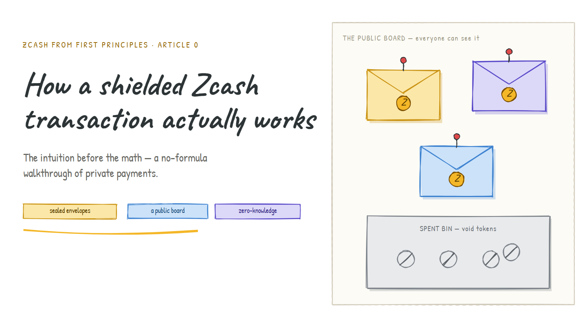
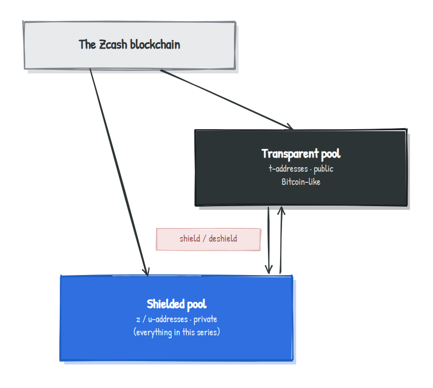
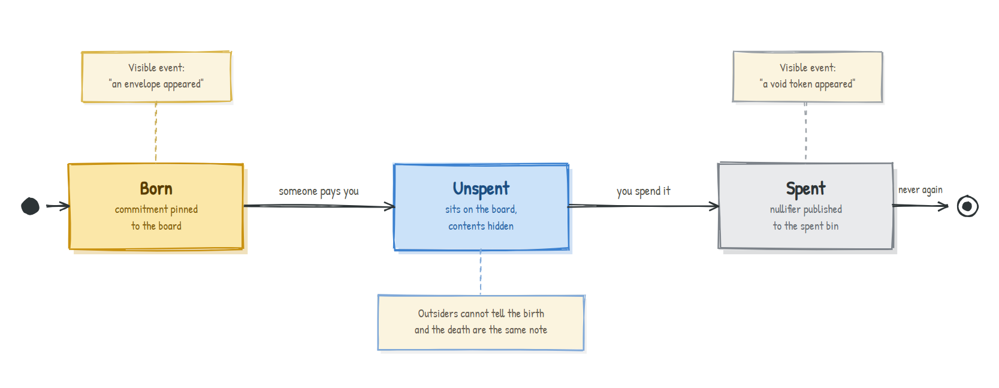
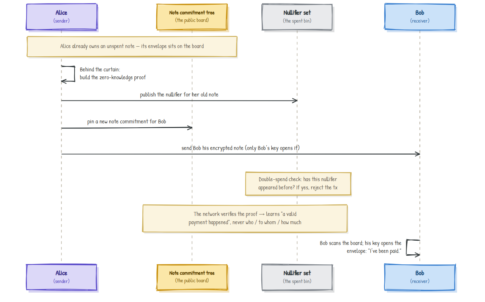
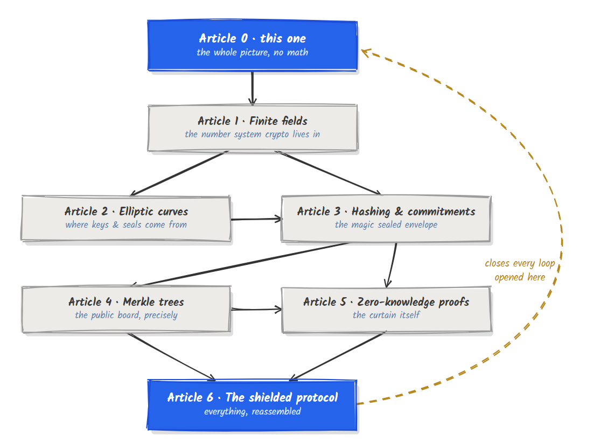

# How a Shielded Zcash Transaction Actually Works

### The intuition before the math: a no-formula walkthrough of private payments

> **Series:** *Zcash from First Principles* . **Article 0 . The Anchor**
> **Audience:** complete newcomers. No cryptography, no blockchain background, and no mathematics assumed.
> **What you'll leave with:** a correct mental model of how Zcash hides *who paid whom, and how much*, while still letting the whole world verify that no money was forged or spent twice.

Every later article in this series zooms into one piece of the machine you're about to meet. So if a word here feels hand-wavy, *good*. That's a promise that we'll come back and earn it properly.

---

## 1. Why should you care?

Imagine your bank statement were nailed to a wall in the town square. Forever. Anyone (your landlord, your employer, a stranger, a future employer, a government) could read every rent payment, every medical bill, every donation, every coffee, and trace exactly who you sent money to and who sent money to you.

That is not a dystopian hypothetical. **That is roughly how Bitcoin works.**

Bitcoin is often called "anonymous," but it isn't. It's *pseudonymous*: your name isn't on the ledger, but every transaction, amount, and link between addresses is public and permanent. The entire field of "chain analysis" exists to peel back that thin pseudonym and tie addresses to real people. Once one of your addresses is linked to you, your financial history unspools.

Zcash was built to answer a deceptively hard question:

> **Can we have money that is completely private, hiding sender, receiver, and amount, while still letting anyone verify that the rules were followed?**

Those two goals fight each other. A public ledger is verifiable *because* everyone can see it. Privacy means nobody can see it. So how can the public verify something it isn't allowed to look at?

Resolving that paradox is the entire story of this series. Let's begin.

---

## 2. There are two worlds inside Zcash

Before anything else, clear up a common misconception: **Zcash is not "the private coin." It's a coin that offers privacy as an option.** It actually started life as a fork of Bitcoin, and it carries two parallel systems on the same blockchain.

| | **Transparent world** | **Shielded world** |
|---|---|---|
| Privacy | Public, just like Bitcoin | Private |
| Addresses start with | `t...` | `z...` or `u...` |
| Sender / receiver / amount | **Visible** to everyone | **Hidden** from everyone |
| Underlying tech | Bitcoin-style public ledger | Cryptographic commitments + zero-knowledge proofs |

Money can even cross the border between them: moving funds *into* the shielded world is called *shielding*, and moving them back out is *deshielding*.

The transparent world is "Bitcoin you already roughly understand." It's the **shielded world** that contains all the beautiful cryptography, and that's the only world this series cares about.

---

## 3. The intuition: sealed envelopes on a public board

Here's the single mental picture to carry through the rest of the article. We'll return to it constantly.

Picture one enormous **public bulletin board** that everyone on Earth can see at all times.

🟦 **Receiving money** means someone pins a **sealed, opaque envelope** to the board. Inside the envelope is *how much money it holds* and *a secret that only the recipient can read*, because the envelope is locked to that recipient's personal key. The whole world sees that *an envelope appeared*. Nobody but the owner can see what's inside.

🟦 **The board only ever grows.** Envelopes are never torn down or erased. New ones are pinned on top, forever.

🟦 **Spending money** means stepping behind a curtain, proving *"I own one of the unspent envelopes on this board, and I'm allowed to open it"*, then dropping a unique **void token** into a public "spent" bin and pinning **new envelopes** for whoever you're paying.

That little ritual (pin a void token, pin new envelopes, all from behind a curtain) *is* a Zcash payment. Everything else is detail.

Now let's give those props their real names.

---

## 4. The five nouns

These five terms are the entire vocabulary of shielded Zcash. Learn them as a *story*, not as a glossary, and they'll stick.

| In the story | Real Zcash term | What it actually is |
|---|---|---|
| The envelope's contents (amount + owner + a secret) | **Note** | The private "coin": a chunk of value belonging to someone |
| The sealed, opaque envelope on the board | **Note commitment** | A cryptographic seal proving an envelope exists while hiding what's inside |
| The bulletin board itself | **Note commitment tree** | An append-only record of *every note ever created* |
| The void token in the "spent" bin | **Nullifier** | A unique marker meaning "this note has now been spent" |
| The "behind the curtain" magic | **Zero-knowledge proof** | A proof that the whole spend is valid, revealing none of it |

If you remember nothing else from this article, remember this table. Everything that follows is just *why* each piece has to be shaped the way it is.

---

## 5. Why each piece is shaped the way it is

This is the part most explainers skip, and it's exactly the part that separates "I memorized some words" from "I understand the design." Each of the five pieces exists to solve **one specific problem.**

### The note commitment: hide the contents, but make forgery impossible

An ordinary envelope can be steamed open. A cryptographic **note commitment** cannot. Think of it as a *magically* sealed, fully opaque envelope with two superpowers:

- **Hiding**: looking at the sealed envelope tells you *nothing* about the amount or owner inside.
- **Binding**: once it's sealed, the contents can't be swapped. You can't later claim the envelope held a different amount.

How can a seal do both at once? That's a real and answerable question. It's the subject of **Article 3 (commitments)**. For now, accept the envelope as magic and keep moving.

### The nullifier: the genuinely clever bit

When you spend a note, you publish its **nullifier**, the "void token." This token is computed from *the note itself* **and** *your secret key*. That recipe buys three properties simultaneously, and each one matters:

1. **Only the owner can create it.** You need the secret key to compute it, so nobody can spend your notes for you.
2. **It's always the *same* token for a given note.** Try to spend the same note twice and you'd produce the *identical* void token both times, and the public "spent" bin already contains it. Double-spend rejected. 
3. **Nobody can trace it back to its envelope.** The void token looks completely unrelated to the envelope it came from.

That third property is the **heart of Zcash privacy**, and it deserves its own section below.

### The zero-knowledge proof: the curtain itself

Everything happens behind a curtain, and what you hand the world afterward is a **zero-knowledge proof**, a kind of unforgeable certificate. It silently attests to all of this at once:

- *the envelope I'm spending really is pinned to the board* (it's a real, existing note),
- *I'm genuinely allowed to open it* (I hold the right key),
- *my void token is computed correctly* (no cheating the double-spend check),
- *my new envelopes hold exactly as much money as the old one*: **no money created from nothing.**

The miracle is that the proof reveals **none** of those facts. Not the amount, not the addresses, not which envelope. It only convinces you that *every statement above is true*. How that's even possible is **Article 5 (zero-knowledge proofs)**, the crescendo of the series.

---

## 6. The life of a single note

A note is *born*, it *lives* on the board, and eventually it *dies*, and crucially, its birth and its death look unrelated to anyone watching.

---

## 7. A payment, end to end

Let's watch Alice pay Bob, with every public and private step labelled.

Notice the asymmetry that makes the privacy work:

- **Alice's old note** dies via a *nullifier* in the spent bin.
- **Bob's new note** is born via a fresh *commitment* on the board.
- To everyone watching, these two events have **no visible connection.** The money's trail goes cold.

> **How does Bob even know he was paid?** His note is encrypted *to his key*. He continuously scans the board and only *his* envelopes pop open for him, like having the one key that fits a specific set of locks. The machinery behind this is **viewing keys**, a later topic.

---

## 8. What the world sees vs. what stays hidden

| Fact about the payment | Visible to the public? |
|---|---|
| That *a* shielded transaction occurred |  Yes |
| That it obeyed all the rules (no forgery, no double-spend) |  Yes (via the proof) |
| **Who** sent the money |  Hidden |
| **Who** received it |  Hidden |
| **How much** was sent |  Hidden |
| **Which** earlier note was spent |  Hidden |

This is the resolution of the paradox from Section 1. The public verifies the *rules*, not the *contents*. Verification and privacy stop fighting, because the zero-knowledge proof lets you check the former without touching the latter.

---

## 9. The heart of it: why the envelope and the void token can't be linked

If you understand this one idea, you understand why Zcash is private. Read it slowly.

- An **envelope (commitment)** is pinned to the board when a note is **born**.
- A **void token (nullifier)** is dropped in the bin when that same note is **spent**, possibly months later.
- They are produced by **different secret recipes**, and there is **no public math** that turns one into the other.

So an outside observer sees a stream of envelopes appearing and a stream of void tokens appearing, but **cannot match them up**. They can't say "the void token dropped today corresponds to the envelope pinned last March." The link exists *only* inside the secret knowledge of the note's owner, and the zero-knowledge proof confirms the link is valid *without revealing it.*

That broken link is the thing chain-analysis firms feast on in Bitcoin, and the thing Zcash deliberately severs.

> **Test your intuition:** If nullifiers were instead computed *only* from the note (no secret key involved), which of the three properties in Section 5 would break, and why would that quietly destroy privacy? *(Answer at the end.)*

---

## 10. An honest disclaimer

This is a **mental model**, not the spec. To keep it newcomer-friendly we've quietly simplified several real things: Zcash has had multiple shielded designs (Sprout, then Sapling, now Orchard); real transactions can spend and create *several* notes at once; "the board" is technically a specific kind of tree, not a literal pinboard; and value balance is enforced with some additional cryptographic bookkeeping. None of those details change the story you just learned; they refine it. We'll add the precision back, one article at a time, and flag clearly whenever we do.

Good educational content earns trust by saying what it left out. This section is that promise.

---

## 11. The loops we opened (your map of the series)

Every "we'll come back to this" above is a thread. Here's where each one gets tied off:

| Loose end from this article | Where it's resolved |
|---|---|
| How can a sealed envelope be both hiding *and* unforgeable? | Article 3: commitments |
| Where do the keys and secret recipes come from? | Articles 1 & 2: fields and curves |
| What *is* "the board," exactly? | Article 4: Merkle trees |
| How can you prove something while revealing nothing? | Article 5: zero-knowledge proofs |
| How do all five pieces snap together in real Zcash? | Article 6: the shielded protocol |

---

## 12. Summary

- Bitcoin is **transparent**; Zcash offers a **shielded** world where sender, receiver, and amount are hidden.
- The apparent paradox (*private yet publicly verifiable*) is the whole point, and it's resolvable.
- A shielded payment is five interlocking pieces: a **note** (the coin), a **note commitment** (the sealed envelope), the **note commitment tree** (the public board), a **nullifier** (the void token that prevents double-spends), and a **zero-knowledge proof** (the curtain that proves validity while revealing nothing).
- Privacy ultimately rests on **one severed link**: nobody outside can connect a note's birth (commitment) to its death (nullifier).
- The public verifies the **rules**, never the **contents**.

You now hold the map. The rest of the series fills it in.

---

## Glossary

| Term | Plain-English meaning |
|---|---|
| **Note** | A private unit of value, Zcash's equivalent of a coin or bill |
| **Note commitment** | A cryptographic seal that proves a note exists without revealing it |
| **Note commitment tree** | The append-only public record of all note commitments |
| **Nullifier** | A unique "spent" marker published when a note is used, preventing double-spends |
| **Zero-knowledge proof** | A proof that a statement is true while revealing nothing beyond its truth |
| **Shielding / deshielding** | Moving funds into / out of the private shielded world |
| **Viewing key** | The key that lets the owner detect and read notes addressed to them |

---

## FAQ

**Is Zcash always private?**
No. Privacy applies to the *shielded* world (`z...`/`u...` addresses). Transparent (`t...`) transactions are public, like Bitcoin.

**If everything is hidden, what stops someone printing free money?**
The zero-knowledge proof. It mathematically forces every transaction's outputs to be backed by real, unspent inputs, *while* keeping the amounts secret.

**Can the same note be spent twice?**
No. Spending a note publishes its nullifier; a second attempt would publish the identical nullifier, which is already in the "spent" bin, so the network rejects it.

**Can outsiders link a sender to a receiver?**
No. The commitment (note's birth) and the nullifier (note's death) can't be matched by anyone without the owner's secret knowledge.

---

### Answer to the intuition test (Section 9)

If the nullifier were computed *only* from the note, with no secret key, then **anyone** could compute it, breaking property #1 (only the owner can spend). Worse, the nullifier would now be derivable straight from public information about the note, which could let observers **link the nullifier back to its commitment**, breaking property #3 and quietly unravelling the privacy of the whole system. The secret key is what makes the void token both *exclusively yours* and *unlinkable.*

---

### What's next

**Article 1 . Finite fields:** the strange, beautiful number system where arithmetic "wraps around," and the reason every piece of cryptography in this series lives there. We'll start, as always, with intuition, no formulas until they're earned.

*Part of the* Zcash from First Principles *series for [ZecHub](https://zechub.org). Licensed CC BY-SA 4.0.*
