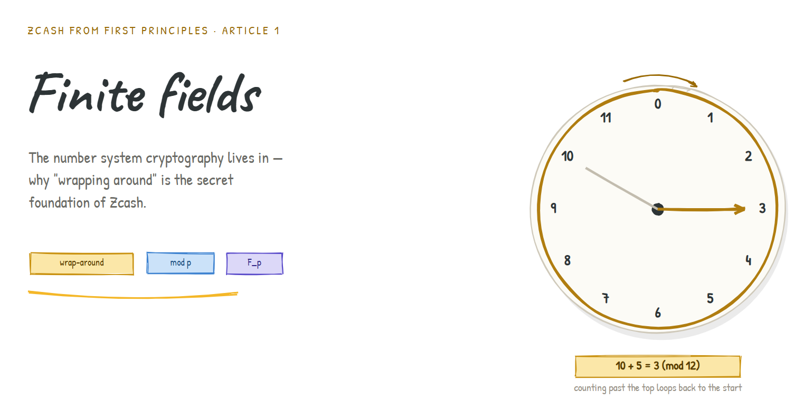
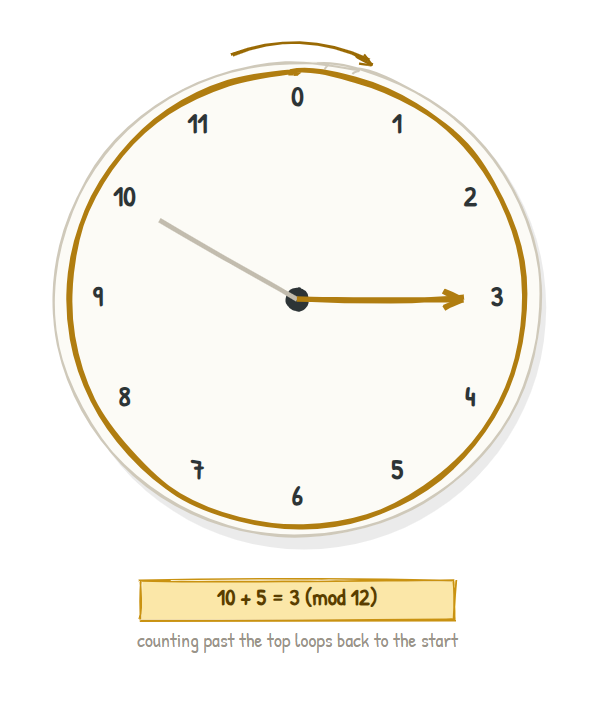
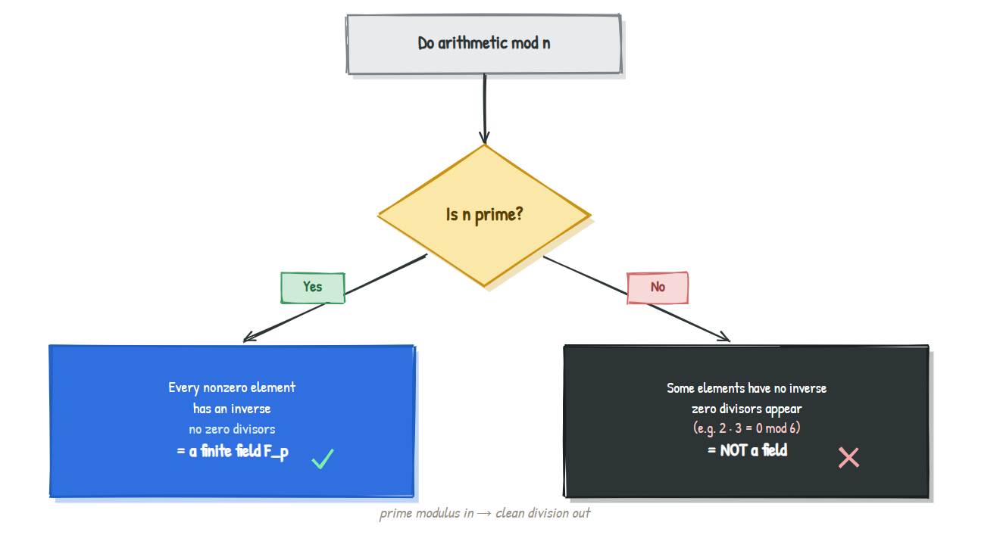
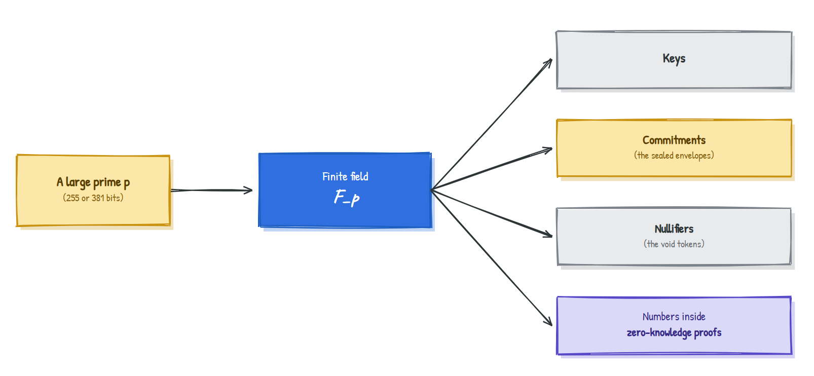

# Finite Fields: The Number System Cryptography Lives In


### Why "wrapping around" is the secret foundation of Zcash

> **Series:** *Zcash from First Principles* . **Article 1 . Finite Fields**
> **Audience:** newcomers. We assume only ordinary school arithmetic (adding, multiplying, dividing). No prior cryptography or higher mathematics.
> **What you'll leave with:** an intuitive and correct understanding of finite fields, why cryptographers use them, and where they show up inside Zcash.

In [Article 0](article-0-shielded-transaction.md) we met five characters: the note, the commitment, the note commitment tree, the nullifier, and the zero-knowledge proof. We left a loose end hanging: *where do all the keys and secret recipes actually come from?* They come from numbers. But not the ordinary numbers you grew up with. They come from a special, self-contained number system called a **finite field**, and almost every piece of cryptography in Zcash is built on top of it.

This article earns that idea slowly. As promised, intuition first. No formulas until they pay for themselves.

---

## 1. Why should you care?

Ordinary numbers have a problem for cryptography: there are infinitely many of them, and they leak information.

Think about what happens when a number gets *bigger*. If I tell you a secret calculation produced `8,142,067`, you already know quite a lot: it's a seven-digit number, it's odd, it's "fairly large." Size is a clue. And clues are exactly what a privacy system cannot afford to give away.

Cryptography wants a number system where:

- there are **finitely many** values, so a computer can store any of them exactly with no rounding and no overflow,
- the values **don't leak their size**, because the system has no real notion of "bigger,"
- you can still **add, subtract, multiply, and divide** freely and reversibly, because cryptographic recipes need real algebra to work, and
- the space can be made **astronomically large**, so guessing is hopeless.

That wish list has a name. It is a **finite field**. Let's build the intuition for one before we write a single symbol.

---

## 2. The intuition: a clock

You already use a finite field every day. It's the clock on your wall.

On a 12-hour clock, numbers *wrap around*. Start at 10 o'clock, add 5 hours, and you don't land on "15 o'clock," you land on **3 o'clock**. The clock has only twelve positions, and counting past the top simply loops back to the start.



Three things just happened that are the whole point of this article:

1. **The world is finite.** There are exactly twelve positions, no matter how long you count.
2. **Adding still works.** You can add hours all day; you always land on a valid clock position.
3. **Size stopped mattering.** "3 o'clock" doesn't tell you whether you counted 3 hours or 15 or 27. The wrap-around *erased the size information.* That erasing is precisely the privacy-friendly property we wanted.

This wrap-around arithmetic has a formal name: **modular arithmetic**. The clock works "modulo 12," written **mod 12**. Mathematicians prefer to count positions starting from 0, so a "clock mod 12" really has positions `0, 1, 2, ..., 11`. A clock mod 7 would have positions `0` through `6`.

> **The one rule:** to compute anything "mod p," do the ordinary arithmetic, then divide by `p` and keep only the remainder.
> Example mod 7: `5 + 4 = 9`, and `9` leaves remainder `2` after dividing by `7`, so `5 + 4 = 2 (mod 7)`.

---

## 3. From a clock to a field

A clock lets us add. A **field** is the upgrade: a number system where all four operations behave, including the tricky one, division.

Informally, a **field** is any collection of "numbers" where you can **add, subtract, multiply, and divide** (by anything except zero), and all the familiar rules still hold: order doesn't matter for addition or multiplication, brackets can be regrouped, there's a `0` and a `1`, and every number has a negative and (except `0`) a reciprocal.

The rational numbers are a field. The real numbers are a field. What we want is a *finite* one.

Here is the headline result, and it is beautiful:

> **Take the whole numbers `0, 1, ..., p-1` and do all arithmetic mod `p`. If `p` is a prime number, the result is a finite field.** We write it `F_p` (read "F sub p").

So `F_7 = {0, 1, 2, 3, 4, 5, 6}` with clock-style arithmetic mod 7 is a genuine finite field. Let's see it breathe.

### Multiplication in F_7 (verified)

Every entry is `(row x column) mod 7`:

| x | 0 | 1 | 2 | 3 | 4 | 5 | 6 |
|---|---|---|---|---|---|---|---|
| **0** | 0 | 0 | 0 | 0 | 0 | 0 | 0 |
| **1** | 0 | 1 | 2 | 3 | 4 | 5 | 6 |
| **2** | 0 | 2 | 4 | 6 | 1 | 3 | 5 |
| **3** | 0 | 3 | 6 | 2 | 5 | 1 | 4 |
| **4** | 0 | 4 | 1 | 5 | 2 | 6 | 3 |
| **5** | 0 | 5 | 3 | 1 | 6 | 4 | 2 |
| **6** | 0 | 6 | 5 | 4 | 3 | 2 | 1 |

Look at the rows for `1` through `6`: each one contains every nonzero value `1..6` exactly once. That "no repeats, nothing missing" pattern is the visible fingerprint of a field.

### Division: the magic that needs a prime

Division is just "multiply by the reciprocal." In `F_7`, the reciprocal (or **inverse**) of a number `a` is the value `a⁻¹` for which `a x a⁻¹ = 1`. Reading them straight off the table:

| `a` | 1 | 2 | 3 | 4 | 5 | 6 |
|---|---|---|---|---|---|---|
| `a⁻¹` | 1 | 4 | 5 | 2 | 3 | 6 |

Check one: `2 x 4 = 8 = 1 (mod 7)`.  So "divide by 2" in `F_7` means "multiply by 4." Every nonzero element has a partner. **That is what makes `F_7` a field.**

---

## 4. Why the modulus must be prime

This is the single most important idea in the article, so let's make it concrete rather than abstract.

Watch what breaks if we naively try to build a "field" mod `6` (and `6` is *not* prime):

> Is there any `x` with `2 x x = 1 (mod 6)`? Checking all of them: `2x0=0, 2x1=2, 2x2=4, 2x3=0, 2x4=2, 2x5=4`. **The answer `1` never appears.** So `2` has no reciprocal mod 6. Worse, `2 x 3 = 6 = 0 (mod 6)`: two nonzero numbers multiplied to give zero.

That second sentence is a catastrophe for arithmetic. Two nonzero things multiplying to zero (called a **zero divisor**) means division is broken, and a system with broken division is not a field. It happens precisely because `6` factors as `2 x 3`.

A prime, by definition, has no such factors. So mod a prime, no zero divisors can appear, every nonzero element gets a clean reciprocal, and the structure is a proper field.



> **Reusable one-liner for your articles:** *prime modulus in, clean division out.*

---

## 5. The one formula worth meeting: how computers find inverses

We read inverses off a table for `F_7`, but Zcash's prime has hundreds of digits; no table is possible. There's a classic shortcut, and it's the only formula in this article.

**Fermat's Little Theorem** says that for a prime `p` and any nonzero `a`:

```
a^(p-1) = 1   (mod p)
```

Rearrange it (peel off one factor of `a`) and you get the inverse for free:

```
a^(-1) = a^(p-2)   (mod p)
```

Test in `F_7` (`p = 7`, so `p - 2 = 5`): the inverse of `2` should be `2⁵ = 32 = 4 (mod 7)`. And indeed our table said `2⁻¹ = 4`.  Computers raise to large powers extremely fast, so this turns "find the reciprocal" into a quick, exact computation even for gigantic primes.

You do not need to memorize this. You need to know that **division in a finite field is a fast, exact operation**, which is exactly why cryptographers are happy to build on it.

---

## 6. Why cryptography fell in love with finite fields

Putting the intuition together, here is the whole case on one page.

| Property of `F_p` | Why a privacy system wants it |
|---|---|
| **Finite** | A computer stores any element exactly; no rounding, no overflow, no floating-point fuzz |
| **Wrap-around** | Erases "size," so a value leaks nothing about how it was produced |
| **All four operations work** | Cryptographic recipes (keys, commitments, proofs) need genuine algebra, not just counting |
| **Choosable size** | Pick a 255-bit or 381-bit prime and the field has more elements than there are atoms in the observable universe; guessing is hopeless |
| **Exact and deterministic** | Two honest parties computing the same thing always get identical results, which proofs depend on |

A finite field is, in one phrase, **a perfectly closed, perfectly exact, perfectly huge playground for arithmetic.** Everything else in Zcash is built by playing inside it.

---

## 7. Where this lives in Zcash

You don't have to take "Zcash uses finite fields" on faith. Here's the concrete map (the deeper machinery is for later articles; this is just to show the fingerprints are real).

- **Sapling** (an older shielded design) builds its proofs over a curve called **BLS12-381**, whose base field uses a prime that is **381 bits** long. Every coordinate, key, and proof element is an element of a finite field built on that prime.
- **Orchard** (the current shielded design) uses a pair of curves called **Pallas and Vesta** (the "Pasta" curves), whose fields use primes roughly **255 bits** long.
- The **note commitment**, the **nullifier**, and the numbers inside a **zero-knowledge proof** from Article 0 are all, at bottom, elements of one of these finite fields. When the protocol says "compute this commitment," it means "do this arithmetic mod that prime."



So the answer to Article 0's open question, *"where do the secret recipes come from?"*, begins here: **everything starts as arithmetic in a finite field.** In the next article we'll take that field and build the actual objects, points on an elliptic curve, that become keys and commitments.

---

## 8. An honest disclaimer

To stay newcomer-friendly we simplified a few true things. Finite fields don't only come in the `F_p` flavour; you can also build fields with `pⁿ` elements (called **extension fields**), and those matter for the "pairings" that Sapling's proof system relies on. We also skipped the full list of field axioms and glossed over how primes of this size are chosen and validated. None of that changes the intuition you now hold; it refines it. We'll add the precision back, with flags, when a later article needs it.

---

## 9. Summary

- Cryptography needs a number system that is **finite, exact, size-blind, fully invertible, and enormous.** That system is a **finite field**.
- The intuition is a **clock**: arithmetic that **wraps around** (modular arithmetic), which conveniently erases the "size" of a number.
- Doing arithmetic with the numbers `0..p-1` mod a **prime** `p` gives a real field `F_p`, where you can also **divide** because every nonzero element has an inverse.
- The modulus **must be prime**: a composite modulus creates zero divisors (like `2 x 3 = 0 mod 6`) and breaks division.
- Computers find inverses fast via **Fermat's Little Theorem** (`a⁻¹ = a^(p-2)`).
- In **Zcash**, every key, commitment, nullifier, and proof element is ultimately an element of a large finite field (255-bit Pasta fields for Orchard, a 381-bit field for Sapling's BLS12-381).

---

## Glossary

| Term | Plain-English meaning |
|---|---|
| **Modular arithmetic** | Arithmetic that wraps around after reaching a fixed value, like a clock |
| **mod p** | "Divide by `p` and keep the remainder" |
| **Field** | A number system where add, subtract, multiply, and divide all work |
| **Finite field `F_p`** | The numbers `0..p-1` with arithmetic done mod a prime `p` |
| **Inverse (reciprocal)** | The element `a⁻¹` with `a x a⁻¹ = 1`; "dividing by `a`" means multiplying by it |
| **Zero divisor** | Two nonzero values whose product is zero; the thing that ruins composite moduli |
| **Prime** | A whole number greater than 1 with no factors except 1 and itself |

---

## FAQ

**Why not just use ordinary integers or decimals?**
Decimals round and drift; integers grow without bound and leak size. Finite fields are exact, bounded, and size-blind, which cryptography requires.

**Does "wrap around" lose information?**
On purpose, yes. Erasing the size of intermediate values is a feature, not a bug, for privacy.

**Is a bigger prime always more secure?**
Loosely, a bigger field means more possible values and harder guessing, but security depends on the whole construction, not the field size alone. Later articles make this precise.

**Why these specific primes (255-bit, 381-bit) in Zcash?**
They're chosen so the curves built on them have the right structure and efficiency for the proof system. That "right structure" is the subject of the next two articles.

---

### Test your intuition

In `F_7`, what is `5 - 6`? (Remember: stay inside `{0,...,6}` by wrapping around.) *(Answer below.)*

<details><summary>Answer</summary>

`5 - 6 = -1`, and `-1` wrapped into `F_7` is `6` (because `6 + 1 = 7 = 0`). So `5 - 6 = 6 (mod 7)`. Subtraction never leaves the field; it just wraps the other way.
</details>

---

### What's next

**Article 2 . Elliptic curves:** we take the finite field we just built and use it to draw a strange kind of curve whose points can be "added" together. Those points become Zcash's keys and commitments, and they hide a one-way trapdoor that makes the whole privacy system possible. Intuition first, as always.

*Part of the* Zcash from First Principles *series for [ZecHub](https://zechub.org). Licensed CC BY-SA 4.0.*
