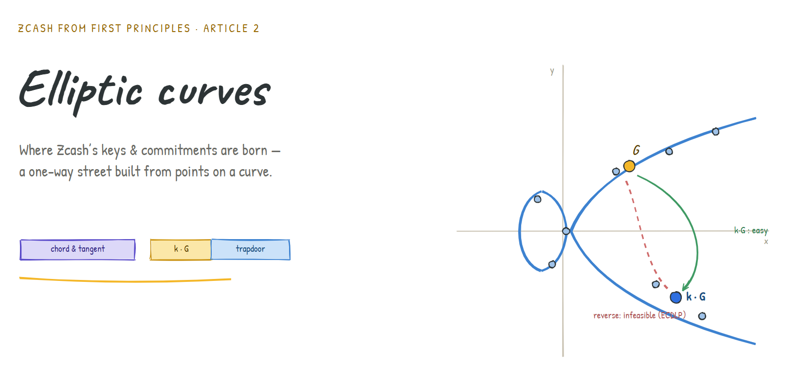
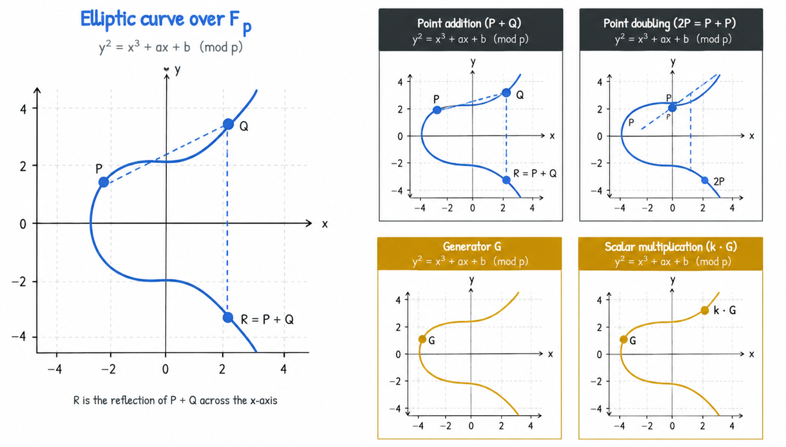
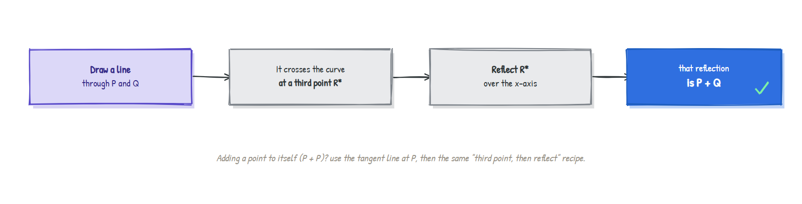
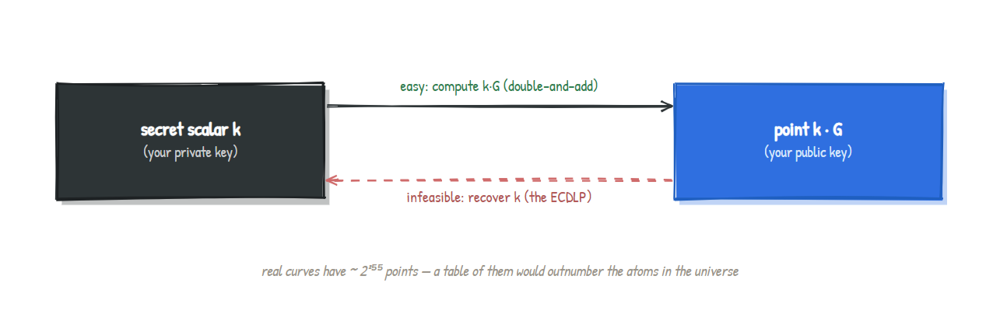
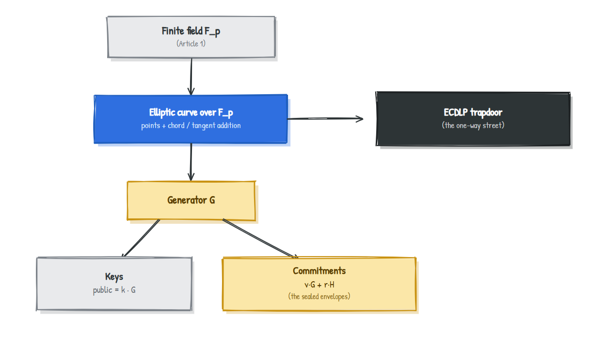

# Elliptic Curves: Where Zcash's Keys and Commitments Are Born


### A one-way street built from points on a curve

> **Series:** *Zcash from First Principles* . **Article 2 . Elliptic Curves**
> **Audience:** newcomers. We assume only [Article 1 (finite fields)](article-1-finite-fields.md): arithmetic that wraps around mod a prime. No other background needed.
> **What you'll leave with:** an intuitive and correct picture of elliptic curves, the "trapdoor" that makes them useful, and exactly how Zcash turns them into keys and commitments.

[Article 1](article-1-finite-fields.md) gave us a perfect playground for arithmetic: the finite field. But a field on its own is just numbers. To build keys and the "sealed envelopes" from [Article 0](article-0-shielded-transaction.md), Zcash needs an object with a special, one-directional kind of difficulty: easy to compute forwards, practically impossible to reverse. That object is an **elliptic curve**. This article builds it from the ground up, intuition before algebra.

---

## 1. Why should you care?

Every privacy system needs a **one-way street**: an operation that's trivial to walk forwards and effectively impossible to walk back.

Here's why. Your **secret key** is a number you keep hidden. Your **public key** (and your address) is derived from it and shown to the world. The entire security of the system rests on one fact: *given the public key, nobody can work backwards to your secret key.* If they could, they could spend your money.

So we need a mathematical operation where:

- going **forwards** (secret -> public) is fast and easy, but
- going **backwards** (public -> secret) is so hard that all the computers on Earth working for the lifetime of the universe wouldn't finish.

Plain finite-field multiplication isn't good enough; division undoes it instantly (that was the whole point of Article 1). We need something with no easy "undo" button. Elliptic curves provide exactly that, and as a bonus, their points combine in a way that's perfect for building commitments. Let's see how.

---

## 2. The intuition: a curve whose points you can "add"

Forget cryptography for a moment. An **elliptic curve** is just the set of points `(x, y)` satisfying an equation of the shape:

```
y^2 = x^3 + ax + b
```

Over ordinary numbers it looks like a smooth, swooping curve, often with a rounded loop and two tails:



The genuinely surprising part: **you can "add" two points on this curve to get a third point on the same curve.** This isn't ordinary addition of coordinates. It's a geometric rule, and it's easier to *see* than to say.

### The chord rule (adding two different points)

To add `P + Q`:

1. Draw a straight line through `P` and `Q`.
2. That line hits the curve at exactly one more place. Call it `R*`.
3. **Reflect `R*` across the horizontal axis.** That reflection is the answer, `P + Q`.



### The tangent rule (adding a point to itself)

To compute `P + P` (written `2P`), there's no second point to draw a line through, so you use the **tangent** line at `P` instead, then follow the same "third intersection, then reflect" recipe.

That's the entire operation. Two geometric rules. With them, the points of an elliptic curve form what mathematicians call a **group**: a set with a well-behaved "addition." It even has a "zero."

### The point at infinity (the curve's zero)

Every number system needs a `0`, the thing that changes nothing when you add it. On an elliptic curve, that role is played by a special extra point called the **point at infinity**, written `O`. You can picture it as "infinitely far up," the place where vertical lines meet. Adding `O` to any point leaves it unchanged, exactly like adding `0`.

---

## 3. From pictures to a finite field

The smooth curve above is the *intuition*. But Zcash doesn't use real numbers (they round and leak size, per Article 1). It uses an elliptic curve **over a finite field**: the same equation `y^2 = x^3 + ax + b`, but with all arithmetic done mod a prime.

When you do that, the pretty curve shatters into a **scatter of disconnected dots**, one dot for each `(x, y)` pair that satisfies the equation mod `p`. It stops looking like a curve at all. But here is the crucial thing:

> **The algebra of the chord-and-tangent rule still works perfectly.** The same formulas that found `P + Q` geometrically now compute it with finite-field arithmetic. The dots still form a group, with the same `0` (the point at infinity).

Let's make this real with a tiny, fully verified example.

### A complete curve, computed exactly

Take `y^2 = x^3 + 2x + 2` over the finite field `F_17`. Computing every valid point gives exactly **18 points, plus the point at infinity = 19 total.** A few of them:

```
(0,6) (0,11) (3,1) (3,16) (5,1) (5,16) (6,3) (6,14) (7,6) (7,11) ...
```

Now pick the point `G = (5, 1)` and keep adding it to itself. Watch what happens (every line below was computed, not guessed):

| Step | Point | Step | Point |
|---|---|---|---|
| `1G` | (5, 1) | `11G` | (13, 10) |
| `2G` | (6, 3) | `12G` | (0, 11) |
| `3G` | (10, 6) | `13G` | (16, 4) |
| `4G` | (3, 1) | `14G` | (9, 1) |
| `5G` | (9, 16) | `15G` | (3, 16) |
| `6G` | (16, 13) | `16G` | (10, 11) |
| `7G` | (0, 6) | `17G` | (6, 14) |
| `8G` | (13, 7) | `18G` | (5, 16) |
| `9G` | (7, 6) | `19G` | **O (infinity)** |
| `10G` | (7, 11) | | |

Two things to notice:

- It **visits all 18 finite points and then lands on `O`** at step 19, then it would repeat forever. The starting point `G` "generates" the whole group, so we call it a **generator**.
- It's a verified group: for instance `1G + 2G = (5,1) + (6,3) = (10,6)`, which is exactly `3G`.  The addition is internally consistent, just as a group demands.

---

## 4. The trapdoor: scalar multiplication

That table of `1G, 2G, 3G, ...` is the heart of everything. Repeatedly adding a point to itself is called **scalar multiplication**: the point `kG` means "`G` added to itself `k` times."

Now the magic. Consider the two directions:

| Direction | Question | Difficulty |
|---|---|---|
| **Forwards** | Given `k` and `G`, compute `kG` | **Easy.** Even for astronomically huge `k`, a trick called *double-and-add* gets there in a few hundred steps |
| **Backwards** | Given `G` and `kG`, recover `k` | **Effectively impossible** on a real cryptographic curve |

That asymmetry is the **one-way street** we needed in Section 1. The backward problem ("which `k` produced this point?") is called the **Elliptic Curve Discrete Logarithm Problem (ECDLP)**, and on the curves Zcash uses, no known method solves it before the heat death of the universe.



> In our toy `F_17` curve you *could* just read `k` off the table, because it only has 19 points. Real curves have around `2²⁵⁵` points. The table would have more rows than there are atoms in the universe, so "reading it off" is not an option. The smallness is what makes the toy curve teachable and also why it isn't secure.

---

## 5. How keys are born (the payoff)

We now have everything needed to explain a real cryptographic key, and it's startlingly simple:

> **Pick a secret number `k`. Publish the point `kG`. That's it.**
> `k` is your **private key**. `kG` is your **public key**. The one-way street (ECDLP) guarantees nobody can run `kG` back to `k`.

This single idea, *a public key is a secret scalar times a fixed generator*, is the seed of Zcash's spending keys, viewing keys, and addresses. The full key tree layers more structure on top, but every branch grows from this root.

### Bonus: why curve points make perfect commitments

Recall the "sealed envelope" (commitment) from Article 0, which had to **hide** its contents yet be **impossible to forge**. Elliptic curves hand us a clean way to build one. Take two fixed, public generator points `G` and `H`, a secret value `v`, and a random blinding number `r`, and form:

```
Commitment  =  v·G  +  r·H
```

This is a **Pedersen commitment**, and it has both properties we wanted:

- **Hiding:** the random `r` smears the result across the whole curve, so the point reveals nothing about `v`.
- **Binding:** the ECDLP makes it infeasible to find a *different* `(v, r)` giving the same point, so you can't change your mind about what you committed to.

A bonus property turns out to be priceless later: these commitments **add up**. The commitment to `v_1` plus the commitment to `v_2` is a valid commitment to `v_1 + v_2`. That "homomorphic" behaviour is how Zcash will later prove that the money going *into* a transaction equals the money coming *out*, without revealing any amount. We'll cash that in around Article 6.

---

## 6. Where this lives in Zcash

The fingerprints are concrete and checkable.

| Zcash design | Curves it uses | Role |
|---|---|---|
| **Sapling** (older) | **BLS12-381** plus an embedded curve called **Jubjub** | BLS12-381 carries the proof system; Jubjub is built over BLS12-381's scalar field so that key and commitment operations are cheap to perform *inside* a zero-knowledge proof |
| **Orchard** (current) | **Pallas** and **Vesta** (the "Pasta" cycle) | Pallas carries Orchard's keys and commitments; the Pallas/Vesta pairing is specially arranged to make advanced proofs efficient |

The reasons one curve gets "embedded" inside another's field, and why a *cycle* of two curves is useful, are real and important, but they belong to the proof-system articles. For now the takeaway is solid: **every Zcash key is a scalar times a generator, and every Zcash commitment is a sum of curve points**, living on one of these named curves.



---

## 7. An honest disclaimer

A few simplifications kept this readable. We used **short Weierstrass** form (`y^2 = x^3 + ax + b`); Zcash's curves are often written in other equivalent forms (Jubjub is a *twisted Edwards* curve) chosen for efficiency and safety, but the group idea is identical. We didn't define the exact point-addition formulas (they're the algebraic version of "third intersection, then reflect"), and we set aside subtleties like curve order, cofactors, and "pairings," which become important in the proof-system articles. None of this changes the intuition; it sharpens it.

---

## 8. Summary

- A privacy system needs a **one-way street**: easy forwards, infeasible backwards. Elliptic curves provide one.
- An **elliptic curve** is the set of points satisfying `y² = x³ + ax + b`, and its points can be **added** via the geometric **chord-and-tangent** rule, with a special **point at infinity** acting as zero.
- Over a **finite field** the curve becomes a scatter of dots, but the same addition still works and the points form a **group**. (Verified example: `y^2 = x^3 + 2x + 2` over `F_17` has 19 points, and `G = (5,1)` generates all of them.)
- **Scalar multiplication** `kG` is easy to compute but infeasible to reverse: the **ECDLP**. That is the trapdoor.
- **Keys:** private key `k`, public key `kG`. **Commitments:** Pedersen form `v·G + r·H`, which hides, binds, and conveniently **adds up**.
- In **Zcash**, Sapling uses **BLS12-381 + Jubjub** and Orchard uses the **Pallas/Vesta (Pasta)** curves; every key and commitment lives on these.

---

## Glossary

| Term | Plain-English meaning |
|---|---|
| **Elliptic curve** | Points satisfying `y^2 = x^3 + ax + b`, with a special "addition" of points |
| **Point addition** | The chord-and-tangent rule: line through two points, take the third hit, reflect |
| **Point at infinity (`O`)** | The curve's "zero"; adding it changes nothing |
| **Generator (`G`)** | A base point whose multiples eventually cover the whole group |
| **Scalar multiplication (`kG`)** | Adding `G` to itself `k` times; easy forwards, hard to reverse |
| **ECDLP** | The hard problem of recovering `k` from `kG`; the security foundation |
| **Pedersen commitment** | `v.G + r.H`; a sealed envelope that hides, binds, and adds up |

---

## FAQ

**Why curves instead of just big numbers mod a prime?**
Both can give a one-way street, but elliptic curves achieve the same security with far smaller keys and faster operations, and their point arithmetic is ideal for commitments.

**Is the ECDLP proven to be hard?**
It's not *proven* impossible, but decades of intense effort have found no efficient attack on well-chosen curves. Security rests on that well-tested assumption.

**Could a quantum computer break this?**
A large enough quantum computer could break the ECDLP. That's a known long-term concern across the industry and an active research area; today's curves remain secure against classical computers.

**Why does Zcash use more than one curve?**
Different jobs. One curve carries the zero-knowledge proof system; another (embedded in the first's field) makes the in-proof key and commitment operations efficient. The next articles explain why that pairing matters.

---

### Test your intuition

Using the verified table in Section 3, what is `9G + 10G` on our toy curve? And what does the answer tell you about `G`? *(Answer below.)*

<details><summary>Answer</summary>

`9 + 10 = 19`, and we saw that `19G = O`, the point at infinity. So `9G + 10G = O`. This means `10G` is the **negative** (additive inverse) of `9G`: two points that add to the "zero" point. On a curve, a point's negative is just its mirror image across the x-axis, and indeed `9G = (7,6)` and `10G = (7,11)` share the same `x` and have `y`-values that sum to `17 = 0 (mod 17)`. The structure is perfectly consistent, which is exactly what "it's a group" guarantees.
</details>

---

### What's next

**Article 3 . Hashing and commitments:** we'll open up the "magic sealed envelope" properly. You've now seen one way to build a commitment from curve points; next we ask what hiding and binding really mean, meet hash functions, and connect both to the note commitments that anchor every Zcash payment.

*Part of the* Zcash from First Principles *series for [ZecHub](https://zechub.org). Licensed CC BY-SA 4.0.*
