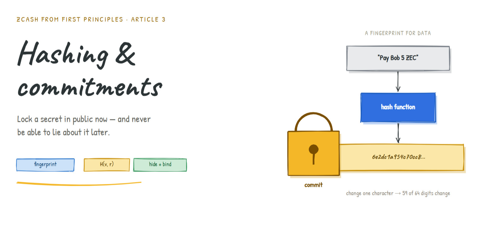
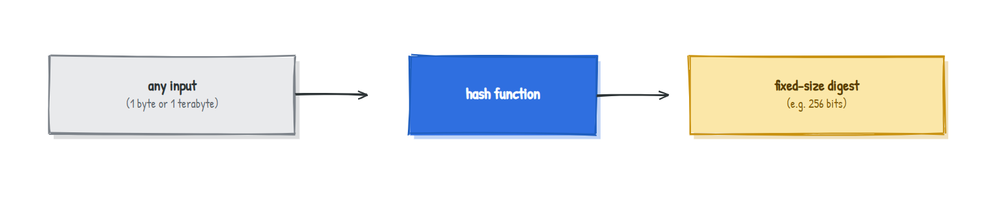
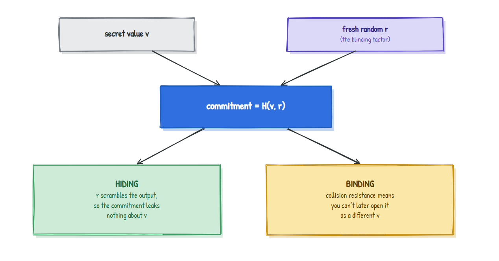
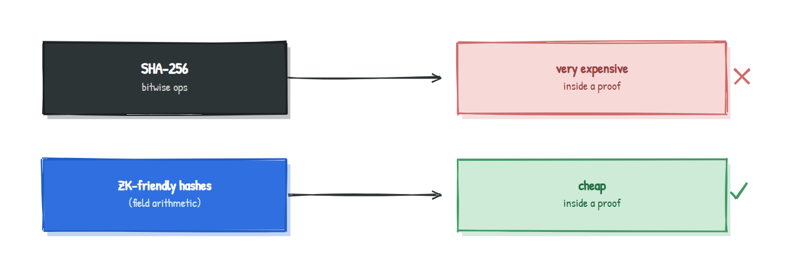

# Hashing and Commitments: The Magic Sealed Envelope
##### Original Research from [Annkkitaaa](https://github.com/Annkkitaaa)



### How to lock a secret in public and never be able to lie about it

> **Series:** *Zcash from First Principles* . **Article 3 . Hashing and Commitments**
> **Audience:** newcomers. We build on [Article 1 (finite fields)](article-1-finite-fields.md) and [Article 2 (elliptic curves)](article-2-elliptic-curves.md), but the intuition stands on its own.
> **What you'll leave with:** a clear understanding of hash functions, what "hiding" and "binding" really mean, and how Zcash builds the note commitments that anchor every private payment.

In [Article 0](article-0-shielded-transaction.md) we described a "magic sealed envelope": something you can pin to a public board that proves an envelope exists while hiding what's inside, and which you can never swap out later. We promised to explain how such a thing is possible. This is that article. We need two ingredients: **hash functions** and **commitments**.

---

## 1. Why should you care?

Imagine you predict the outcome of an election and want to prove, *afterwards*, that you called it in advance. You can't just announce your prediction (that influences people, or invites accusations you changed it). And you can't keep it fully secret (then you can't prove anything later).

What you want is a way to **lock in a value now, in public, such that:**

- nobody can tell what you locked in (it stays secret for now), and
- later, when you reveal it, you **can't lie** about what it was.

This "lock now, reveal later, no lying" gadget is called a **commitment**, and it is everywhere in Zcash. A note's value and owner are locked into a commitment the moment the note is created. To build commitments, we first need their workhorse: the hash function.

---

## 2. The intuition: a fingerprint for data

A **hash function** takes any data at all, a single letter or an entire library, and crushes it down to a short, fixed-size string called a **digest** or **hash**. Think of it as a **fingerprint for data.**



A good cryptographic fingerprint has four properties. Hold them as intuitions, not equations:

| Property | Plain meaning | Why it matters |
|---|---|---|
| **Deterministic** | Same input always gives the same fingerprint | You can re-check a fingerprint any time |
| **Fast forwards** | Computing the fingerprint is quick | Practical to use everywhere |
| **One-way (preimage resistant)** | Given a fingerprint, you can't find the input that made it | Hides the original data |
| **Collision resistant** | You can't find two different inputs with the same fingerprint | Nobody can forge a match |

And one more behaviour that makes fingerprints feel almost magical:

### The avalanche effect (verified)

Change the input by the tiniest amount and the fingerprint changes *completely*, with no resemblance to the old one. Here are two real SHA-256 fingerprints of messages differing by a single character:

```
H("Pay Bob 5 ZEC") = 6e2dc1a954c70cc865f18ea8cb70b7b56eeaf6ca42b380824a55d65dc342f34b
H("Pay Bob 6 ZEC") = 76abc346d8d3053f76a9ae18b617af71f02729a73ec6a51732d2d94934e4217f
```

Out of 64 hex digits, **59 are different.** One character in, an entirely unrelated fingerprint out. This is why you cannot nudge an input toward a target fingerprint: there's no "warmer / colder" signal to follow.

---

## 3. From fingerprint to commitment

Here's a tempting but broken idea: to commit to a secret value `v`, just publish its fingerprint `H(v)`.

This *binds* you nicely (you can't later claim a different `v`, because that would need a collision). But it **fails to hide.** If the set of possible values is small, an attacker just fingerprints every candidate and compares. Committing to "yes" or "no"? They hash both and instantly learn which you chose. Determinism, our friend a moment ago, is now leaking the secret.

The fix is one word: **randomness.**

> **A commitment is the fingerprint of your value mixed with a fresh random number:**
> `commitment = H(v, r)` where `r` is a secret random "blinding" value.

Now the same `v` produces a different-looking commitment every time, because `r` is different. The two properties we wanted finally both hold:



To **open** (reveal) the commitment later, you publish `v` and `r`; anyone recomputes `H(v, r)` and checks it matches. You're locked in. That is the magic sealed envelope from Article 0, made real.

> **Two takeaways to carry forever:** *binding* comes from the hash being collision resistant; *hiding* comes from the random blinding factor `r`.

---

## 4. Two ways to build the envelope

There are two common recipes, and Zcash uses both.

| | **Hash-based commitment** | **Pedersen commitment** (from Article 2) |
|---|---|---|
| Recipe | `H(v, r)` | `v.G + r.H` (points on a curve) |
| Hiding from | the random `r` | the random `r` |
| Binding from | collision resistance | the elliptic-curve trapdoor (ECDLP) |
| Special power | simple and fast | the commitments **add up** (homomorphic) |

That last row is why Pedersen commitments matter so much in Zcash. Because `commit(v_1) + commit(v_2)` is a valid `commit(v_1 + v_2)`, the protocol can later prove that **money in equals money out** by adding commitments together, all without revealing a single amount. We're stockpiling that fact for Article 6.

---

## 5. A subtlety that shapes all of Zcash: ZK-friendly hashing

Here is an insight most introductions miss, and it's exactly the "math meets engineering" point worth highlighting.

SHA-256 is a superb fingerprint for everyday computing. But Zcash doesn't just *compute* hashes; it has to **prove, inside a zero-knowledge proof, that a hash was computed correctly** (Article 5 explains why). And here's the catch: a zero-knowledge proof works in the language of **finite-field arithmetic** (Article 1), while SHA-256 is built from bit-twiddling operations (shifts, ANDs, XORs). Expressing all that bit-twiddling in field arithmetic is enormously expensive, making proofs huge and slow.

So Zcash cryptographers designed hash functions whose internals are *already* field arithmetic, making them cheap to prove:



This single engineering pressure, *"it must be cheap to prove,"* is why Zcash invented and adopted special hash functions instead of reaching for SHA-256 everywhere.

---

## 6. Where this lives in Zcash

Zcash has used different hashes across its designs, each chosen for the job:

| Design | Hashes used | Where |
|---|---|---|
| **Sprout** (earliest) | **SHA-256** | Note commitments and the tree |
| **Sapling** | **Pedersen hashes**, plus **BLAKE2** | Pedersen for note commitments and the Merkle tree; BLAKE2 for key derivation and nullifiers |
| **Orchard** (current) | **Sinsemilla**, plus **Poseidon** | Sinsemilla for note commitments and the Merkle tree; Poseidon for the nullifier, all designed for arithmetic circuits |

The names to recognize are **Pedersen** and **Sinsemilla** (commitment-style hashes built from curve points, so they inherit the "adds up" superpower and prove cheaply) and **Poseidon** (a field-arithmetic hash purpose-built for zero-knowledge circuits). When Article 0 said a note's contents are sealed into a commitment, *this* is the machinery doing the sealing.

So the open loop from Article 0, *"how can a sealed envelope hide its contents yet be impossible to forge?"*, is now closed: **hiding from a random blinding factor, binding from collision resistance or the curve trapdoor.**

---

## 7. An honest disclaimer

We simplified to keep things clear. Real commitment schemes specify exactly how `v` and `r` are encoded and which generators are used; "hiding" and "binding" each come in flavours (perfect vs computational) with precise security definitions; and we didn't show the internals of Pedersen, Sinsemilla, or Poseidon. None of that changes the intuition: a commitment is a fingerprint plus randomness that hides now and binds forever. The details return, flagged, when the protocol article needs them.

---

## 8. Summary

- A **hash function** is a **fingerprint for data**: deterministic, fast forwards, one-way, collision resistant, with an **avalanche effect** (one bit in, a totally different fingerprint out).
- A **commitment** lets you **lock a value in public now and reveal it later without being able to lie.**
- Publishing a bare fingerprint `H(v)` binds but does **not** hide. Adding a random blinding factor, `H(v, r)`, fixes that: **hiding from `r`, binding from collision resistance.**
- Zcash uses both **hash-based** and **Pedersen** commitments; Pedersen commitments additionally **add up**, which Article 6 will exploit to prove value balance privately.
- Because hashes must be **proven** inside zero-knowledge proofs, Zcash uses **ZK-friendly** hashes built from field arithmetic (**Pedersen**, **Sinsemilla**, **Poseidon**) rather than SHA-256 everywhere.

---

## Glossary

| Term | Plain-English meaning |
|---|---|
| **Hash function** | Crushes any data into a short fixed-size fingerprint (digest) |
| **Digest** | The output fingerprint of a hash function |
| **Preimage resistance** | Can't reverse a digest back to its input (one-way) |
| **Collision resistance** | Can't find two inputs with the same digest |
| **Avalanche effect** | A tiny input change completely changes the digest |
| **Commitment** | Lock a value now, reveal later, can't lie about it |
| **Blinding factor (`r`)** | The fresh random number that makes a commitment hide |
| **ZK-friendly hash** | A hash built from field arithmetic so it's cheap to prove |

---

## FAQ

**Why not just encrypt the value instead of committing to it?**
Encryption is about *secrecy you can later decrypt*. A commitment is about *binding*: the guarantee that you can't change your answer later. Different jobs.

**If commitments hide the value, how does anyone check the rules?**
That's the role of zero-knowledge proofs (Article 5): they prove the hidden value obeys the rules without revealing it.

**Is SHA-256 broken, since Zcash avoids it in places?**
No. SHA-256 is fine and Zcash still uses it. It's just expensive to *prove inside a circuit*, which is why ZK-friendly hashes exist for that specific job.

**Where does the random `r` come from, and who keeps it?**
It's generated freshly when the note is created and known to the note's owner. It's part of what makes each note unique and private.

---

### Test your intuition

You commit to your election prediction as `H(v, r)` and publish it. A friend insists you should publish just `H(v)` to keep it simpler. In one sentence, why is that a bad idea if there are only two possible outcomes? *(Answer below.)*

<details><summary>Answer</summary>

With only two outcomes, your friend can simply compute `H("win")` and `H("lose")` themselves and compare against your published digest, instantly learning your prediction. The bare hash binds but does not hide; the random `r` is what stops this guess-and-check attack.
</details>

---

### What's next

**Article 4 . Merkle trees:** we now have millions of commitments piling up. Article 4 shows how Zcash organizes them into a single tree whose tiny root fingerprint stands in for the entire history, and how you can prove your note is in that tree without revealing which one. That's the real shape of Article 0's "public board."

*Part of the* Zcash from First Principles *series for [ZecHub](https://zechub.org). Licensed CC BY-SA 4.0.*
