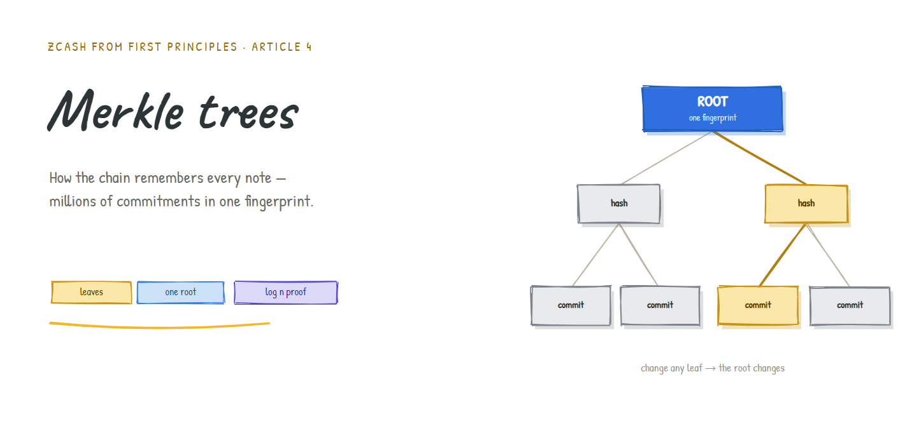
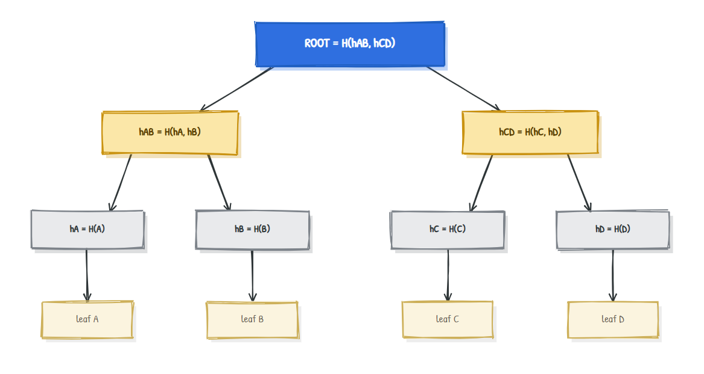
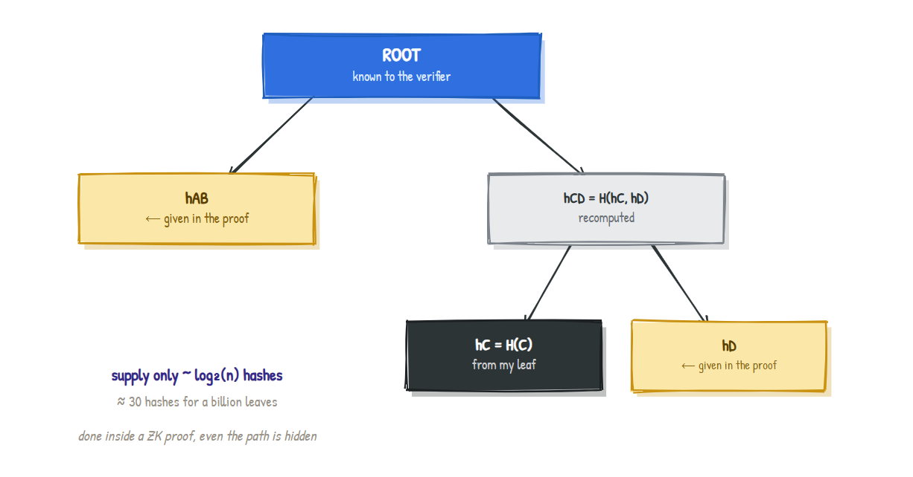
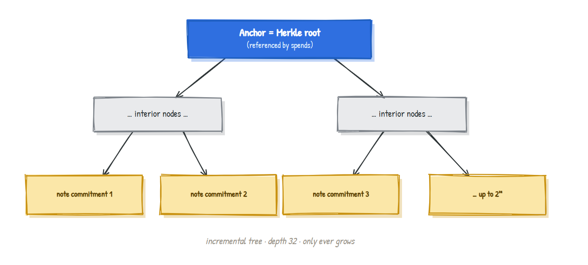

# Merkle Trees: How the Blockchain Remembers Every Note



### Summarizing millions of commitments in one tiny fingerprint

> **Series:** *Zcash from First Principles* · **Article 4 · Merkle Trees**
> **Audience:** newcomers. We build on [Article 3 (hashing and commitments)](article-3-hashing-commitments.md). If you know what a fingerprint and a commitment are, you're ready.
> **What you'll leave with:** an intuitive, correct picture of Merkle trees, how to prove membership without revealing which item you mean, and exactly how this becomes Zcash's note commitment tree.

[Article 0](article-0-shielded-transaction.md) described a "public board" that holds every note ever created and only ever grows. By now you can guess what's pinned to it: **commitments** (Article 3), the sealed envelopes. But a real board would hold *hundreds of millions* of them. How does the network store that, verify it, and let you prove your envelope is on the board without pointing to it? The answer is one of the most elegant structures in computer science: the **Merkle tree.**

---

## 1. Why should you care?

Two problems appear the moment you have a giant public list of commitments.

**Problem one: integrity at scale.** If the list has 300 million entries, how does anyone confirm that *not one* has been secretly altered? Re-checking 300 million items on every glance is hopeless.

**Problem two: private membership.** To spend a note (Article 0), you must prove your commitment is genuinely on the board. But if you point at it ("it's entry number 4,201,337!"), you've just deanonymized yourself. You need to prove *"my envelope is somewhere on this board"* without revealing **which** one.

A Merkle tree solves both at once. It compresses the entire list into a single fingerprint, and it lets you prove membership with a tiny, position-hiding proof.

---

## 2. The intuition: a tournament of fingerprints

Picture a knockout tournament bracket, but instead of players advancing, **fingerprints get combined.**

- At the bottom, each piece of data gets its own fingerprint (its hash from Article 3). These are the **leaves.**
- Pair them up. Each pair's two fingerprints are hashed *together* into one parent fingerprint.
- Pair up the parents, hash each pair together, and so on.
- Keep going until a **single fingerprint** sits at the top. That champion is the **Merkle root.**



The single most important property follows directly from the avalanche effect (Article 3):

> **The root is a fingerprint of *everything* below it.** Change any leaf, even by one bit, and its fingerprint changes, which changes its parent, which changes *that* parent, all the way up. **The root changes.** So one small root value certifies the integrity of the entire list. That solves Problem one.

---

## 3. A real tree, computed exactly

Let's build the four-leaf tree above with actual SHA-256 fingerprints over the leaves `A, B, C, D` (digests shown truncated for readability):

```
hA = 559aead08264...     hB = df7e70e50215...
hC = 6b23c0d5f35d...     hD = 3f39d5c348e5...

hAB = H(hA , hB) = 63956f0ce48e...
hCD = H(hC , hD) = 98a2fbfddbc7...

ROOT = H(hAB , hCD) = 1b3faa3fcc5e...
```

Everything is just "hash a thing, then hash pairs of hashes." Nothing more exotic than Article 3, arranged in a tree.

---

## 4. The clever part: proving membership without revealing position

Now Problem two. Say you want to prove that leaf `C` is in the tree, to someone who only knows the **root**. You do *not* hand them the whole tree. You hand them just the fingerprints needed to climb from `C` to the root, called the **authentication path** (or **Merkle proof**):

> To prove `C` is in the tree, provide:
> - its sibling `hD`, and
> - its uncle `hAB`.

The verifier, knowing only the root, recomputes the climb:

```
step 1:  H(hC , hD)        = hCD       (combine C with its sibling)
step 2:  H(hAB , hCD)      = ROOT?     (combine with the uncle)
```

Computed for real: this yields `1b3faa3fcc5e...`, which **matches the root.** ✅ The leaf is proven to be in the tree.



Two things make this powerful:

- **It's tiny.** For 4 leaves you supplied 2 hashes. For a tree of `n` leaves you supply only about **log₂(n)** hashes. For a billion leaves, that's roughly **30 hashes**, not a billion. The proof barely grows as the tree explodes in size.
- **It's the seed of privacy.** The proof shows your leaf is *somewhere* in the tree. When this same check is performed *inside a zero-knowledge proof* (Article 5), even the path itself is hidden, so you prove "my note is in the tree" while revealing neither the note nor its position. That fully solves Problem two.

---

## 5. From a Merkle tree to Zcash's note commitment tree

Now we can state precisely what Article 0's "public board" really is:

> The **note commitment tree** is a Merkle tree whose **leaves are note commitments.** Every time a note is created anywhere in the world, its commitment is appended as the next leaf, and the root is updated.

A few real specifics:

- **It only grows.** Leaves are appended, never removed. This is called an **incremental Merkle tree.** (It matches Article 0's "the board never tears anything down.")
- **The root is called the *anchor*.** When you spend, your transaction references a recent anchor and proves, in zero knowledge, that your note's commitment sits in the tree with that root.
- **Fixed depth.** Zcash's shielded trees have depth **32**, meaning they can hold up to `2³²` (over four billion) notes.
- **ZK-friendly hashing.** The tree isn't built with SHA-256. Sapling hashes the tree with **Pedersen hashes** and Orchard uses **Sinsemilla** (both from Article 3), precisely so the membership climb is cheap to prove inside a circuit.



### One thing the tree does *not* handle: double-spends

The tree proves a note **exists**. It does not, by itself, stop you from spending the same note twice. That job belongs to the **nullifier set** from Article 0: a separate collection of "void tokens." When you spend, you publish the note's nullifier, and the network rejects any nullifier it has seen before.

So the two public structures play complementary roles, and keeping them separate is exactly what severs the link between a note's birth and its death:

| Structure | Question it answers | Updated when |
|---|---|---|
| **Note commitment tree** | "Does this note exist?" | A note is **created** (commitment appended) |
| **Nullifier set** | "Has this note already been spent?" | A note is **spent** (nullifier published) |

---

## 6. An honest disclaimer

Simplifications, as usual. Real incremental Merkle trees track "frontier" nodes so the root can update without rebuilding everything; the network keeps a window of recent anchors, not just the latest, so wallets aren't broken by every new block; and empty leaves use a defined padding value. We also drew binary trees with neat powers of two. None of this changes the intuition: leaves of commitments, hashed in pairs up to one root, with short membership proofs. The exact bookkeeping returns in the protocol article.

---

## 7. Summary

- A **Merkle tree** hashes data into **leaves**, then hashes **pairs upward** until a single **root** remains.
- Thanks to the avalanche effect, the **root is a fingerprint of the entire list**: change one leaf and the root changes. One small value certifies a huge dataset.
- A **membership proof (authentication path)** is just the siblings along the climb to the root, about **log₂(n)** hashes, so proofs stay tiny even for billions of leaves.
- Performed **inside a zero-knowledge proof**, that membership check hides *which* leaf you mean, proving "my note is in the tree" without revealing the note or its position.
- Zcash's **note commitment tree** is an **incremental** Merkle tree of note commitments, depth **32**, whose root is the **anchor**; Sapling hashes it with **Pedersen** and Orchard with **Sinsemilla**.
- The tree proves **existence**; the separate **nullifier set** prevents **double-spends**. Keeping them apart is what unlinks a note's birth from its death.

---

## Glossary

| Term | Plain-English meaning |
|---|---|
| **Merkle tree** | A tree of hashes; leaves are data fingerprints, parents hash their children |
| **Leaf** | A bottom node; in Zcash, one note commitment |
| **Merkle root** | The single top fingerprint summarizing the whole tree |
| **Authentication path / Merkle proof** | The sibling hashes needed to prove a leaf is in the tree |
| **Incremental Merkle tree** | An append-only Merkle tree (leaves are only ever added) |
| **Anchor** | A Merkle root that a spend references as "the tree state I'm proving against" |
| **Nullifier set** | The separate collection of spent-markers that blocks double-spends |

---

## FAQ

**Why a tree and not just a long list of hashes?**
A flat list would force you to reveal or process every entry to prove membership. A tree gives you logarithmic-size proofs and a single root for integrity.

**Does the verifier need the whole tree?**
No. The verifier only needs the **root** plus your short authentication path. That's the whole point.

**Why depth 32 specifically?**
It bounds the tree at about four billion notes, which is ample headroom, while keeping the membership proof (and its in-circuit cost) a fixed, manageable size.

**If the root changes with every new note, how do old proofs stay valid?**
The network remembers a window of recent roots (anchors), so a proof made against a slightly older anchor still verifies. The protocol article makes this precise.

---

### Test your intuition

In our 4-leaf tree, suppose an attacker secretly swaps leaf `C` for a different value but leaves the published root unchanged. What goes wrong for them, and why can't they fix it quietly? *(Answer below.)*

<details><summary>Answer</summary>

Changing `C` changes `hC` (avalanche effect), which changes `hCD = H(hC, hD)`, which changes `ROOT = H(hAB, hCD)`. So the recomputed root no longer matches the published root, and the tampering is detected. To "fix it quietly" they'd need to find a different `C` that produces the *same* `hC`, which is a hash collision, infeasible by Article 3. Integrity holds.
</details>

---

### What's next

**Article 5 · Zero-knowledge proofs:** the crescendo. We've now built notes, commitments, and the tree, and we keep saying "proven in zero knowledge." Article 5 finally explains how you can prove a statement is true, that your note is in the tree, that your nullifier is correct, that money balances, while revealing none of it.

*Part of the* Zcash from First Principles *series for [ZecHub](https://zechub.org). Licensed CC BY-SA 4.0.*
