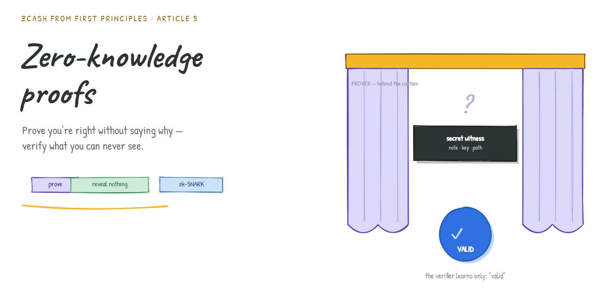
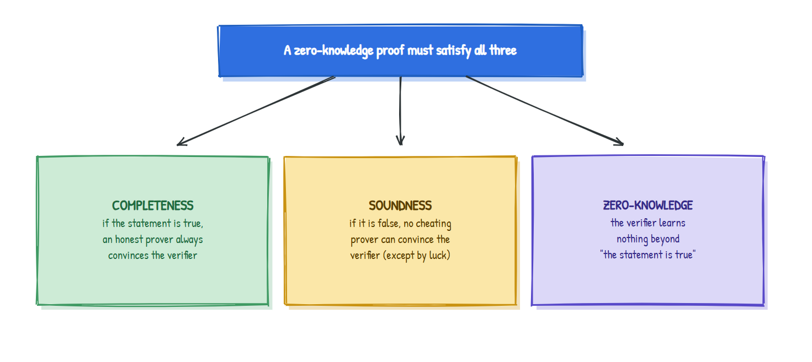
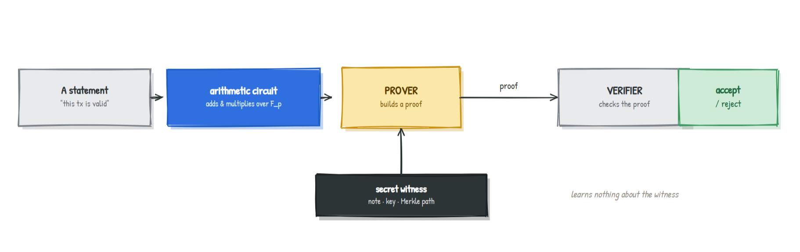
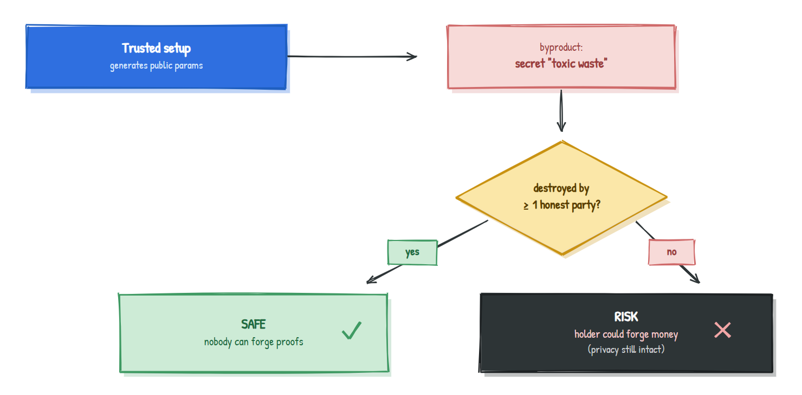

# Zero-Knowledge Proofs: Proving You're Right Without Saying Why

### The curtain that lets the world verify what it can never see

> **Series:** *Zcash from First Principles* · **Article 5 · Zero-Knowledge Proofs**
> **Audience:** newcomers. We draw on every earlier article (finite fields, curves, commitments, Merkle trees), but each idea is recalled as we need it.
> **What you'll leave with:** an intuitive, correct understanding of what a zero-knowledge proof is, the three guarantees it makes, how arbitrary statements get proven, and what powers Zcash's Sapling and Orchard.

This is the article the whole series has been climbing toward. From [Article 0](article-0-shielded-transaction.md) onward we kept saying a payment is validated "behind a curtain," proven correct while revealing nothing. A zero-knowledge proof is that curtain. It's the piece that finally resolves the paradox we opened with: *how can the public verify a transaction it isn't allowed to see?*

---

## 1. Why should you care?

Recall the contradiction at the heart of Zcash:

- A blockchain is trustworthy because it is **publicly verifiable**.
- Zcash payments are **completely private**: amounts, sender, receiver, all hidden.

These look mutually exclusive. Verification seems to *require* looking. Privacy *forbids* looking. If you can't reconcile them, you can't have private money that anyone trusts.

A **zero-knowledge proof (ZKP)** is the reconciliation. It lets a **prover** convince a **verifier** that a statement is true **without revealing anything beyond the fact that it's true.** No amounts. No identities. No note. Just: *"everything here obeys the rules."* Let's build the intuition before any machinery.

---

## 2. The intuition: three everyday proofs

**Proof you know a password, without saying it.** A website could verify you know your password by watching you unlock something only the password unlocks, never seeing the password itself. You prove *knowledge* without *disclosure*.

**The colour-blind friend and two balls.** You hold a red ball and a green ball that look identical to your colour-blind friend. You want to convince him they're *different colours* without telling him which is which. He hides both behind his back, optionally swaps them, and shows you one. You say whether he swapped. If the balls really differ, you're always right. If they were identical, you'd be guessing, right only half the time. After 20 rounds, your unbroken streak convinces him they differ, yet he never learns which ball is red. **He's convinced of a fact while learning nothing else.** That is zero knowledge in miniature.

**The cave.** A ring-shaped cave has a magic door at the back that opens only with a secret word. You claim to know the word. To prove it without revealing it: a verifier waits outside while you walk in and pick the left or right passage at random. The verifier then shouts which side they want you to come *out* of. If you truly know the word, you can always comply (you can open the door to switch sides if needed). If you're bluffing, you can only come out the right side by luck, 50/50 each round. Repeat 20 times and a bluffer's odds of surviving are less than one in a million.

That cave story quietly demonstrates the **three guarantees** every zero-knowledge proof must make.

---

## 3. The three guarantees

| Guarantee | In the cave story | In Zcash |
|---|---|---|
| **Completeness** | If you know the word, you always exit the right side | A valid transaction always produces an accepted proof |
| **Soundness** | A bluffer gets caught with overwhelming probability | A fraudulent transaction (forged money, double-spend) cannot produce an accepted proof |
| **Zero-knowledge** | The verifier never hears the secret word | The network never learns amounts, addresses, or which note |

If any one of these fails, the system breaks: no completeness and honest users get rejected; no soundness and forgers print money; no zero-knowledge and privacy evaporates.

---

## 4. From a cave to *any* statement: circuits and witnesses

The cave proves one cute fact. Zcash needs to prove a rich statement: *"I know an unspent note in the tree, I'm authorized to spend it, its nullifier is computed correctly, and my inputs equal my outputs."* How do we get from balls and caves to that?

The bridge is an idea that ties this whole series together:

> **Any statement you can check with a computation can be rewritten as an arithmetic circuit:** a network of additions and multiplications over a finite field (Article 1).

Think of the circuit as a list of arithmetic constraints that are *all satisfied only if the statement is true.* The private inputs that make everything check out, your note, your key, the Merkle path, are called the **witness.**

This is why we spent Article 1 on finite fields and Article 3 on ZK-friendly hashes: the circuit speaks field arithmetic, so every operation inside the statement (including hashing and the Merkle climb of Article 4) has to be expressed that way. The cheaper each operation is to express, the smaller and faster the proof.

---

## 5. Making it practical: non-interactive and succinct

The cave needed many back-and-forth rounds. That's impractical for a blockchain, where a proof must be posted once and checked by everyone, forever. Two upgrades fix this.

**Non-interactive (the Fiat-Shamir idea).** Instead of a live verifier shouting random challenges, the prover generates the "random challenges" themselves by *hashing* their own proof-so-far. Because a good hash is unpredictable (Article 3), the prover can't cook the challenges in their favour. The chatty conversation collapses into a **single self-contained proof** anyone can check later, with no interaction.

**Succinct.** The best systems make the proof **tiny and fast to verify, no matter how big the statement is.** This is the genuinely astonishing part.

> A Groth16 proof (the system Sapling uses) is roughly **192 bytes** and verifies in milliseconds, *whether the statement it proves is small or enormous.* A few hundred bytes can attest to a computation involving many thousands of constraints.

Put those together and you get the acronym you'll see everywhere:

> **zk-SNARK** = **z**ero-**k**nowledge **S**uccinct **N**on-interactive **AR**gument of **K**nowledge. Zero-knowledge (reveals nothing), succinct (tiny and fast), non-interactive (one-shot), argument of knowledge (the prover really *knows* a valid witness).

---

## 6. The one catch: trusted setup

There's no free lunch. Many SNARKs need a one-time **setup** that produces public parameters for the circuit. The setup generates secret randomness as a byproduct, and that secret must be **destroyed.** If anyone kept it, they could forge proofs, that is, **forge money** (though, crucially, they still could *not* break privacy).

This leftover secret is nicknamed **toxic waste.** To dispose of it safely, Zcash ran elaborate **multi-party ceremonies** where many independent participants each contributed randomness; as long as *even one* destroyed their piece honestly, the toxic waste is unrecoverable.

Newer systems remove this requirement entirely, which is one of the biggest reasons Zcash evolved its proof system over time.

---

## 7. Where this lives in Zcash

| Design | Proof system | Trusted setup? | Built on |
|---|---|---|---|
| **Sprout** (earliest) | early zk-SNARK | Yes | original ceremony |
| **Sapling** | **Groth16** | Yes (the multi-party "Powers of Tau" + Sapling ceremony) | **BLS12-381** (Article 2) |
| **Orchard** (current) | **Halo 2** | **No trusted setup** | **Pallas / Vesta** (Article 2) |

The march from Sprout to Sapling to Orchard is largely a story about proofs getting smaller, faster, and shedding the trusted setup. **Halo 2**, used by Orchard, needs no ceremony at all and is built to support *recursion* (proofs that verify other proofs), which is why Orchard uses the Pallas/Vesta **cycle** of curves from Article 2: each curve is tuned to verify proofs written over the other.

This closes the biggest loop from Article 0. The "behind the curtain" magic is a **zk-SNARK**: it proves your transaction satisfies an arithmetic circuit encoding all the rules, while revealing nothing but the single bit "valid."

---

## 8. An honest disclaimer

Zero-knowledge proofs are a deep field and we stayed at intuition level on purpose. We didn't define the precise probability bounds in soundness, the exact form of an arithmetic circuit (R1CS, PLONKish, and so on), how polynomials and commitments turn a circuit into a short proof, or the real internals of Groth16 and Halo 2. The cave is an *interactive* proof; production systems are non-interactive and far more intricate. None of that changes the core: prove a circuit is satisfied by a secret witness, completely, soundly, and revealing nothing. The machinery is a whole series of its own.

---

## 9. Summary

- A **zero-knowledge proof** lets a prover convince a verifier a statement is true **while revealing nothing else**, resolving the verify-vs-privacy paradox.
- It must satisfy three guarantees: **completeness** (true statements convince), **soundness** (false statements can't), and **zero-knowledge** (the verifier learns only "it's true").
- Arbitrary statements become **arithmetic circuits** over a finite field; the secret inputs that satisfy the circuit are the **witness**. This is why finite fields and ZK-friendly hashes mattered.
- **Fiat-Shamir** makes proofs **non-interactive** (one-shot); the best systems are also **succinct** (a Groth16 proof is about **192 bytes** and verifies in milliseconds regardless of statement size). Together: a **zk-SNARK**.
- Some SNARKs need a **trusted setup** whose leftover **toxic waste** must be destroyed (via multi-party ceremonies); compromise would allow forging money but **not** breaking privacy.
- **Sapling** uses **Groth16** (trusted setup, BLS12-381); **Orchard** uses **Halo 2** (no trusted setup, Pallas/Vesta, recursion-friendly).

---

## Glossary

| Term | Plain-English meaning |
|---|---|
| **Zero-knowledge proof** | Convince someone a statement is true while revealing nothing else |
| **Prover / Verifier** | The one who makes the proof / the one who checks it |
| **Completeness** | True statements always get accepted (from an honest prover) |
| **Soundness** | False statements get rejected (cheaters can't win except by luck) |
| **Witness** | The secret inputs that make the statement true |
| **Arithmetic circuit** | A statement rewritten as adds and multiplies over a finite field |
| **Non-interactive (Fiat-Shamir)** | A one-shot proof needing no live back-and-forth |
| **Succinct** | The proof is tiny and fast to verify regardless of statement size |
| **zk-SNARK** | Zero-knowledge Succinct Non-interactive ARgument of Knowledge |
| **Trusted setup / toxic waste** | One-time parameter generation whose leftover secret must be destroyed |

---

## FAQ

**If the proof reveals nothing, how can checking it mean anything?**
Because the math is arranged so that *only* a real, valid witness can produce a passing proof. Passing the check is itself the evidence, no disclosure required.

**Could someone fake a proof?**
Soundness makes this infeasible. The one exception is a SNARK whose trusted-setup toxic waste was kept; that's exactly why the ceremonies to destroy it matter.

**Does a broken trusted setup leak my private data?**
No. It would let an attacker forge *new* money, but it does **not** reveal amounts, addresses, or notes. Privacy and soundness are separate guarantees.

**Why did Zcash change proof systems over time?**
To get smaller, faster proofs and, with Halo 2, to eliminate the trusted setup entirely and enable recursion.

---

### Test your intuition

In the cave, why is it essential that the verifier chooses the exit side *after* the prover has already walked in, rather than announcing it beforehand? *(Answer below.)*

Answer

If the verifier announced the side first, a bluffer who doesn't know the word could simply walk into that side from the start and stroll back out, never needing the door. Choosing *after* the prover commits to a passage forces a bluffer to rely on luck (50/50 per round), which is what makes repeated rounds convincing. This "commit first, then be challenged" ordering is exactly what Fiat-Shamir preserves by deriving the challenge from a hash of the prover's already-committed proof.

---

### What's next

**Article 6 · The shielded protocol, end to end:** the finale. We take every piece, notes, commitments, the note commitment tree, nullifiers, value balance, and the zero-knowledge proof, and assemble a complete Zcash shielded transaction, closing every single loop opened back in Article 0.

*Part of the* Zcash from First Principles *series for [ZecHub](https://zechub.org). Licensed CC BY-SA 4.0.*
