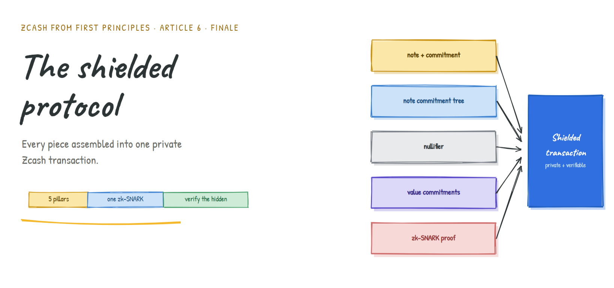
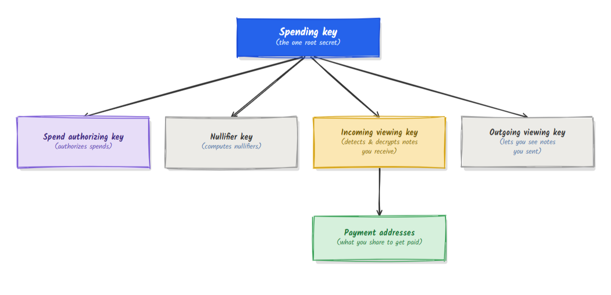
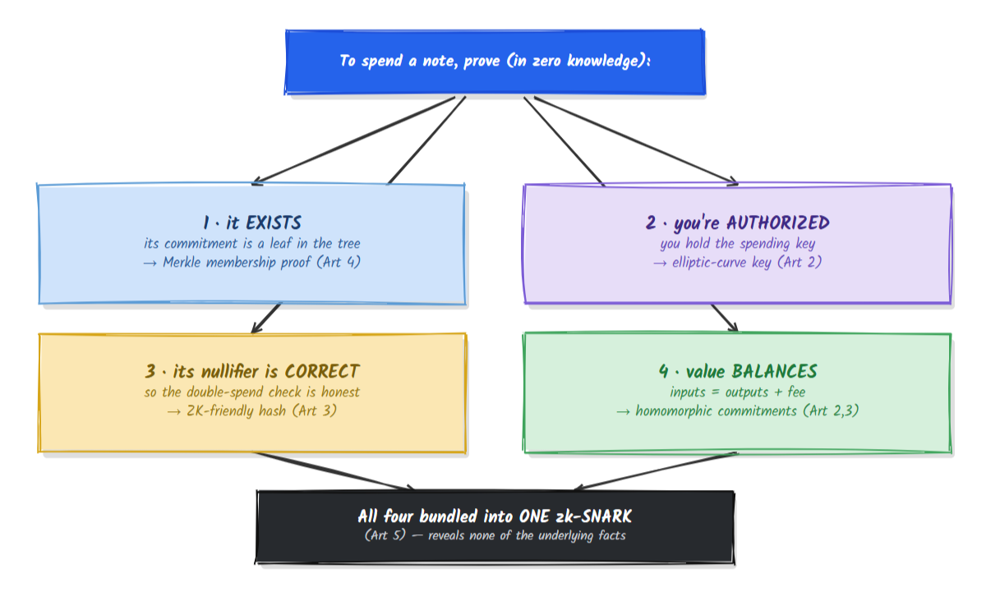
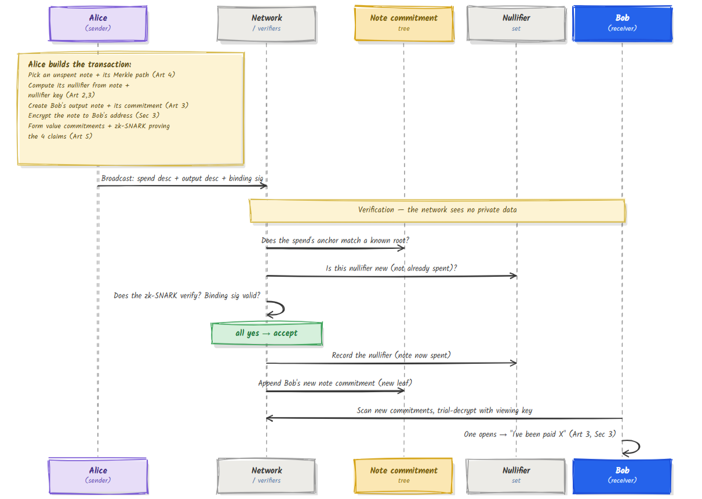

# The Shielded Protocol, End to End
##### Original Research from [Annkkitaaa](https://github.com/Annkkitaaa)



### Assembling every piece into one private Zcash transaction

> **Series:** *Zcash from First Principles* . **Article 6 . The Shielded Protocol** (finale)
> **Audience:** newcomers who've read Articles 0 through 5. This is where everything connects.
> **What you'll leave with:** a complete, correct mental model of a shielded Zcash transaction, with every concept from the series in its proper place, and every loop from Article 0 closed.

We began, in [Article 0](article-0-shielded-transaction.md), with a paradox and a story about sealed envelopes on a public board. Then we spent five articles building the parts: finite fields, elliptic curves, commitments, Merkle trees, and zero-knowledge proofs. Now we put them together and watch a real private payment work, start to finish.

---

## 1. Why should you care?

Individually, each piece you've learned is clever. But the *magic* of Zcash is in how they interlock. A nullifier alone doesn't give privacy. A commitment alone doesn't prevent forgery. A proof alone proves nothing useful. It's the **assembly** that turns five components into money that is simultaneously private and trustworthy.

This article is the assembly. By the end, the sentence *"the network verifies a transaction it cannot see"* will feel not like a paradox but like an obvious consequence of parts you already understand.

---

## 2. The cast, reassembled

Here is the entire series on one page, mapped from Article 0's story to the real machinery.

| Article 0 story element | Real component | Built from |
|---|---|---|
| The money inside an envelope | **Note** (value, recipient, randomness) | encoded as field elements (Art 1) |
| The sealed opaque envelope | **Note commitment** | Pedersen / Sinsemilla commitment (Art 2, 3) |
| The public board | **Note commitment tree** (anchor = its root) | incremental Merkle tree (Art 4) |
| The void token | **Nullifier** | a ZK-friendly hash of note + secret key (Art 2, 3) |
| "Money in equals money out" | **Value commitments + balance check** | homomorphic Pedersen commitments (Art 2, 3) |
| The behind-the-curtain magic | **Zero-knowledge proof** | zk-SNARK over an arithmetic circuit (Art 5) |
| "Only you can read your envelope" | **Encrypted note + viewing keys** | encryption + key hierarchy (this article) |

---

## 3. Where keys come from

Everything a user can do flows from a single secret, the **spending key**, through a one-way hierarchy (each arrow is an irreversible derivation, courtesy of the trapdoors in Articles 2 and 3):



Two things worth noticing, both consequences of earlier articles:

- The split lets you hand out a **viewing key** (say, to an auditor) that reveals your transactions **without** granting the power to spend. Privacy is selective, not all-or-nothing.
- Each derivation is **one-way**: holding a viewing key never lets anyone recover the spending key, exactly the elliptic-curve trapdoor from Article 2 doing its job.

---

## 4. Spending a note: the four claims

To spend a note privately, you must convince the network of four things at once **without revealing the note, its value, its position, or your identity.** Each claim is satisfied by a component you already know.



The proof reveals **none** of the underlying facts (which note, whose key, what value). It reveals only that *all four claims hold.* That is the entire trick of shielded Zcash, stated in one diagram.

---

## 5. The value-balance trick (the payoff we saved)

Back in Articles 2 and 3 we noted that Pedersen commitments **add up**: the commitment to `v_1` plus the commitment to `v_2` is a commitment to `v_1 + v_2`. Here's where that pays off.

Every input and output note carries a **value commitment**: a Pedersen commitment `v.G + r.H` that hides its amount `v`. Because these add, the network can compute:

```
(sum of input value commitments) − (sum of output value commitments)
```

If the transaction is balanced (no money created or destroyed), the `v` parts cancel exactly, leaving only a commitment to **zero value**, blinded by leftover randomness. The sender proves they know that leftover randomness by producing a small signature called the **binding signature.** A valid binding signature is only possible when the values truly balance, **yet not a single amount was revealed.**

> This is the cleanest illustration in the whole series of *why* we needed homomorphic, curve-based commitments. The "money in equals money out" rule is enforced by **adding sealed envelopes together** and checking the result seals to zero.

---

## 6. A complete transaction, watched end to end

Let's assemble Alice paying Bob. We'll use Sapling's clear "spend side / output side" structure as the teaching model.

**A shielded transaction bundles two kinds of descriptions:**

| Spend description (consumes a note) | Output description (creates a note) |
|---|---|
| value commitment of the input | value commitment of the output |
| the **anchor** it proves against (a tree root) | the new **note commitment** (a new leaf) |
| the **nullifier** of the spent note | an **ephemeral key** for encryption |
| a re-randomized public key + spend-authorization signature | the **encrypted note** (ciphertext for the recipient) |
| the **zk-SNARK** proving the four claims | a **zk-SNARK** proving the output is well-formed |

Plus one **binding signature** over the whole bundle, enforcing value balance (Section 5).



Trace the privacy: the network checked the anchor, checked the nullifier was fresh, verified the proof, and verified balance. It accepted a valid payment **having learned no amount, no address, and not which note was spent.** Meanwhile the spent note's **nullifier** (its death) and Bob's new **commitment** (his note's birth) sit in two different public structures with no visible link between them, the severed link from Article 0.

---

## 7. Closing every loop from Article 0

Article 0 deliberately opened questions. Here they all are, closed.

| Loop opened in Article 0 | Closed by |
|---|---|
| How is a sealed-yet-unforgeable envelope possible? | Commitments: hiding from randomness, binding from collision resistance / the curve trapdoor (Art 3) |
| Where do keys and secret recipes come from? | Field arithmetic and elliptic-curve scalar multiplication (Art 1, 2) |
| What exactly is "the board"? | An incremental Merkle tree of note commitments; its root is the anchor (Art 4) |
| Why can't the void token be linked to its envelope? | The nullifier is a keyed hash kept in a separate set from commitments (Art 2, 3, 4) |
| How do you prove validity while revealing nothing? | A zk-SNARK over an arithmetic circuit encoding all four claims (Art 5) |
| How does the recipient learn they were paid? | The note is encrypted to their address; they trial-decrypt with a viewing key (this article) |
| How is "money in = money out" enforced privately? | Homomorphic value commitments + the binding signature (Sec 5) |

The paradox from page one, *verify what you cannot see*, is now fully dissolved. The network verifies **claims about hidden data**, never the data itself.

---

## 8. Sapling vs Orchard, in one breath

We taught with Sapling's structure because its split is clearest. The current design, **Orchard**, refines rather than replaces these ideas:

| | **Sapling** | **Orchard** |
|---|---|---|
| Transaction unit | separate **Spend** and **Output** descriptions | unified **Actions** (each does one spend + one output) |
| Proof system | **Groth16** (trusted setup) | **Halo 2** (no trusted setup) |
| Curves | BLS12-381 + Jubjub | Pallas / Vesta (Pasta) |
| Commitment hash | Pedersen | Sinsemilla |

Every concept in this article carries over directly; Orchard mainly bundles spend-and-output together and swaps in a proof system with no ceremony. The five pillars are unchanged.

---

## 9. An honest disclaimer

This is the most complete picture in the series, but still a model. We compressed the exact field encodings of a note, the precise key-derivation formulas, the re-randomization of spend keys, diversified addresses, memo fields, fee handling, the difference between value commitments and note commitments in full detail, and the precise role of each signature. We also presented one canonical flow; real transactions can carry many spends and outputs at once and may mix transparent and shielded parts. The authoritative source is the Zcash Protocol Specification. What you now hold is the correct shape; the specification fills in every measurement.

---

## 10. Summary

- A shielded transaction interlocks all five components: a **note** (the value), its **commitment** in the **note commitment tree**, a **nullifier** to prevent double-spends, **value commitments** for balance, and a **zk-SNARK** binding it all together.
- Spending proves **four claims at once**, the note exists, you're authorized, its nullifier is correct, and value balances, in **zero knowledge**, revealing none of the underlying facts.
- **Value balance** is enforced by **adding homomorphic commitments** and checking they seal to zero, via the **binding signature**, with no amount disclosed.
- A user's powers flow from one **spending key** through a **one-way hierarchy**, enabling **viewing keys** that reveal without granting spend power.
- The network **verifies claims about hidden data**, dissolving the verify-vs-privacy paradox from Article 0. Every loop opened there is now closed.
- **Orchard** refines **Sapling** (unified Actions, Halo 2 with no trusted setup, Pasta curves, Sinsemilla) without changing the five pillars.

---

## Glossary

| Term | Plain-English meaning |
|---|---|
| **Spending key** | The single root secret from which all a user's keys derive |
| **Viewing key** | Reveals your transactions to a holder without letting them spend |
| **Spend description** | The part of a tx that consumes a note (nullifier, anchor, proof) |
| **Output description** | The part of a tx that creates a note (commitment, ciphertext, proof) |
| **Action (Orchard)** | A unified unit doing one spend and one output together |
| **Value commitment** | A homomorphic Pedersen commitment to an amount |
| **Binding signature** | The signature that proves values balance without revealing them |
| **Anchor** | The tree root a spend proves membership against |
| **Trial decryption** | A recipient testing new commitments to find notes meant for them |

---

## FAQ

**Does the network ever see the amount or who paid whom?**
No. It verifies the proof, the freshness of the nullifier, the anchor, and the binding signature. All private values stay hidden.

**What stops me from spending a note twice?**
The nullifier. Spending publishes it; the network rejects any nullifier already in the nullifier set. The same note always yields the same nullifier.

**How can balance be checked if amounts are hidden?**
Value commitments add up homomorphically; a balanced transaction's commitments cancel to a commitment of zero, which the binding signature proves.

**Can I prove my transactions to an auditor without giving up control?**
Yes. Hand over a viewing key. It reveals your shielded activity but cannot authorize spends, thanks to the one-way key hierarchy.

**Is Sapling obsolete now that Orchard exists?**
Both have existed on the network; Orchard is the current design. The concepts are shared, so understanding one gives you the other.

---

### Test your intuition

A friend says: "Since the proof hides the amount, a thief could just claim their outputs are worth more than their inputs and print free money." Using Section 5, explain in two sentences why this fails. *(Answer below.)*

<details><summary>Answer</summary>

The amounts are hidden, but each is wrapped in a homomorphic value commitment, and the network adds all input commitments and subtracts all output commitments; if the hidden values didn't balance, the result would not seal to zero and **no valid binding signature could be produced.** The thief can hide *how much*, but cannot make unbalanced values pass the balance check, so printing free money is impossible without revealing nothing yet still being caught by the arithmetic.
</details>

---

### The series, complete

You've now traveled from a single paradox to a full private payment:


From here, the natural next arc goes deeper: the inner workings of Groth16 and Halo 2, trusted-setup ceremonies, the Sapling and Orchard circuits in detail, key derivation and diversified addresses, and the protocol's evolution across network upgrades. But the foundation is now in place, and every one of those topics has a home to attach to.

*Part of the* Zcash from First Principles *series for [ZecHub](https://zechub.org). Licensed CC BY-SA 4.0.*
