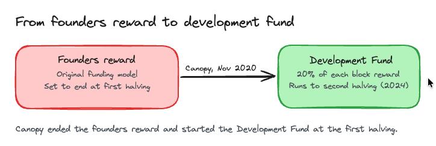
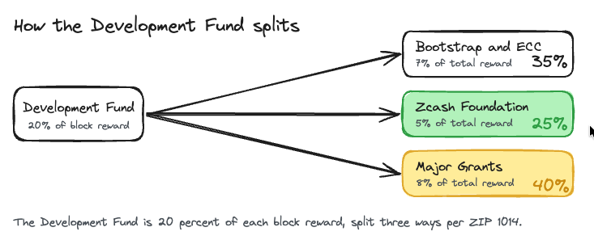
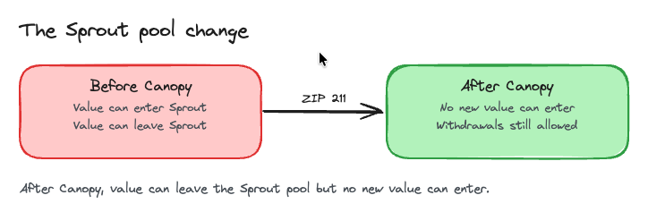

# Canopy

> Status: Activated. Canopy went live on Zcash mainnet at block 1,046,400 (November 18, 2020 UTC). Some dashboards show it in local time, which is the same block and the same moment.

What you'll take away: how Zcash kept funding its own development after the founders reward ended, and how Canopy set up the funding split that later upgrades still build on.

Canopy is Zcash's fifth network upgrade, also labeled Network Upgrade 4 (NU4). It is deployed by [ZIP 251](https://zips.z.cash/zip-0251), and it activated at mainnet block 1,046,400 on November 18, 2020 (UTC), the same moment as Zcash's first block reward halving. Canopy was mainly a governance and monetary upgrade. It ended the original founders reward and started the new Zcash Development Fund, which pays the Electric Coin Company, the Zcash Foundation, and independent grant recipients. The policy behind that fund came out of an extended community governance process in 2019.

Why this matters. Software usually gets paid for by a company. Zcash is a decentralized network with no single owner, and the original founders reward that funded its early years was scheduled to end at the first halving. Without a replacement, every coin of the post-halving block reward would have gone to miners, leaving nothing at the protocol level for the people who keep building Zcash. Canopy was the replacement. It routed a fixed share of each block reward into a Development Fund and set the rules for who receives it.

## The development fund

Canopy ended the original founders reward and replaced it with the Zcash Development Fund. The change landed at the same block as Zcash's first halving, when the block reward dropped from 6.25 ZEC to 3.125 ZEC. So miners saw their reward cut in half on the same day a new slice of that smaller reward started flowing to development.

The fund was set to run for four years, from this first halving in November 2020 until the second halving in 2024. The agreed policy was written up as [ZIP 1014](https://zips.z.cash/zip-1014). The consensus machinery that actually moves the money is the funding stream mechanism: [ZIP 207](https://zips.z.cash/zip-0207) introduced the general way to direct part of the block subsidy to defined recipients, and [ZIP 214](https://zips.z.cash/zip-0214) set the specific rules and recipient addresses for the Development Fund.

## How the money is split

The Development Fund takes 20 percent of each block reward. Miners keep the other 80 percent. That 20 percent is then split three ways, following ZIP 1014.

1. 35 percent to the Bootstrap Project, the parent organization of the Electric Coin Company.
2. 25 percent to the Zcash Foundation.
3. 40 percent to Major Grants, which funds independent work and is administered by the Zcash Foundation. Major Grants later became Zcash Community Grants (ZCG).

Measured against the whole block reward instead of just the fund, those shares work out to 7 percent for the Electric Coin Company, 5 percent for the Zcash Foundation, and 8 percent for Major Grants. Both ways of describing it are the same numbers.

## The Sprout pool change

Canopy also started retiring the oldest shielded pool. Sprout was Zcash's first shielded pool, and Canopy began winding it down through [ZIP 211](https://zips.z.cash/zip-0211).

From the moment Canopy activated, no new value can be added into the Sprout pool. In technical terms, the vpub_old field of every JoinSplit must be zero. Funds already in Sprout can still be withdrawn, so nobody is locked out, but the pool can only shrink from here. This is a first step toward eventually deprecating the legacy Sprout pool in favor of newer shielded pools.

## The technical extras

Alongside the funding changes, Canopy carried two smaller technical ZIPs. [ZIP 212](https://zips.z.cash/zip-0212) changed how a recipient derives the Sapling ephemeral secret, deriving it from the note plaintext. [ZIP 215](https://zips.z.cash/zip-0215) wrote down explicit rules for validating Ed25519 signatures, so every node agrees on exactly which signatures count as valid.

## Glossary

| Term | Plain-English meaning |
|---|---|
| Founders reward | The original funding model that paid for early Zcash development, scheduled to end at the first halving |
| Development Fund | The 20 percent share of each block reward that Canopy routed to development, running to the second halving |
| Block reward (subsidy) | The new ZEC created and paid out as each block is mined |
| Halving | The scheduled event where the block reward is cut in half |
| Funding stream | The consensus mechanism (ZIP 207) that directs part of the block subsidy to defined recipient addresses |
| Sprout pool | Zcash's original shielded pool, which Canopy stopped accepting new value into |

## FAQ

Does Canopy change my ZEC or my privacy? No. Canopy is about how development is funded, plus a few technical rules. Your balances and your shielded transactions are unaffected.

Did Canopy cut the block reward? Canopy activated at the same block as Zcash's first halving, which cut the reward from 6.25 ZEC to 3.125 ZEC. The halving is part of Zcash's monetary policy. Canopy's job was to decide how a share of that smaller reward is used.

What is the Development Fund for? It funds the people building Zcash. The money goes to the Electric Coin Company (through the Bootstrap Project), the Zcash Foundation, and Major Grants, which supports independent work.

Can I still use funds in the Sprout pool? Yes. You can still withdraw funds that are already in Sprout. You just cannot add new value into it after Canopy.

Is the Development Fund permanent? No. It was set to run for four years, from the first halving in November 2020 until the second halving in 2024, giving the community time to see how it works before revisiting it.

How does Canopy relate to NU6 and NU6.1? Canopy set up the three-way funding split and the funding stream machinery. Later upgrades, including NU6 and NU6.1, revisited and reshaped the Development Fund built on top of that foundation.

## Test your understanding

Canopy activated at the exact same block as Zcash's first halving. Why was that timing chosen, and what would have happened to development funding without Canopy?

Answer

The original founders reward was scheduled to end at the first halving. Without Canopy, all of the smaller post-halving block reward would have gone to miners, leaving no protocol-level funding for development. Canopy replaced the founders reward with the Development Fund at that exact block, so funding continued without a gap.

### Resources

[ZIP 251: Deployment of the Canopy Network Upgrade](https://zips.z.cash/zip-0251)

[ZIP 1014: Establishing a Dev Fund for ECC, ZF, and Major Grants](https://zips.z.cash/zip-1014)

[ZIP 207: Funding Streams](https://zips.z.cash/zip-0207)

[ZIP 214: Consensus Rules for a Zcash Development Fund](https://zips.z.cash/zip-0214)

[ZIP 211: Disabling Addition of New Value to the Sprout Value Pool](https://zips.z.cash/zip-0211)

[Canopy Network Upgrade](https://z.cash/upgrade/canopy/)

### See also

[Zcash Network Upgrades](../Start_Here/Network_Upgrades.md)

[Development Fund](../Start_Here/Development_Fund.md)

[Zcash Monetary Policy](../Start_Here/Zcash_Monetary_Policy.md)

[Shielded Pools](../Using_Zcash/Shielded_Pools.md)

[NU6.1](NU6_1.md)

[Zcash Governance](../Zcash_Community/Zcash_Governance.md)

---

*Footer*
