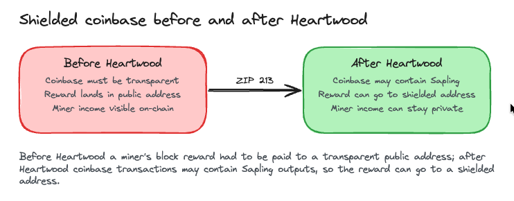
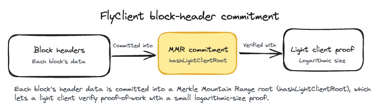
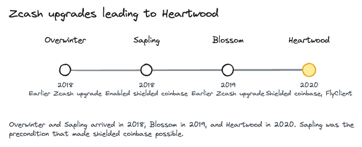

# Heartwood

> Heartwood went live on Zcash mainnet at block 903,000 (July 16, 2020 UTC).

What you'll take away: how Heartwood let miners receive their block rewards straight into shielded addresses, and how it made Zcash's proof-of-work checkable by lightweight clients.

Heartwood is a Zcash [network upgrade](../start-here/network-upgrades), a consensus-rule hard fork whose deployment is defined in [ZIP 250](https://zips.z.cash/zip-0250). It bundled two feature changes: [ZIP 213](https://zips.z.cash/zip-0213) (Shielded Coinbase) and [ZIP 221](https://zips.z.cash/zip-0221) (FlyClient). Heartwood was Zcash's fourth major network upgrade, and it was jointly supported by the [Electric Coin Company](../zcash-organizations/electric-coin-company) and the [Zcash Foundation](../zcash-organizations/zcash-foundation). Like every Zcash upgrade, it set a new consensus branch id, a tag that gives two-way replay protection so a transaction built under the new rules cannot be replayed on the old chain, and the reverse.

Heartwood activates at a set block height (903,000), not at a fixed clock time, so the exact minute you see on a dashboard can differ slightly from one place to another. The block, and the moment, are the same.

Why this matters. Miners earn newly minted ZEC every time they mine a block. Before Heartwood, that income had to land in a transparent address, which is public. Anyone could watch how much a miner earned and where the coins went next. Heartwood let that reward go straight into a shielded address instead, so a miner's pay can stay private. It also made it possible for lightweight wallets and other chains to check Zcash's proof-of-work without downloading the whole chain.

## Shielded coinbase

The coinbase transaction is the special transaction that pays out a block reward. Before Heartwood, its outputs had to be transparent, so a miner's freshly minted ZEC always started life in a public address. Heartwood changed the consensus rules so that, in the words of ZIP 213, coinbase transactions may contain Sapling outputs. In plain terms, miners can now receive rewards directly into shielded Sapling addresses. Transparent coinbase outputs are still supported, so this is a new option, not a forced change.

## Why Sapling first

Shielded coinbase targets Sapling outputs specifically, and there is a reason for that. ZIP 213 explains that the Sapling upgrade brought architectural changes and performance improvements that made shielding funds directly in the coinbase transaction feasible. The original Sprout shielded pool was too resource-intensive to shield right in the coinbase. Sapling's more efficient proving system and note format made it practical. Sapling had itself extended the older rule that barred shielded coinbase outputs so that the rule also covered Sapling outputs, and Heartwood relaxes that rule to permit them. It is a good example of how Zcash upgrades build on each other: one upgrade's plumbing becomes the foundation for the next.

## FlyClient

Heartwood also changed what a block header commits to. The header field previously named hashFinalSaplingRoot was repurposed and renamed to hashLightClientRoot. It now commits to the root of a Merkle Mountain Range (MMR), a running structure built over the header data and metadata of prior blocks, such as timestamps, difficulty targets, Sapling roots, accumulated work, and transaction counts. That commitment lets a light client, or an outside chain, verify Zcash's proof-of-work using a small proof whose size grows only logarithmically with the length of the chain. The payoff is better light-client wallets and easier third-party and cross-chain integration, because a client no longer has to download every block to trust the work behind the chain.

## Where Heartwood fits

Heartwood is one step in a run of Zcash upgrades, each adding a piece the next one relies on. Overwinter and Sapling arrived in 2018, Blossom in 2019, and Heartwood in 2020 at block 903,000. Canopy followed later in 2020 at block 1,046,400. Sapling is the key link in this chain for Heartwood: its efficient shielded-transaction machinery was the technical precondition that made shielded coinbase possible.

## Glossary

| Term | Plain-English meaning |
|---|---|
| Network upgrade (NU) | A coordinated change to Zcash's consensus rules, activated at a set block height |
| Coinbase transaction | The special transaction in each block that pays out the block reward |
| Shielded Sapling address | A private Zcash address type introduced by the Sapling upgrade |
| Shielded coinbase | The Heartwood change that lets block rewards be paid into shielded Sapling addresses |
| FlyClient | A method that lets light clients verify proof-of-work with small proofs |
| Merkle Mountain Range (MMR) | A running summary of past blocks that the block header commits to |
| Consensus branch id | A tag identifying which upgrade's rules a transaction follows, used for replay protection |

## FAQ

Does Heartwood change my ZEC or my privacy? No. Heartwood did not touch your existing funds. It added the option for miners to receive rewards into shielded addresses and improved support for light clients. Your own balances and shielded transactions are unaffected.

What is shielded coinbase? The coinbase is the transaction that pays a block reward. Heartwood lets that reward go into a shielded Sapling address instead of a transparent one, so miner income can stay private.

Do miners have to receive rewards shielded now? No. Shielded coinbase is optional. Transparent coinbase outputs remain supported, so miners can choose either.

Why does shielded coinbase use Sapling and not the older Sprout pool? Because Sapling's more efficient design made shielding directly in the coinbase practical. The earlier Sprout pool was too resource-intensive to do it.

What changed for light clients? The block header now commits to a Merkle Mountain Range over past blocks through the hashLightClientRoot field. That lets light clients and other chains verify Zcash's proof-of-work with small, logarithmic-size proofs instead of the whole chain.

## Test your understanding

Before Heartwood, why did the block reward paid to a miner show up publicly, and what did Heartwood change?

Answer

Coinbase outputs had to be transparent, so a miner's newly minted reward always landed in a public transparent address that anyone could inspect. Heartwood changed the consensus rules (ZIP 213) so that coinbase transactions may contain Sapling outputs, letting miners receive their rewards directly into shielded addresses.

### Resources

[ZIP 250: Deployment of the Heartwood Network Upgrade](https://zips.z.cash/zip-0250)

[ZIP 213: Shielded Coinbase](https://zips.z.cash/zip-0213)

[ZIP 221: FlyClient - Consensus-Layer Changes](https://zips.z.cash/zip-0221)

[Heartwood network upgrade](https://z.cash/upgrade/heartwood/)

### See also

[Zcash Network Upgrades](../start-here/network-upgrades)

[Shielded Pools](../using-zcash/shielded-pools)

[Wallets](../using-zcash/wallets)

[zk-SNARKS](../zcash-tech/zk-snarks)

[Electric Coin Company](../zcash-organizations/electric-coin-company)

[Zcash Foundation](../zcash-organizations/zcash-foundation)

---

Series: [Network Upgrades index](../start-here/network-upgrades) · Previous: [Blossom](../zcash-tech/blossom) · Next: [Canopy](../zcash-tech/canopy)
