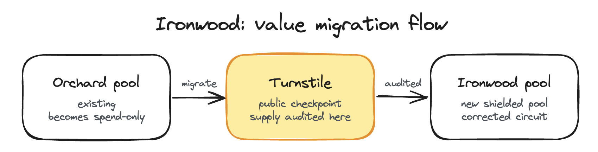
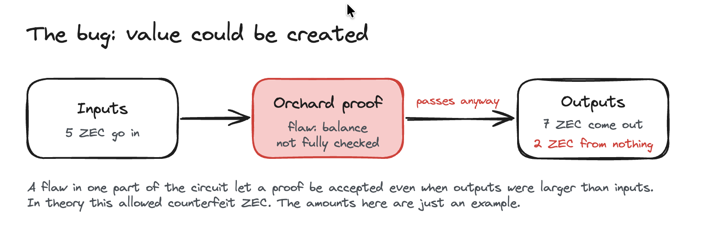
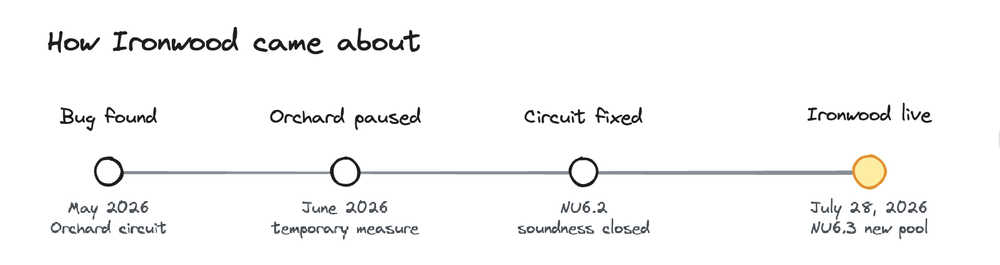
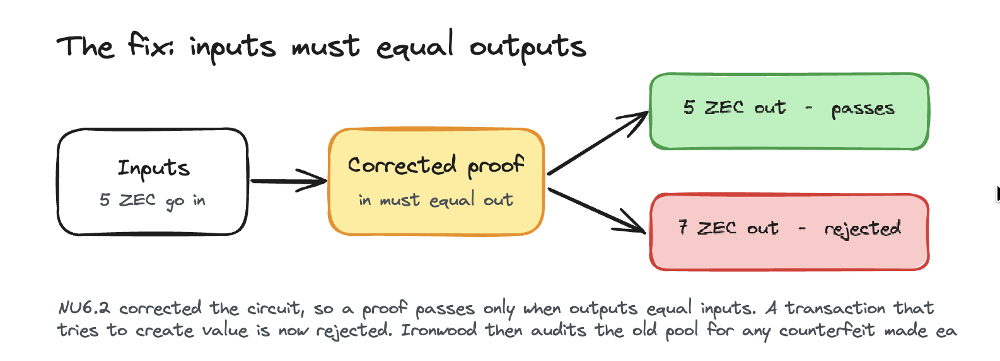

# Ironwood

> Status: Scheduled. Ironwood activates on Zcash mainnet at block 3,428,143 (July 28, 2026 UTC).

What you'll take away: what Ironwood changes, why a bug in hidden money is serious, and how the turnstile lets anyone confirm that no ZEC was forged.

Ironwood is a Zcash [network upgrade](../Start_Here/Network_Upgrades.md), formally NU6.3, that introduces a new shielded pool of the same name. A [shielded pool](../Using_Zcash/Shielded_Pools.md) is the set of funds whose amounts and owners stay hidden by [zero-knowledge cryptography](zk_SNARKS.md). Ironwood exists to contain and audit a soundness bug found in the existing Orchard shielded pool, and to give the community a stronger way to check that the total supply of ZEC is honest. Its consensus rules are finalized in [ZIP 258](https://zips.z.cash/zip-0258).

Why this matters. With transparent money like Bitcoin, anyone can check that no coins were forged by reading the public ledger. Shielded money hides the amounts, so you cannot just look. Instead the cryptography itself has to guarantee that no one can create money in secret. Ironwood matters because a bug was found in that guarantee for the Orchard pool. The upgrade closes the gap and gives anyone a way to confirm that the total supply of ZEC is still honest.

New to Zcash? Start with [What is ZEC and Zcash](../Start_Here/What_is_ZEC_and_Zcash.md) and [Shielded Pools](../Using_Zcash/Shielded_Pools.md), then come back here.

## Why Ironwood was needed

In late May 2026, independent security researcher Taylor Hornby, during a protocol audit for [Shielded Labs](../Zcash_Organizations/Shielded_Labs.md), responsibly disclosed a soundness bug in the Orchard shielded pool. Orchard was Zcash's newest shielded pool at the time, and the flaw sat in an elliptic-curve part of its zero-knowledge circuit, which uses the [Halo](Halo.md) 2 proving system.

1. A soundness bug means the math that proves a transaction is valid does not fully guarantee it.
2. In theory, an attacker could have used the flaw to mint counterfeit ZEC that left no trace a normal node would catch.
3. That meant the total ZEC supply was no longer fully enforced by the Orchard pool's cryptography.

The numbers above are a simplified picture. The real flaw was in a specific piece of the circuit's math, not a literal count of coins going in and out. The point to take away is only that a soundness bug can let value be created without detection.

Importantly, there is no evidence the bug was ever exploited, no evidence of impact to user funds, and no evidence that the total supply of ZEC changed. It was found through security research and fixed before any known harm.

## The response

The Zcash community shipped fixes in stages rather than all at once.

1. In early June 2026, a temporary measure disabled the Orchard pool while a full fix was prepared.
2. The NU6.2 upgrade corrected the Orchard circuit itself, closing the underlying soundness vulnerability.
3. The NU6.3 upgrade, Ironwood, introduces a fresh shielded pool and a public checkpoint so value can move out of the old Orchard pool under full audit.

## What the Ironwood pool does

NU6.2 secured the Orchard circuit for all new transactions, but value created under the old rules still sits in the Orchard pool. Ironwood gives that value a clean destination and a way to audit it as it moves.

The Ironwood pool is a new shielded value pool created when NU6.3 activates. It is built on the corrected circuit and uses a quantum-recoverable note format (a design that lets funds be recovered if [quantum computers](Post_Quantum_Security.md) ever break today's cryptography), defined in [ZIP 2005](https://zips.z.cash/zip-2005).

1. After activation, the old Orchard pool becomes spend-only, so no new value may enter it.
2. Newly shielded value flows into Ironwood instead.
3. Shielded ZEC keeps the same strong privacy guarantees that hide sender, receiver, and amount.

## The turnstile

The key idea in Ironwood is the turnstile, an accounting checkpoint that every coin must pass through when moving from the old Orchard pool into Ironwood.

> A turnstile does for hidden money what a glass door does for a bank vault. You still cannot see inside, but you can count exactly what goes in and what comes out.

1. Funds leaving Orchard are counted at a public verification point before they enter Ironwood.
2. This lets anyone audit how much ZEC migrates, strengthening confidence in the real circulating supply.
3. If any counterfeit ZEC had been created through the earlier bug, this migration accounting is where it would show up.

Turnstiles are not new to Zcash. The network has used them before, at the boundaries between the Sprout, Sapling, and Orchard pools, so that value moving between pools stays auditable and no pool can release more than legitimately entered it.

Consensus rules keep every value pool, including Ironwood, within the network's maximum money limit, so pool balances can never go negative.

## What users need to do

Wallets and node software handle most of this automatically, but the practical shift is simple: over time, move shielded holdings from the old Orchard pool through the turnstile into the Ironwood pool. Follow the guidance from your wallet provider, and always update to a supported release before the activation block.

## FAQ

Was my ZEC affected? No. There is no evidence the bug was ever used, no impact to user funds, and no change to the total supply.

Do I need to do anything? Keep your wallet and node software updated to a supported release before the activation block. Your wallet moves funds into Ironwood over time as you spend, so there is nothing manual to rush. Follow your wallet provider's guidance.

Is Zcash still private? Yes. Ironwood keeps the same shielded privacy that hides sender, receiver, and amount. This upgrade is about supply integrity, not privacy.

Was the bug ever exploited? There is no evidence that it was. It was found through security research, responsibly disclosed, and fixed before any known harm.

What happens to the old Orchard pool? It becomes spend-only. No new value can enter it, and existing value moves into Ironwood through the turnstile, where the migration is publicly audited.

## Glossary

| Term | Plain-English meaning |
|---|---|
| Shielded pool | The set of funds whose amounts and owners are hidden by zero-knowledge cryptography |
| Soundness bug | A flaw that lets an invalid transaction pass the proof check as if it were valid |
| Turnstile | A public checkpoint that counts value moving between pools so the supply stays auditable |
| Spend-only | A pool you can spend from, but cannot add new value to |
| Network upgrade (NU) | A coordinated change to Zcash's consensus rules, activated at a set block height |
| Quantum-recoverable note | A note format designed so funds could be recovered if quantum computers ever break today's cryptography |

## Test your understanding

If the ZEC inside shielded pools is hidden, how can anyone confirm that the Orchard bug did not secretly inflate the total supply?

Answer

Through the turnstile. Every coin leaving the old Orchard pool is counted at a public checkpoint as it enters Ironwood. If more value tried to leave than legitimately entered, the accounting would not balance, so any counterfeit the bug could have created would surface at that gate.

### Resources

[ZIP 258: Network Upgrade 6.3](https://zips.z.cash/zip-0258)

[ZIP 257: Network Upgrade 6.2](https://zips.z.cash/zip-0257)

[ZIP 2005: Ironwood Quantum Recoverability](https://zips.z.cash/zip-2005)

[Ironwood: A New Shielded Pool for Zcash](https://zodl.com/ironwood-a-new-shielded-pool-for-zcash/)

### See also

[Zcash Network Upgrades](../Start_Here/Network_Upgrades.md)

[Shielded Pools](../Using_Zcash/Shielded_Pools.md)

[Halo](Halo.md)

[zk-SNARKS](zk_SNARKS.md)

[Post Quantum Security](Post_Quantum_Security.md)

[Shielded Labs](../Zcash_Organizations/Shielded_Labs.md)

[What is ZEC and Zcash](../Start_Here/What_is_ZEC_and_Zcash.md)

---

*Footer*
