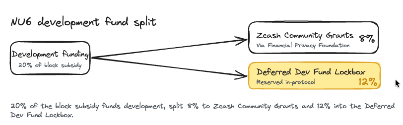
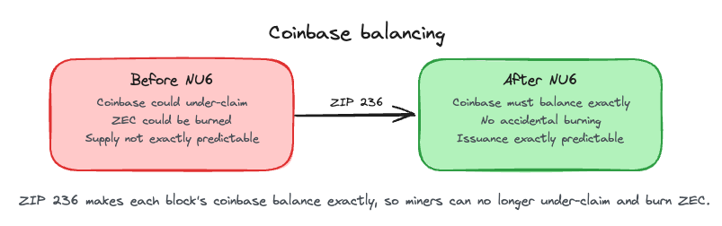
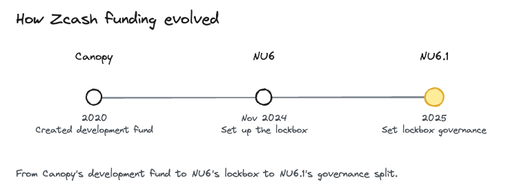

# NU6

> Status: Activated. NU6 went live on Zcash mainnet at block 2,726,400 (November 23, 2024 UTC). Some dashboards show it in local time, which is the same block and the same moment.

What you'll take away: how Zcash keeps funding its own development after a halving, why it set aside a reserve it did not yet know how to spend, and how it made the total ZEC supply exactly predictable.

NU6 is a Zcash [network upgrade](../Start_Here/Network_Upgrades.md), deployed by [ZIP 253](https://zips.z.cash/zip-0253), that activated on mainnet in November 2024 at block 2,726,400. It is a monetary and [development-funding](../Start_Here/Development_Fund.md) upgrade: it kept a share of the block subsidy going to development past the November 2024 halving, set up an in-protocol reserve for future community-decided use, and tightened how new ZEC is counted. NU6 was endorsed by both the Electric Coin Company and the Zcash Foundation.

Why this matters. Zcash has no single owner, so it has to pay for its own development out in the open, from block rewards. The fund that did this was scheduled to end around the November 2024 halving, the second in Zcash's history. NU6 kept that funding going, and instead of handing every coin to fixed recipients, it reserved a share inside the protocol so the community could decide later what to do with it. It also closed a quiet accounting gap, so the total amount of ZEC that will ever exist can now be predicted exactly.

## What NU6 changed

NU6 continued to send 20% of the block subsidy to development funding after the November 2024 halving, a rule defined in [ZIP 1015](https://zips.z.cash/zip-1015). It split that 20% two ways.

1. 8% of the block subsidy goes to the Financial Privacy Foundation for Zcash Community Grants (ZCG), which funds work by and for the community.
2. 12% goes into a new in-protocol lockbox, held for future community-decided use.

The rest of the block subsidy, plus transaction fees, goes to the miners who secure the network. NU6 also updated the existing funding-stream and dev-fund rules (ZIP 207 and ZIP 214) to fit this new structure.

## The deferred lockbox

The 12% share is the new idea in NU6. Instead of being paid to a recipient address, that value is deposited directly into an in-protocol pool called the Deferred Dev Fund Lockbox, defined in [ZIP 2001](https://zips.z.cash/zip-2001).

1. The lockbox is a new funding-stream type (DEFERRED_POOL), where block-reward value goes into the protocol itself, not to a person or organization.
2. The network tracks it as its own chain value pool balance, the same way it tracks the balances of the shielded pools.
3. NU6 created the lockbox on purpose but left the hard question open: who controls those funds, and how are they released?

That question was answered later by [NU6.1](NU6_1.md), which set the governance and split the reserved share into 8% for Zcash Community Grants and 12% for a coin-holder-controlled fund seeded by the lockbox.

## Balancing the books

NU6 also closed an accounting gap in how new ZEC is created, defined in [ZIP 236](https://zips.z.cash/zip-0236). Coinbase transactions are the special transactions that pay out each block's new ZEC and fees.

1. Before NU6, a coinbase transaction only had to not claim more than it was owed. A miner could claim less than the full subsidy, which quietly burned that ZEC.
2. After NU6, a coinbase transaction must balance exactly: total output value must equal the miner subsidy plus fees, no more and no less.
3. Because miners can no longer under-claim and accidentally burn ZEC, the total amount of ZEC that will ever exist can now be predicted exactly.

## How funding evolved

NU6 is one chapter in a longer story about how Zcash pays for itself.

1. Canopy (2020) ended the original founders reward and created the [development fund](../Start_Here/Development_Fund.md).
2. NU6 (November 2024) restructured that funding after the second halving and set up the Deferred Dev Fund Lockbox, reserving a share of issuance for future community-decided grants.
3. NU6.1 (2025) answered the question NU6 left open, who controls the reserved funds, by splitting them into 8% for Zcash Community Grants and 12% for a coin-holder-controlled fund.

## Glossary

| Term | Plain-English meaning |
|---|---|
| Block subsidy | The new ZEC created with each block that is mined |
| Coinbase transaction | The special transaction that pays out a block's subsidy and fees |
| Deferred Dev Fund Lockbox | An in-protocol reserve that holds a share of issuance for future community-decided use |
| Zcash Community Grants (ZCG) | A committee that funds work by and for the Zcash community |
| Consensus branch id | The identifier nodes use to tell which upgrade's rules a block follows |
| Network upgrade (NU) | A coordinated change to Zcash's consensus rules, activated at a set block height |

## FAQ

Does NU6 change my ZEC or my privacy? No. NU6 is about how development is funded and how issuance is counted, not about your transactions or privacy. Your funds and shielded transactions are unaffected.

Where does the funding come from? From the block subsidy, the new ZEC issued as blocks are mined. A 20% share is routed to development instead of all of it going to miners.

What is the lockbox for? It reserves a share of issuance inside the protocol so the community can decide later how to use it. NU6 set the reserve aside, and NU6.1 set the rules for who controls it.

Does the exact-balance rule change my coins? No. It only requires each block's coinbase transaction to pay out exactly what it is owed. It affects new issuance accounting, not existing balances.

What technically defines NU6? NU6 is deployed by ZIP 253, which sets its mainnet activation at block 2,726,400 and its consensus branch id to c8e71055. The consensus changes themselves come from ZIP 236, ZIP 1015, and ZIP 2001, with ZIP 207 and ZIP 214 updated to fit.

How is NU6 different from NU6.1? NU6 restructured funding and created the lockbox. NU6.1 decided who controls the lockbox funds and how the reserved share is split.

## Test your understanding

NU6 set up the Deferred Dev Fund Lockbox but did not say who controls it. Why would an upgrade create a reserve and deliberately leave its governance for later?

Answer

Creating the reserve locked in that a share of issuance would be set aside inside the protocol instead of paid to fixed recipients. Deciding who controls those funds and how they are released is a harder governance question. NU6 deliberately left that open, and NU6.1 answered it: 8% to Zcash Community Grants, and 12% to a coin-holder-controlled fund seeded by the lockbox.

### Resources

[ZIP 253: Deployment of the NU6 Network Upgrade](https://zips.z.cash/zip-0253)

[ZIP 236: Blocks should balance exactly](https://zips.z.cash/zip-0236)

[ZIP 1015: Block Subsidy Allocation for Non-Direct Development Funding](https://zips.z.cash/zip-1015)

[ZIP 2001: Lockbox Funding Streams](https://zips.z.cash/zip-2001)

[Network Upgrade 6 (NU6)](https://z.cash/upgrade/nu6/)

### See also

[Zcash Network Upgrades](../Start_Here/Network_Upgrades.md)

[Development Fund](../Start_Here/Development_Fund.md)

[Zcash Monetary Policy](../Start_Here/Zcash_Monetary_Policy.md)

[NU6.1](NU6_1.md)

[NU6.2](NU6_2.md)

[What is ZEC and Zcash](../Start_Here/What_is_ZEC_and_Zcash.md)

---

*Footer*
