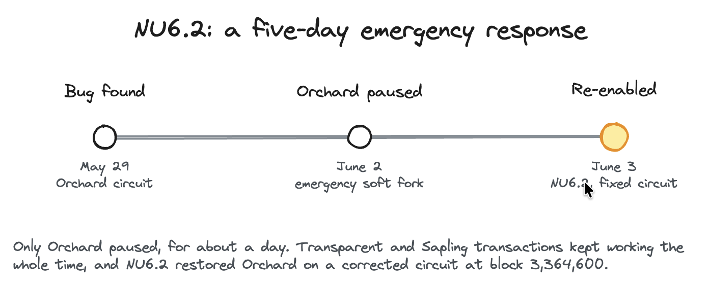
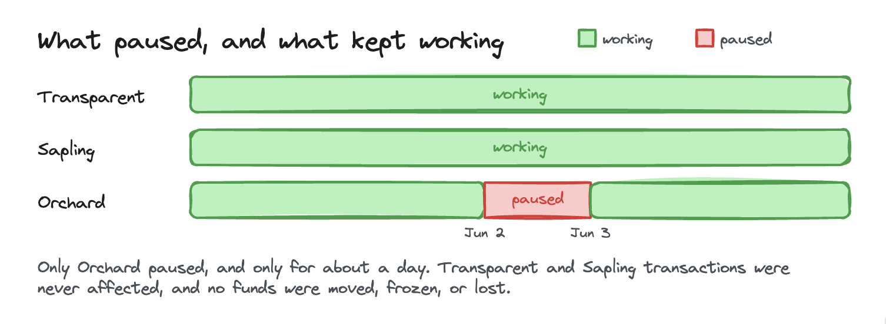
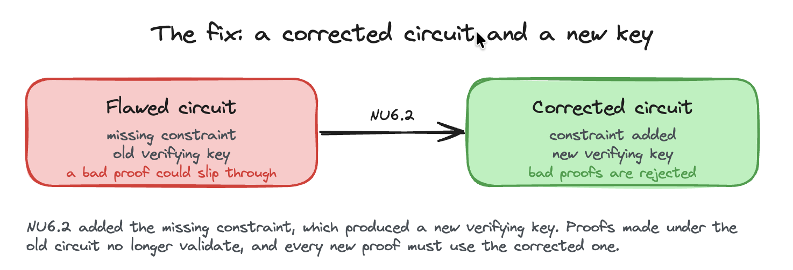

# NU6.2

> NU6.2 went live on Zcash mainnet at block 3,364,600 (June 3, 2026 UTC).

What you'll take away: what NU6.2 fixed, why Zcash paused shielded transactions for about a day, and how the network closed the hole without losing any funds.

NU6.2 is a Zcash [network upgrade](../Start_Here/Network_Upgrades.md), formally defined in [ZIP 257](https://zips.z.cash/zip-0257), that re-enabled the Orchard shielded protocol after an emergency pause. It corrected a soundness bug in Orchard's zero-knowledge circuit and restored [shielded](../Using_Zcash/Shielded_Pools.md) transactions. Think of it as the emergency-repair chapter of the Orchard bug story. The follow-up upgrade, [Ironwood (NU6.3)](Ironwood.md), then added a new pool and a public audit of the old one.

Why this matters. Orchard is where most private Zcash payments happen. When a flaw was found in the math that keeps that pool honest, the network faced a hard choice: keep shielded transactions running with a known risk, or pause them until the fix was ready. NU6.2 is how Zcash chose safety first and still restored privacy within a day.

## What happened

The trigger was a soundness bug in Orchard's Action circuit, the math that is supposed to prove every shielded transaction obeys the rules. Independent researcher Taylor Hornby found it during a [Shielded Labs](../Zcash_Organizations/Shielded_Labs.md) audit and disclosed it responsibly in late May 2026. It had sat unnoticed since Orchard launched in 2022, and in theory it could let an invalid transaction pass as valid, which could allow funds to be stolen or double-spent inside the Orchard pool. Zcash's turnstile accounting still capped how much value could ever leave Orchard, so the total ZEC supply itself could not be inflated, but a flaw in the math that keeps shielded funds honest is serious, so the network acted within days. The [Ironwood](Ironwood.md) page explains the bug and how it could create value in full.

## The emergency pause

On June 2, 2026, an emergency soft fork temporarily disabled all Orchard transactions. It shipped as a hotfix in zcashd v6.12.5 and zebra v4.5.3.

1. Shielded Orchard sends and receives were paused, so no new Orchard proofs could be created or accepted.
2. Transparent and Sapling transactions kept working normally.
3. No funds were moved, frozen, or lost. The pause only stopped new Orchard activity while the real fix was finished.

## What NU6.2 changed

The next day, June 3, 2026, the NU6.2 hard fork activated at block 3,364,600 and re-enabled Orchard on a corrected circuit.

1. It fixed the Action circuit's variable-base scalar multiplication gadget by adding the missing constraints.
2. That produced a new verifying key, so proofs made under the old, flawed circuit no longer validate, and every new proof must use the corrected one.
3. It made the exact proof length a consensus rule, closing a gap that was not enforced before.

The corrected code shipped in zcashd v6.20.0 and zebra v5.0.0, built on halo2_gadgets v0.5.0 and the orchard crate v0.14.0.

## What NU6.2 did not do

NU6.2 secured the circuit for every new transaction, but value created under the old rules still sat in the Orchard pool. Auditing that value and moving it to a clean pool is a separate job, and that is what [Ironwood (NU6.3)](Ironwood.md) handles with its new pool and turnstile.

## Was anything lost

No. There is no evidence the bug was ever exploited, no unauthorized value creation, and no impact to user funds. Zcash's turnstile accounting confirmed the total supply stayed intact through the whole event.

## Glossary

| Term | Plain-English meaning |
|---|---|
| Shielded pool | The set of funds whose amounts and owners are hidden by zero-knowledge cryptography |
| Orchard | Zcash's current shielded protocol, where most private transactions happen |
| Soundness bug | A flaw that lets an invalid transaction pass the proof check as if it were valid |
| Verifying key | The public value the network uses to check that a proof is valid. Correcting the circuit changed it |
| Soft fork | A backward-compatible rule change, one that paused Orchard without splitting the network |
| Hard fork | A coordinated rule change that all nodes must upgrade for, activated at a set block |

## FAQ

Did I lose access to my ZEC? No. For about a day, shielded Orchard transactions were paused, but no funds were lost or at risk, and transparent and Sapling transactions kept working.

Why pause instead of patching quietly? A soundness bug could let funds be stolen or double-spent inside the Orchard pool, so the safe move was to stop new Orchard transactions until the corrected circuit was live.

Do old shielded proofs still work? Proofs made under the old circuit no longer validate after NU6.2. Wallets on a supported release automatically use the corrected circuit.

Was the bug ever used? There is no evidence it was. It was caught by security research and fixed before any known harm.

How is NU6.2 different from Ironwood? NU6.2 corrected the circuit and re-enabled Orchard. [Ironwood (NU6.3)](Ironwood.md) then added a new pool and a public turnstile to audit and move the old pool's value.

## Test your understanding

Why did Zcash pause Orchard transactions for a day instead of leaving them running while the fix was written?

Answer

Because the flaw was a soundness bug, meaning invalid transactions could pass as valid. Leaving Orchard open would have kept a door open to theft and double-spending inside the pool. Pausing new Orchard transactions closed that door until the corrected circuit activated at NU6.2.

### Resources

[ZIP 257: Deployment of the Orchard Temporary Vulnerability Mitigation and NU6.2 Network Upgrade](https://zips.z.cash/zip-0257)

[Zcash Foundation: Zebra emergency soft fork and NU6.2 activation](https://zfnd.org/zebra-4-5-3-and-5-0-0-emergency-soft-fork-and-nu6-2-activation/)

### See also

[Ironwood (NU6.3)](Ironwood.md)

[Zcash Network Upgrades](../Start_Here/Network_Upgrades.md)

[Shielded Pools](../Using_Zcash/Shielded_Pools.md)

[Halo](Halo.md)

[Shielded Labs](../Zcash_Organizations/Shielded_Labs.md)

[What is ZEC and Zcash](../Start_Here/What_is_ZEC_and_Zcash.md)

---

Series: [Network Upgrades index](../Start_Here/Network_Upgrades.md) · Previous: [NU6.1](NU6_1.md) · Next: [Ironwood](Ironwood.md)
