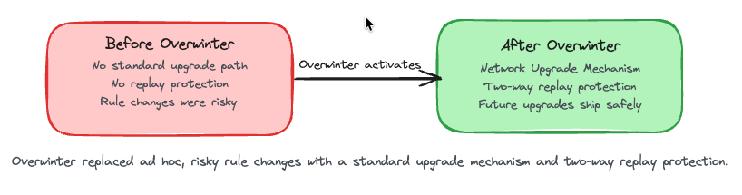
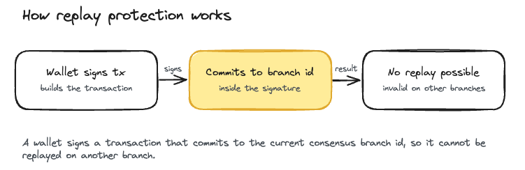
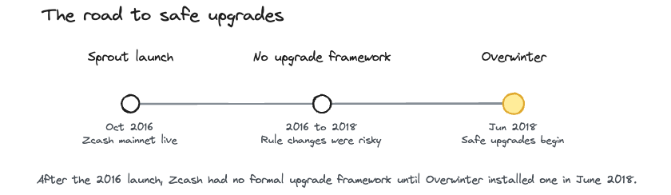

# Overwinter

> Status: Activated. Overwinter went live on Zcash mainnet at block 347,500 (June 26, 2018 UTC). Some dashboards show it in local time, which is the same block and the same moment.

What you'll take away: how Zcash learned to change its own rules safely, and why that groundwork made every later upgrade, starting with Sapling, possible.

Overwinter is a Zcash [network upgrade](../Start_Here/Network_Upgrades.md), the first one after the network launched. It is defined across several Zcash Improvement Proposals: [ZIP 200](https://zips.z.cash/zip-0200), [ZIP 201](https://zips.z.cash/zip-0201), [ZIP 202](https://zips.z.cash/zip-0202), [ZIP 203](https://zips.z.cash/zip-0203), and [ZIP 143](https://zips.z.cash/zip-0143). Overwinter did not add any new shielded features. Instead it hardened the protocol so that future upgrades could ship safely. The upgrade is documented by the [Electric Coin Company](../Zcash_Organizations/Electric_Coin_Company.md) on the official Zcash upgrade page.

Why this matters. Changing the rules of a live blockchain is dangerous. Get it wrong and two versions of the network can disagree, or a transaction meant for one chain can be copied onto another. Before Overwinter, Zcash had no standard, replay-safe way to coordinate a rule change. Overwinter fixed that. It gave Zcash a formal process for upgrades and, just as important, two-way replay protection, so a transaction that is valid under one set of rules cannot be replayed under another. That groundwork is what made Sapling, and every upgrade after it, possible to activate cleanly.

## The upgrade mechanism

Overwinter introduced the Network Upgrade Mechanism, defined in [ZIP 200](https://zips.z.cash/zip-0200). Every upgrade now defines two things: a consensus branch id that names the current set of rules, and an activation height, the block at which the new rules take effect. This gives everyone running Zcash software a clear window to update before the switch.

Overwinter itself activated on mainnet at block 347,500, with consensus branch id 0x5ba81b19.

[ZIP 201](https://zips.z.cash/zip-0201) handles how nodes treat each other around an upgrade. Before activation, nodes prefer to connect to peers running the same version. At activation, a node disconnects from peers that are on a different consensus branch, so the network splits cleanly along the new rules instead of getting confused.

## Replay protection

A replay is when someone takes a transaction that was valid on one chain and rebroadcasts it on another. Overwinter closes that door with a new signature scheme, defined in [ZIP 143](https://zips.z.cash/zip-0143). When a wallet signs a transaction, the signature now commits to the current chain's consensus branch id. A transaction signed for one branch is simply not valid on any other branch, in either direction. That is what two-way replay protection means.

This works hand in hand with the new version 3 transaction format from [ZIP 202](https://zips.z.cash/zip-0202), sometimes called the Overwintered format. It adds an fOverwintered flag and a version group id that make clear which set of consensus rules a transaction belongs to. As a side benefit, the new signature scheme also improved how quickly transparent transactions are validated.

## Transaction expiry

[ZIP 203](https://zips.z.cash/zip-0203) added transaction expiry. A transaction can now set an expiration block height. If it has not been mined by that height, nodes drop it from the mempool, the waiting room of unconfirmed transactions. Before this, a transaction could sit unconfirmed for a long time. Expiry means a stuck transaction eventually clears on its own, which reduces uncertainty for you and keeps the mempool from filling up with old, unmined transactions.

## Where it fits

Overwinter was the first Zcash network upgrade after the October 2016 mainnet launch, and it shipped deliberately ahead of Sapling. Its job was infrastructure, not features. By installing the upgrade mechanism and the replay-protection machinery first, it gave every later upgrade (Sapling, Blossom, Heartwood, Canopy, NU5, and the ones after) a safe path to activate.

## Glossary

| Term | Plain-English meaning |
|---|---|
| Network upgrade (NU) | A coordinated change to Zcash's consensus rules, activated at a set block height |
| Consensus branch id | A short identifier that names the current set of consensus rules |
| Activation height | The block at which a network upgrade's new rules take effect |
| Replay protection | A rule that stops a transaction valid on one chain from being reused on another |
| Mempool | The pool of transactions that have been broadcast but not yet mined into a block |
| Transaction expiry | An expiration block height after which an unmined transaction is dropped |

## FAQ

Did Overwinter change my ZEC or my privacy? No. Overwinter added no new features and did not touch shielded transactions. It was plumbing for safe future upgrades. Your funds and privacy were unaffected.

Did Overwinter add Sapling or shielded addresses? No. Overwinter added no shielded features. It prepared the ground so that Sapling could activate safely later.

What is a consensus branch id? It is a short label that names the current set of rules. Transactions commit to it when they are signed, which is what gives Zcash its replay protection.

Why do some sources say June 25 and others June 26? Overwinter activated at 01:37 UTC on June 26, 2018. That is just after midnight UTC, so in many Western time zones the local clock still read June 25. It is the same block and the same moment.

What is transaction expiry good for? It means a transaction that never gets mined will not linger forever. After its expiry height, nodes drop it, so you are not left guessing about a stuck payment.

Do I need to do anything? No. Overwinter activated in 2018. Any current Zcash wallet or node already follows these rules.

## Test your understanding

Overwinter added no new shielded features. So why is it considered one of the most important upgrades in Zcash's history?

Answer

Because it built the machinery that every later upgrade depends on. Overwinter introduced the Network Upgrade Mechanism and two-way replay protection, giving Zcash a standard, safe way to change its consensus rules. Without that groundwork, Sapling and the upgrades after it could not have activated cleanly.

### Resources

[ZIP 200: Network Upgrade Mechanism](https://zips.z.cash/zip-0200)

[ZIP 201: Network Peer Management for Overwinter](https://zips.z.cash/zip-0201)

[ZIP 202: Version 3 Transaction Format for Overwinter](https://zips.z.cash/zip-0202)

[ZIP 203: Transaction Expiry](https://zips.z.cash/zip-0203)

[ZIP 143: Transaction Signature Validation for Overwinter](https://zips.z.cash/zip-0143)

[Overwinter Network Upgrade](https://z.cash/upgrade/overwinter/)

### See also

[Zcash Network Upgrades](../Start_Here/Network_Upgrades.md)

[Shielded Pools](../Using_Zcash/Shielded_Pools.md)

[Full Nodes](Full_Nodes.md)

[NU6.1](NU6_1.md)

[Electric Coin Company](../Zcash_Organizations/Electric_Coin_Company.md)

[What is ZEC and Zcash](../Start_Here/What_is_ZEC_and_Zcash.md)

---

*Footer*