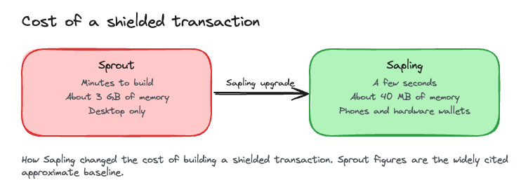
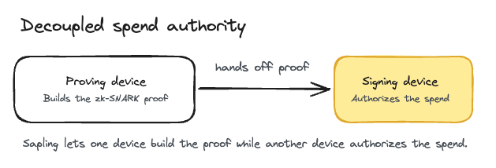
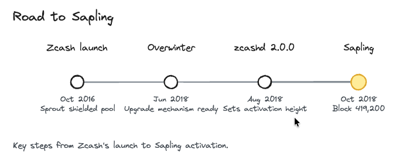

# Sapling

> Sapling went live on Zcash mainnet at block 419,200 (October 29, 2018, 02:15 UTC).

What you'll take away: Sapling made private Zcash payments fast and light enough to run on a phone or a hardware wallet.

Sapling was the second major Zcash network upgrade, activating on Zcash's second anniversary. It was a consensus hard fork that rebuilt how shielded (private) transactions are put together. The deployment is defined by ZIP 205, the new transaction signature rules by ZIP 243, and both build on ZIP 200, the network upgrade mechanism. The full details live in the Zcash Protocol Specification. Electric Coin Company built the upgrade and shipped the first version that supported it, zcashd 2.0.0, in August 2018. On chain, the network identifies the Sapling rules by its consensus branch id.

Why this matters. Before Sapling, making a truly private payment meant waiting minutes while your computer chewed through gigabytes of memory to build the proof. That was too slow and too heavy for most people, so a lot of users, exchanges, and shops skipped shielded transactions and sent ZEC in the open instead. Sapling cut the work down to a few seconds and about 40 megabytes of memory. That single change is what made shielded ZEC practical to use in everyday life, on ordinary phones and on hardware wallets.

## What changed

The heart of Sapling is a faster way to build the zero-knowledge proof that keeps a shielded transaction private. The original Sprout design used a single proving circuit (the JoinSplit circuit) that was slow and memory-hungry. Sapling replaced it with two purpose-built circuits, a Spend circuit and an Output circuit, described in the Zcash Protocol Specification. The result is a large drop in cost. Per Electric Coin Company, a shielded transaction can be built in as little as a few seconds using about 40 megabytes of memory. The pre-Sapling Sprout baseline was far heavier, on the order of minutes and several gigabytes of memory (these Sprout-side figures are the widely cited approximate baseline).

## New keys

Sapling also introduced a new set of shielded addresses and keys. One key can derive many diversified addresses, which are separate payment addresses that an outside observer cannot link back to each other. Sapling added viewing keys too: a full or incoming viewing key lets you share the ability to see a wallet's transaction details without handing over the ability to spend its funds. That is useful for auditing, accounting, or simply proving a payment was made.

A related change is that Sapling separated the job of building the proof from the job of signing the transaction. The device that constructs the zero-knowledge proof no longer has to be the device that holds spend authority. This decoupling is what lets a hardware wallet keep your spending key isolated while a separate device does the heavier proving work.

## The trusted setup

Sapling's circuits rely on a set of public parameters that had to be generated carefully. If a single party had produced them alone and kept the leftover secret data (the "toxic waste"), that party could have forged proofs. To avoid this, the parameters came from a two-phase, multi-party ceremony. Phase 1, called Powers of Tau, was circuit-agnostic, meaning it was not tied to Sapling's specific circuits. Phase 2, the Sapling MPC, was circuit-specific. Each phase stays secure as long as at least one participant was honest and destroyed their toxic waste, so the ceremony only fails if every single participant colludes.

## How it activated

Sapling followed Overwinter, the June 2018 upgrade that prepared the network's upgrade mechanism. Electric Coin Company set the mainnet activation height in zcashd 2.0.0, released in August 2018, and the network switched to the Sapling rules when block 419,200 was mined. On chain, that moment is marked by the Sapling consensus branch id.

## Glossary

| Term | Plain-English meaning |
|---|---|
| Shielded transaction | A private Zcash transaction that hides the sender, receiver, and amount. |
| Sprout | The original shielded protocol Zcash launched with, slower and heavier than Sapling. |
| Spend and Output circuits | The two new Sapling proving circuits that replaced Sprout's single JoinSplit circuit. |
| Diversified address | One of many unlinkable payment addresses you can derive from a single key. |
| Viewing key | A key that lets someone see a wallet's transactions without being able to spend from it. |
| Consensus branch id | A short code that tells the network which upgrade's rules a transaction follows. |

## FAQ

Did Sapling change how much ZEC I own? No. Sapling changed how shielded transactions are built, not the amount of ZEC anyone holds or the total supply. Your balance was unaffected.

Is my ZEC still private after Sapling? Yes, and more usable. Sapling kept the strong privacy of shielded transactions and made them fast and cheap enough to actually use. Shielded funds stay hidden the same way.

Do I have to do anything? No action is required from you as a holder. Sapling was a network upgrade that wallet and node software adopted. Modern wallets already support Sapling addresses.

What is the difference between Sprout and Sapling? Sprout was the first shielded protocol and used one slow, memory-heavy proving circuit. Sapling replaced it with faster Spend and Output circuits, added viewing keys and diversified addresses, and made shielded transactions light enough for phones and hardware wallets.

Why do some sources say October 28 and others October 29? The activation height was set in advance to target October 28, 2018. The block that actually triggered the change, block 419,200, was mined in the early hours of October 29 UTC. In many local time zones that was still October 28. It is the same block and the same moment either way.

What is a viewing key? A viewing key lets you share read access to a shielded wallet. Someone with a full or incoming viewing key can see the wallet's transaction details but cannot spend its funds. See [Viewing Keys](../zcash-tech/viewing-keys) for more.

## Test your understanding

Under Sprout, why did so many people avoid shielded transactions, and how did Sapling fix it?

Answer

Under Sprout, building a shielded transaction took minutes and used gigabytes of memory, so it was too slow and heavy for most users, exchanges, and shops. Sapling introduced faster Spend and Output circuits that cut the work to a few seconds and about 40 megabytes, making shielded transactions practical on everyday phones and hardware wallets.

### Resources

- [ZIP 205: Deployment of the Sapling Network Upgrade](https://zips.z.cash/zip-0205)
- [ZIP 243: Transaction Signature Validation for Sapling](https://zips.z.cash/zip-0243)
- [Zcash Sapling upgrade page](https://z.cash/upgrade/sapling/)
- [Electric Coin Company: Sapling announcement](https://electriccoin.co/blog/sapling/)
- [Electric Coin Company: Announcing the Sapling MPC](https://electriccoin.co/blog/sapling-mpc/)

### See also

- [Shielded Pools](../using-zcash/shielded-pools)
- [Viewing Keys](../zcash-tech/viewing-keys)
- [zk-SNARKS](../zcash-tech/zk-snarks)
- [Zcash Network Upgrades](../start-here/network-upgrades)
- [Wallets](../using-zcash/wallets)
- [Electric Coin Company](../zcash-organizations/electric-coin-company)

---

Series: [Network Upgrades index](../start-here/network-upgrades) · Previous: [Overwinter](../zcash-tech/overwinter) · Next: [Blossom](../zcash-tech/blossom)
