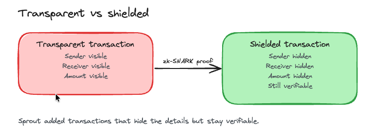
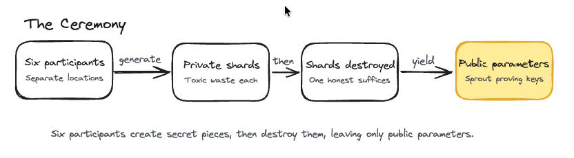
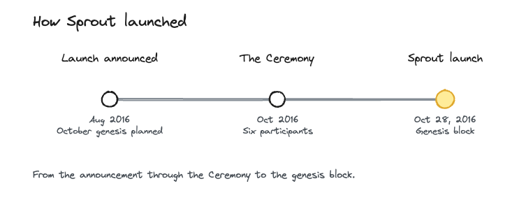

# Sprout

> Zcash launched on October 28, 2016, with the Sprout shielded pool.

What you'll take away: Sprout is where Zcash began, the first time private, verifiable money ran on a live blockchain.

Sprout is the original launch of the Zcash network, not a later [network upgrade](../start-here/network-upgrades). It went live at the genesis block on October 28, 2016. No numbered ZIP defines Sprout: the ZIP process started later with Overwinter, so Sprout is described by the original Zcash Protocol Specification and the Zerocash construction it was built on. The [Electric Coin Company](../zcash-organizations/electric-coin-company) (then the Zerocoin Electric Coin Company), led by Zooko Wilcox, built and shipped it. Sprout introduced the first practical zk-SNARK shielded transactions and the original shielded pool, so people could send ZEC with the sender, receiver, and amount hidden while the network still checked that the balances added up. The name signaled a young, budding chain that the team expected to grow.

Why this matters. Every public blockchain before Sprout put your payments on display: anyone could see who paid whom and how much. Sprout was the first live, permissionless network to hide those details and still prove no one was cheating. That matters for ordinary financial privacy, the kind you expect from cash or a bank statement no one else can read. It also proved that strong on-chain privacy could work in practice, beyond a paper design. The trusted-setup Ceremony that made it possible became a reference point for later cryptography work, and the slow, memory-heavy proving system Sprout shipped with is exactly what pushed the team to build Sapling two years later.

## First shielded pool

Sprout created two kinds of addresses. Transparent addresses (t-addresses) work like Bitcoin, with the details visible on the public ledger. Shielded addresses (z-addresses) send funds into the Sprout [shielded pool](../using-zcash/shielded-pools), where the sender, the receiver, and the amount stay hidden. The trick is [zk-SNARKs](../zcash-tech/zk-snarks), zero-knowledge proofs that let a transaction show it is valid, with no double spend and balances that add up, without revealing any of the details. Sprout was the first time this ran in production on a live cryptocurrency.

## The Ceremony

The zk-SNARKs in Sprout needed a set of public parameters, and generating them safely required a one-time setup called the Ceremony. Six participants in separate, distant locations each generated a secret piece, called toxic waste. If anyone ever reassembled all the pieces, they could forge ZEC out of nothing. The design turned that risk into a simple rule: as long as at least one participant destroyed their piece, the full secret could never be rebuilt, so counterfeiting stayed impossible. The participants who have been named publicly include Zooko Wilcox, Andrew Miller, Peter Van Valkenburgh, Peter Todd, and Derek Hinch of NCC Group. One participant chose to stay anonymous.

## The origin

Sprout is the baseline that every later change builds on. When the network-upgrade mechanism arrived with Overwinter, it labeled the original rules as consensus branch id 0, which simply means no upgrade has been applied yet. Everything since then (Overwinter, Sapling, Blossom, Heartwood, Canopy, NU5, NU6, and onward) sits on the chain Sprout started. The launch was announced in August 2016 for an October 28 genesis, the Ceremony ran in the weeks before, and the genesis block's hardcoded timestamp reads October 28, 2016, at 07:56 UTC.

## Glossary

| Term | Plain-English meaning |
|---|---|
| zk-SNARK | A zero-knowledge proof that shows a transaction is valid without revealing the sender, receiver, or amount |
| Shielded pool | The private side of Zcash where amounts and parties are hidden. The Sprout pool was the first one |
| z-address and t-address | A z-address is shielded and keeps details private. A t-address is transparent and shows details on the public ledger |
| The Ceremony | The 2016 multi-party setup that generated Sprout's public parameters and then discarded the toxic waste |
| Toxic waste | The secret key pieces from the Ceremony that had to be destroyed so ZEC could not be forged |
| Consensus branch id 0 | The label for Sprout's rules, meaning the baseline before any network upgrade |

## FAQ

Does Sprout change my ZEC or my privacy today? No. Sprout is history, the launch that started the chain your ZEC lives on. Your coins and your privacy today depend on the wallet and shielded pool you use now, not on anything you need to do about Sprout.

Why is there no ZIP number for Sprout? The ZIP process began later, with the Overwinter upgrade. Sprout is the original launch, described by the Zcash Protocol Specification and the Zerocash construction it was based on. ZIP 200 only mentions Sprout in hindsight, as consensus branch id 0, the baseline before any upgrade.

Did I need to trust the six people in the Ceremony? The setup was built so you only needed one of them to be honest. Each held a secret piece, and as long as a single participant destroyed theirs, the full secret could never be rebuilt and no one could forge ZEC. Five participants have been named publicly and one stayed anonymous.

Is the Sprout pool the one my wallet uses now? Probably not. Sprout was the first shielded pool, but later upgrades such as Sapling introduced a faster shielded design, and most wallets use newer pools today. Sprout still matters as the work that proved private, verifiable transactions could run on a live network.

What made Sprout different from Bitcoin? Bitcoin puts every payment on a public ledger where amounts and addresses are visible. Sprout added shielded transactions that hide the sender, receiver, and amount while still letting the network confirm the transaction is valid. It kept transparent addresses too, so both styles live on the same chain.

## Test your understanding

Sprout is often called a network upgrade with an activation height. Why is that not quite right?

Answer

Sprout is the original launch of Zcash, not a later upgrade. It has been active since the genesis block (block 0) on October 28, 2016, so there is no activation height to point to. The network-upgrade mechanism came later and labeled Sprout's rules as consensus branch id 0, the baseline before any upgrade.

### Resources

[ZIP 200: Network Upgrade Mechanism](https://zips.z.cash/zip-0200)

[Zcash network upgrades](https://z.cash/upgrade/)

[Electric Coin Company: Zcash Sprout launch](https://electriccoin.co/blog/zcash-sprout-launch/)

[Electric Coin Company: The Design of the Ceremony](https://electriccoin.co/blog/the-design-of-the-ceremony/)

### See also

[Shielded Pools](../using-zcash/shielded-pools)

[zk-SNARKS](../zcash-tech/zk-snarks)

[Zcash Network Upgrades](../start-here/network-upgrades)

[What is ZEC and Zcash](../start-here/what-is-zec-and-zcash)

[Electric Coin Company](../zcash-organizations/electric-coin-company)

---

Series: [Network Upgrades index](../start-here/network-upgrades) · Next: [Overwinter](../zcash-tech/overwinter)
