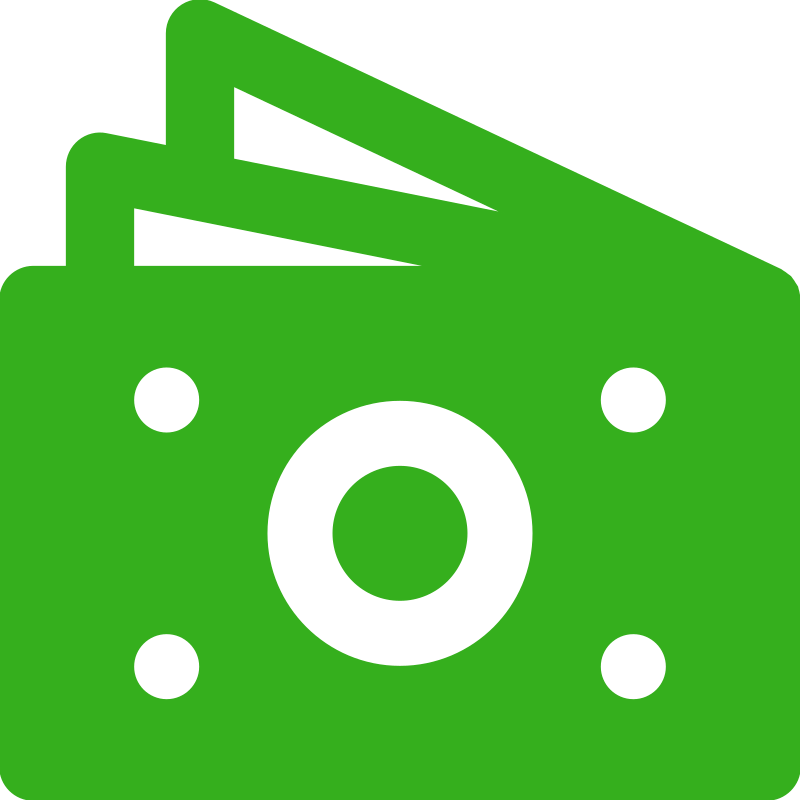
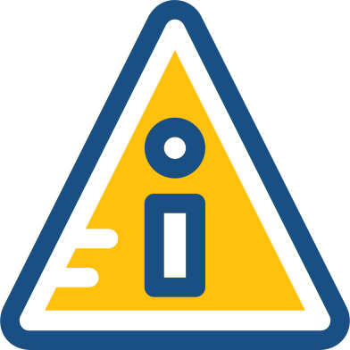
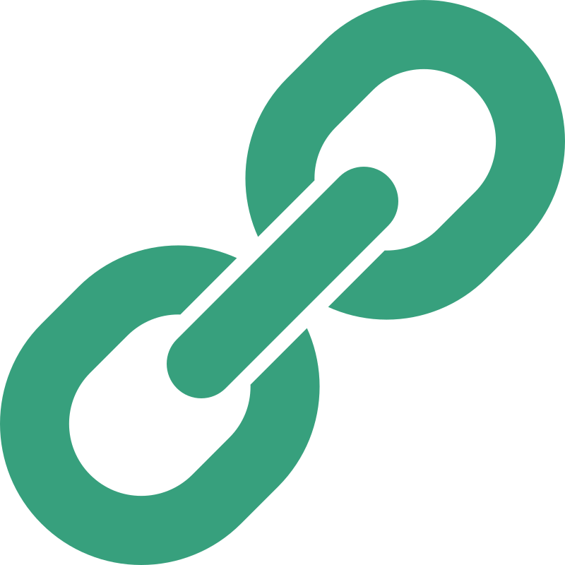
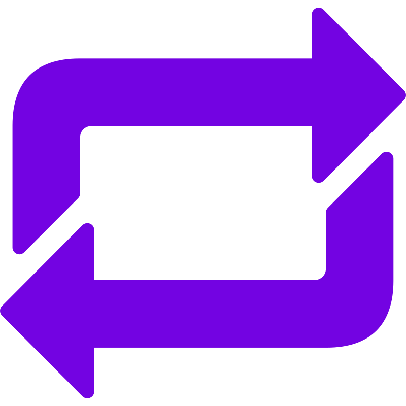

#  Receive Donations Privately with Zcash

 
 
 Beginner • ⏱ 5 min 

## TL;DR

- Use a **shielded (z) address**
- Never share a transparent (t) address publicly
- Encourage donors to send from shielded wallets
- Avoid linking your identity to transactions

 

##  Who is this for?

- Creators accepting donations
- Open-source contributors
- Communities raising funds
- Anyone who wants private financial support

 

##  The Problem

Most cryptocurrencies expose everything:
- Your wallet balance
- Who sent you money
- Your entire transaction history

This creates serious risks:
- Loss of financial privacy
- Targeting or surveillance
- Public exposure of donors

 

##  Why Zcash

Zcash shielded transactions hide:
- Sender address
- Receiver address
- Transaction amount

This allows you to receive funds **without exposing your financial graph**.

 

##  What You Need

- A Zcash wallet that supports shielded addresses:
  - Zashi
  - YWallet
  - Other supported wallets

 

##  Step-by-Step Guide

### Step 1 — Create a Shielded Address
Open your wallet and generate a **z-address**.
This usually starts with: `zs...`

### Step 2 — Share Only Your Shielded Address

- Publish your z-address on:
  - Website
  - Social media
  - Donation pages

**Do NOT share a transparent (t) address.**

### Step 3 — Guide Donors (Optional but Recommended)

Encourage donors to:
- Use wallets that support shielded transactions
- Send from shielded pools (not transparent)

### Step 4 — Maintain Basic Privacy Hygiene

- Avoid reusing the same address across unrelated identities
- Do not publicly associate your address with personal identity unless necessary

 

##  Common Mistakes to Avoid

- Sharing a transparent (t) address  
- Posting your wallet alongside personal identity  
- Accepting funds from transparent sources without shielding  
- Reusing the same address across multiple contexts  

 

##  Result

You can:
- Receive donations privately
- Protect your supporters
- Avoid exposing your financial activity

 

##  Related

- [Privacy - Shielded vs Transparent](/privacy/shielded-vs-transparent)
- [Wallets](/wallets)

 

##  Progress

**Step 1 of 6**

You’ve learned how to receive funds privately.

 

## → Next Step

Continue your journey:

- [Send Money Without Linking Identity](/zcash-use-cases/send-money-without-linking-identity)
