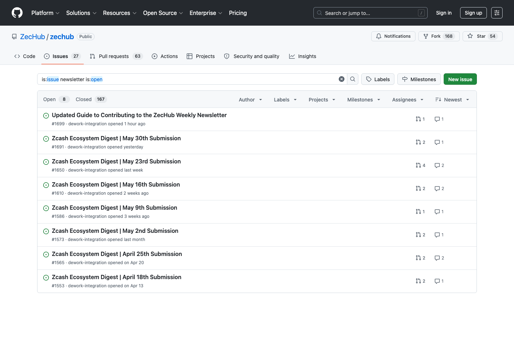
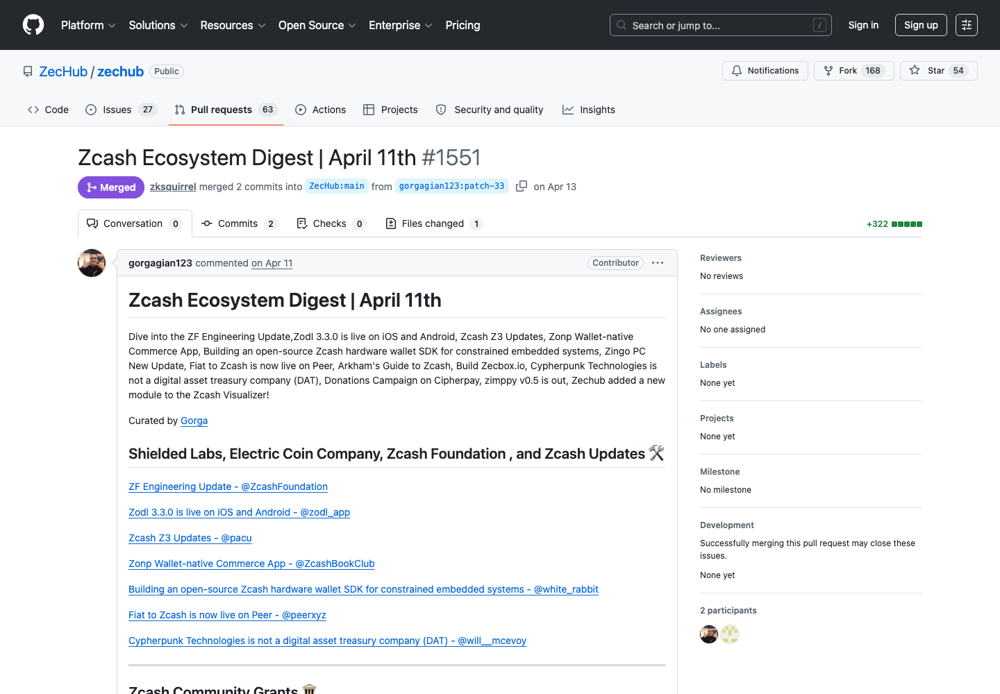

<a href="https://github.com/zechub/zechub/edit/main/site/contribute/ZecWeekly_Newsletter.md" target="_blank">
  
</a>

# ZecWeekly Newsletter

ZecWeekly is a newsletter that goes out every Friday morning. It includes all the news that happened during the week in the Zcash ecosystem.

The news is curated weekly by community members and all relevant links are added to the newsletter.

Please subscribe to the newsletter [here](https://zechub.substack.com/).

## Contribute

Newsletter contributions work best when one contributor prepares the edition for the correct week, follows the current bounty or coordination thread, and submits the pull request after the weekly links are ready. Please do not submit a future edition before ZecHub has posted or confirmed the date for that edition. Early pull requests often miss late-week updates, conflict with an assigned curator, or use the wrong deadline.

### 1. Confirm the current edition

Before you start writing:

- Check the [ZecHub GitHub issues](https://github.com/ZecHub/zechub/issues) and [Dework](https://app.dework.xyz/zechub-2424) for the current newsletter task.
- Use the date in the issue title or task description as the source of truth.
- Open the issue and check whether another contributor has already commented, been assigned, or opened a linked pull request.
- Search open pull requests for the issue number and the edition date before starting. For example, search `is:pr is:open "May 30th" repo:ZecHub/zechub`.
- If the task is unclear, ask in the issue, the ZecHub Discord, or by messaging [ZecHub on Twitter](https://twitter.com/ZecHub) before preparing the full edition.



### 2. Fork the repository

If you are new to GitHub, use this workflow:

1. Open the [ZecHub repository](https://github.com/ZecHub/zechub).
2. Click **Fork** and create a fork under your GitHub account.
3. In your fork, create a new branch for the edition. A clear branch name is helpful, such as `digest-may-30-2026`.
4. Make sure your pull request will target `ZecHub/zechub` as the base repository and `main` as the base branch.

If you use the command line, the same workflow looks like this:

```bash
git clone https://github.com/YOUR-USERNAME/zechub.git
cd zechub
git checkout -b digest-month-day-year
```

### 3. Create the newsletter file

Use the [newsletter template](https://github.com/ZecHub/zechub/blob/main/newsletter/newslettertemplate.md) as your starting point. Newsletter editions belong in the [`newsletter`](https://github.com/ZecHub/zechub/tree/main/newsletter) folder.

When creating the file:

- Match the filename format requested by the issue or used by recent accepted editions.
- Keep the same section order as the template unless the task asks for a different format.
- Add links from the relevant week only.
- Write a short, clear description for each link so readers understand why it matters.
- Translate or summarize non-English sources in English when needed.
- Check every link before opening the pull request.

### 4. Collect links at the right time

ZecWeekly normally covers the Zcash ecosystem activity for the current week and is published near the end of the week. The safest timing is:

- Start collecting links after the current newsletter issue or task is posted.
- Keep a draft while the week is still active.
- Submit the pull request close to the requested submission date, after you have checked for late-week updates.
- Do not submit a future week's newsletter before the task for that date exists or before ZecHub confirms that you should prepare it.

If an issue says to submit by a specific date, follow that date. If there is a conflict between this page and a current issue, follow the current issue.

### 5. Open the pull request

When your newsletter file is ready:

1. Commit your changes to your fork.
2. Open a pull request into `ZecHub/zechub` on the `main` branch.
3. Use a title that matches the edition, such as `Zcash Ecosystem Digest | May 30th`.
4. Link the issue in the pull request body so reviewers can connect the work to the task.

Example pull request body:

```md
Closes #ISSUE_NUMBER

Summary:
- Adds the Zcash Ecosystem Digest for Month Day.
- Uses the newsletter template and the current issue deadline.
- Checks links and descriptions for the requested week.
```

After the pull request is open, watch for review comments. If ZecHub asks for edits, update the same branch instead of opening a second pull request for the same edition.

### Real examples

Use these merged newsletter pull requests as examples of accepted submissions:

- [Zcash Ecosystem Digest | April 11th](https://github.com/ZecHub/zechub/pull/1551)
- [Zcash Ecosystem Digest | March 28th](https://github.com/ZecHub/zechub/pull/1544)
- [Zcash Ecosystem Digest | February 14th](https://github.com/ZecHub/zechub/pull/1474)



When comparing your work with an example, focus on the file location, title format, section order, link descriptions, and whether the pull request connects back to the correct task.

### Common mistakes to avoid

- Opening a pull request before the edition date or task is confirmed.
- Working on an issue that already has a linked pull request.
- Submitting the pull request to your own fork instead of `ZecHub/zechub`.
- Using the wrong file name or putting the file outside the `newsletter` folder.
- Copying an old edition without updating every date, link, and description.
- Adding links from the wrong week.
- Leaving broken links, duplicate links, or placeholder text from the template.
- Opening a new pull request after review comments instead of updating the original branch.

### Final checklist

Before requesting review, confirm that:

- The issue or task date matches your newsletter file.
- No other open pull request is already covering the same issue or edition.
- The file is in the `newsletter` folder.
- The template sections are complete.
- Every link works and has a useful description.
- The pull request body links the correct issue.
- You are available to make edits if reviewers request changes.

## Past editions

[ZecWeekly Archive](https://zechub.substack.com/p/archive)
