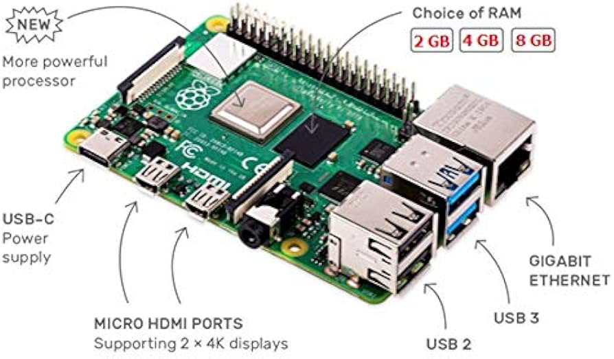

# Raspberry Pi 4 Guide for Running Zebra

Running the Zebra node software on a Raspberry Pi 4 allows you to participate in the Zcash network as an independent, consensus-compatible node. This guide will walk you through the steps to set up and run Zebra on your Raspberry Pi 4.

## Prerequisites

1. Raspberry Pi 4 (2GB RAM or higher recommended).

2. MicroSD card (16GB or higher recommended) with Raspberry Pi OS (Raspbian) installed.

3. Stable internet connection.

4. Keyboard, mouse, and a monitor (for initial setup).

5. SSH client (optional, for remote access).

## Installation

1. __Update Your System__
   Open a terminal or SSH into your Raspberry Pi and ensure your system is up to date by running:

   __sudo apt update__

   __sudo apt upgrade__

2. __Install Dependencies__
   You'll need to install some necessary dependencies for building and running Zebra:

   __sudo apt install build-essential cmake git clang libssl-dev pkg-config__

3. __Clone the Zebra Repository__
   Open a terminal and clone the Zebra repository to your Raspberry Pi:

   __git clone https://github.com/ZcashFoundation/zebra.git__

   __cd zebra__

4. __Build Zebra__
   To build Zebra, use the following commands:

   __cargo build --release__

   This process may take some time. Ensure that your Raspberry Pi is adequately cooled, as compiling can generate heat.

5. __Configuration__
   Create a configuration file for Zebra. You can use the default configuration as a starting point:

   __cp zcash.conf.example zcash.conf__

   Edit the zcash.conf file to customize your node's settings. You can specify the network, enable mining, set up peer connections, and more.

6. __Start Zebra__
   You can now start Zebra with your custom configuration:

   __./target/release/zebrad -c zcash.conf__

   __git comment__ 

   This command will start the Zebra node, and it will begin syncing with the Zcash blockchain.

7. __Monitoring__
   You can monitor the progress and status of your Zebra node by opening a web browser and navigating to __http://127.0.0.1:8233/status__.

## Troubleshooting

If you encounter any issues with building or running Zebra, check the [Zebra documentation](https://doc.zebra.zfnd.org/docs/intro.html) for troubleshooting tips and additional information.

Make sure to keep your Raspberry Pi cool, as running a node can generate heat. You might want to use a cooling solution, such as a fan or a heat sink.

## Conclusion

By following this guide, you should have successfully set up and run Zebra on your Raspberry Pi 4. You're now contributing to the Zcash network as an independent node, helping to secure the privacy of Zcash transactions.
