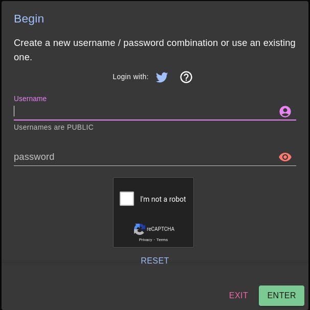
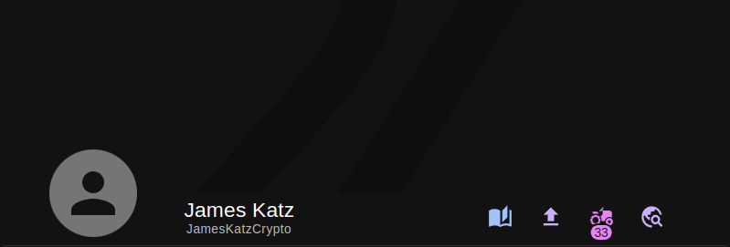
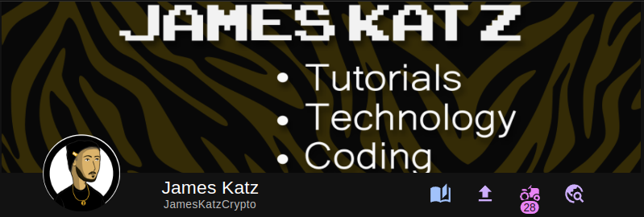
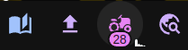
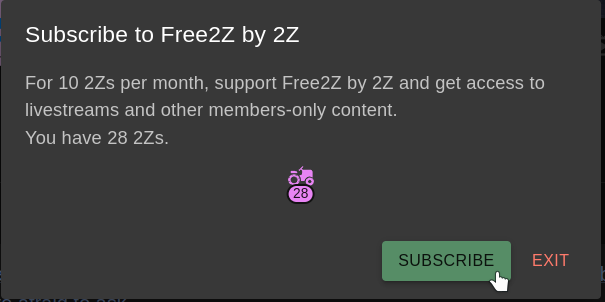
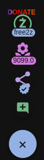
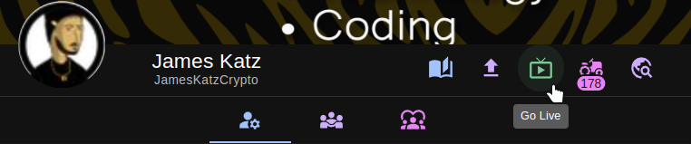
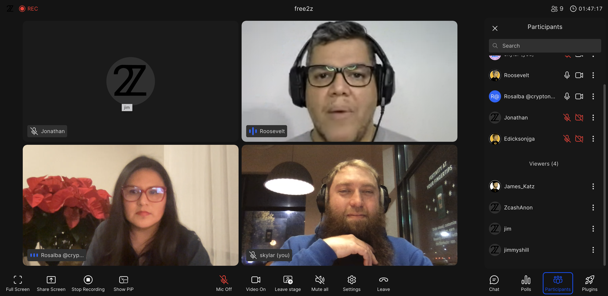

# Tutorial Free2z: Como criar uma conta e fazer Livestreams
## Introdução
Free2z é uma plataforma onde criadores e apoiadores se conectam para alcançar objetivos em comum. A Free2z fornece ferramentas para os criadores demonstrarem seus talentos e angariarem fundos para seus projetos, tudo de forma privada. Na Free2z, os apoiadores podem encontrar criadores e projetos nos quais eles acreditam.

## Crie sua conta
Atualmente existem duas formas de criar uma conta no Free2z:

Escolha um nome de usuário e senha.
Conecte sua conta do Twitter.
Para criar sua conta, visite https://free2z.cash/ e clique no botão "CREATE".

O formulário de login/criação de conta irá aparecer no seu navegador. Escolha seu nome de usuário e uma senha, esses serão seus dados de login.
Resolva o Captcha e clique no botão "Enter" para finalizar a criação da sua conta.

Outra maneira de criar sua conta é conectando-a à sua conta do Twitter. Basta clicar no logo do Twitter ao lado do texto "Login with". Você será solicitado a conectar sua conta.

Clique em "Authorize app" para conectar sua conta ao Free2z.

## Personalize seu perfil
Após ter criado sua conta, você será redirecionado para a sua página de perfil.
Se você criou sua conta conectando-a ao seu Twitter, algumas informações já estarão preenchidas. Caso contrário, você precisará preencher alguns dados. Se preferir, use um pseudônimo em vez do seu nome real.

O perfil está bem básico no momento, então vamos personalizá-lo, configurando um avatar e um banner. A interface da Free2z é intuitiva e esse processo é bem simples: basta utilizar a ferramenta de upload de imagem.

Você pode ver o resultado no topo da página.

Ah, bem melhor! Se você possuir algum talento artístico, você pode deixar seu perfil bem bonito!

Escreva uma breve descrição sobre a sua página. Você pode escrever sobre si mesmo ou descrever qual tipo de conteúdo as pessoas podem esperar de você. Dica: utilize a sintaxe Markdown para personalizar esse campo!

Não se esqueça de fornecer o seu endereço Zcash blindado, assim os apoiadores poderão enviar doações para você!

O último passo é configurar um "Valor de Membro". Esse é o valor que outros usuários deverão pagar para se inscrever na sua página. Esse valor é denominado em 2Zs (Tuzies). Aprenda mais sobre 2Zs mais adiante.

Por fim, clique no botão "Update Profile" para finalizar a configuração da sua página!

## Inscrições e 2Zs
O Free2z permite que os usuários sigam seus criadores preferidos através de inscrições. As inscrições são feitas utilizando 2Zs.

2Zs ou Tuzies são moedas virtuais que existem somente dentro da plataforma Free2z, elas são utilizadas de diversas formas:

1. Seguir criadores (inscrição)
2. Aumentar a visibilidade das postagens dos criadores (Boost)
3. Fazer doações aos criadores

Você pode ver seu saldo de 2Zs no cabeçalho do seu perfil.

Você pode comprar 2Zs utilizando Zcash, basta clicar no seu ícone do seu saldo. O valor mínimo para compra é de 0.05 ZEC e a conversão atual é de 0.05 ZEC por 10 2Zs.

## Doações e inscrições
Quando você encontrar um criador que te agrade, você pode demonstrar sua apreciação enviando doações ou se inscrevendo em sua página. As doações vão direto para a carteira do criador!

Como um exemplo, vamos nos inscrever na [página da pŕopria Free2z](https://free2z.cash/free2z)

Para se inscrever em uma página, basta clicar no ícone de inscrição no cabeçalho da pagina.

Você verá o valor mínimo para inscrição. Verifique se você tem 2Zs suficientes e clique em "Subscribe".

### Doe 2Zs ou Zcash.
Você pode doar diretamente pelo perfil do criador, clicando no botão "Fund Creator".

Ou então dentro de uma publicação. Procure pelo botão com o sinal de "mais". Aqui você pode doar para o criador, ou promover a publicação dentro da plataforma.

## Free2z Live
A plataforma Free2z nos fornece uma ferramenta incrível chamada Free2z Live. Com essa ferramenta, os criadores podem iniciar uma live stream para os membros incritos em sua página. 
Algumas característica principais da Free2z Live: 
- Audio e vídeo
- Compartilhamento de tela
- Edição colaborativa de código
- Chat
- Quadro branco
- E muito mais!

### O que pode ser feito com a Free2z Live
A Free2z Live é uma ferramenta poderosa, permitindo que criadores transmitam qualquer tipo de conteúdo. Alguns exemplos de conteúdo que você pode transmitir com a Free2z Live são:
- Tutoriais e demonstrações
- Apresentações e eventos
- Projetos colaborativos
- Jornalismo ao vivo
- Sua criatividade é o limite!

### Como iniciar uma Live stream
É muito simples iniciar uma live stream com a Free2z Live. Mas existem alguns requisitos que você precisa ficar atento:

1. O criador **deve** ter configurado o Vaor de membro de no mínimo 10 2Sz.
2. O criador **deve** ter um saldo de pelo menos 150 2Zs.
Se o criador preencher **ambos** requisitos, um ícone chamado "Go Live" aparecerá em sua página de perfil.

Para iniciar uma live stream, clique no ícone "Go Live". Em seguida, o seu navegador irá pedir permissão para acessar o seu microfone e webcam (caso você tenha uma). Após conceder as permissões, a Free2z irá solicitar que você insira um apelido para usar durante a live. Escolha um apelido e clique no botão "Join" para iniciar a transmissão ao vivo.

Prontinho! Quando a live stream iniciar, sua página de perfil irá mostrar um ícone indicando que você está ao vivo, para que seus inscritos possam se juntar e participar.

Os usuários que entrarem na sua live stream poderão conversar no chat, pedir para subir no palco, interagir votando em enquetes e muito mais.

_(Exemplo de uma Live Stream)_

A Free2z Live é uma ferramenta versátil e poderosa. Na próxima seção deste tutorial, darei uma introdução às principais funcionalidades e ferramentas.

### Explorando a Free2z Live
Não entrarei em muitos detalhes de cada ferramenta, pois este tutorial tem o intuito de ser uma introdução às principais ferramentas que a Free2z Live nos oferece.

No canto inferior esquerdo da tela, podemos ver alguns botões.

Uma funcionalidade bem legal aqui, é a habilidade de você compartilhar sua tela, assim os outros usuários podem ver o que você está fazendo.

Bem em baixo, podemos ver as opções da live stream.

As opções mais importantes aqui são:
- Mutar / desmutar o microfone
- Habilitar / desabilitar a webcam
- Deixar o palco
- Mutar todos participantes
- Sair da Live Stream - para finalizar uma live steram para todos os participantes, clique no botão "Leave" e depois em "End meeting for all"

Os botões no canto inferior direito contém funcionalidades relacionadas a interção com a live stream, tais como:

- Chat: Os participantes podem conversar aqui durante a transmissão.
- Enquetes: O host pode criar uma enquete, e os paricipantes podem votar aqui.
- Lista de participantes: Mostra a lista dos usuários participando da live scteram.
- Plugins: O host pode usar plugins para melhorar a experiência durante a live stream.

A Free2z Live já é uma ferramente excelente, porém com o uso de plugins a experiência tanto do host quanto dos usuários pode ser ainda melhor!

Esse tutorial não tem o propósito de explicar cada plugin em datalhes, porém eu aconselho você testar todos eles, pois cada um adiciona uma camada de interatividade na sua live stream. Para habilitar um plugin, basta clicar no botão com a imagem de um foguete.

## Conclusão
Vimos que a Free2z é uma plataforma vestátil e poderosa para criadores publicarem seus conteúdos, compartilharem conhecimento, arrecadar fundos para seus projetos e interagir com sua audiência através do Free2z Live.

----

### Referências
[Free2z](https://free2z.cash/)

[Free2z documentation](https://free2z.cash/docs/)

[2Z Overview](https://free2z.cash/docs/2Zs/)

[Creating a profile](https://free2z.cash/docs/creators/creating-a-profile)

[What is Free2z Live?](https://free2z.cash/docs/creators/free2z-live)

[Free2z for Supporters](https://free2z.cash/docs/category/for-supporters)

---
_Written by James Katz for Zechub._