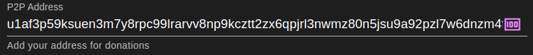
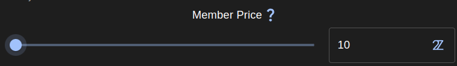
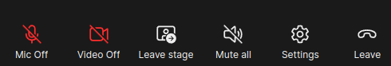
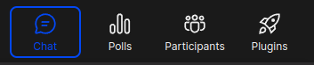

# Free2z: Configuración de la cuenta + tutorial Livestrem
## Introducción
Free2Z es una plataforma para que creadores y colaboradores se conecten y alcancen sus objetivos. Además, proporciona herramientas para que los creadores muestren su talento y recauden fondos para sus proyectos sin comprometer su privacidad. Los colaboradores pueden encontrar y apoyar causas en las que creen.

## Crea tu cuenta
Actualmente, hay dos maneras de crear tu cuenta en Free2Z:
1. Elije un nombre de usuario y una contraseña.
2. Conecta tu cuenta de Twitter.

Para crear una cuenta o iniciar sesión, visita https://free2z.cash/ y haz clic en el botón "CREAR".

Aparecerá el formulario de inicio de sesión/registro en tu navegador. Elije tu nombre de usuario y una contraseña segura: estos serán tus datos de acceso. Resuelve el captcha y haz clic en el botón "Entrar" para crear tu cuenta.

También puedes crear una cuenta Free2Z conectando tu cuenta de Twitter. Para ello, haz clic en el logotipo de Twitter junto a "Iniciar sesión con", y se te pedirá que conectes tu cuenta de Twitter."

Haz clic en "Autorizar aplicación" para conectar tu cuenta de Twitter a Free2z.

## Personaliza tu perfil
Una vez creada tu cuenta, serás redirigido a tu página de perfil de Free2Z. Si creaste tu cuenta conectando tu Twitter, la mayoría de los campos se rellenarán automáticamente. Si creaste tu cuenta introduciendo un nombre de usuario y una contraseña, deberás introducir tus datos aquí. Puedes utilizar un seudónimo en lugar de tu nombre real.

Ahora mismo es bastante aburrido, así que vamos a hacerlo más interesante configurando un avatar y un banner. La interfaz de Free2Z hace este paso muy fácil usando el botón de subir (la flecha hacia arriba a la derecha).

Puedes ver el resultado en la parte superior de la página.

Ah, ¡mucho mejor! Si tienes dotes artísticas, ¡puedes hacer que tu página de perfil de Free2Z tenga un aspecto increíble!

Escribe una buena descripción para tu página. Puedes hablar de ti mismo o describir el tipo de contenido que los demás pueden esperar de ti. (Consejo: utiliza la sintaxis markdown para personalizar tu descripción).

No olvides indicar tu dirección blindada de Zcash para que tus seguidores puedan donarte directamente.

El último paso para completar la configuración de tu página es establecer un 'Precio para Miembros'. Este es el precio en 2Zs (Tuzies) que otros usuarios pagarán para suscribirse a tu página. (Más sobre 2Zs más adelante).

Por último, haz clic en el botón "Actualizar perfil" para finalizar la configuración de tu perfil.

## Suscripciones y 2sz
Free2Z permite a los usuarios suscribirse a sus creadores favoritos y obtener acceso a funciones exclusivas y contenidos sólo para miembros. El creador debe configurar una cantidad mínima de 2Zs para una suscripción.
Los 2Zs o Tuzies son créditos digitales in-app que se utilizan en Free2Z para muchos propósitos, incluyendo:
1. Suscribirse a los creadores
2. Potenciar la visibilidad de una página de Free2Z
3. Hacer donaciones a los creadores

Puedes ver tus créditos 2Zs en la cabecera de tu página de perfil.

Puedes comprar más 2Zs con Zcash haciendo clic en tu saldo de 2Zs. La cantidad mínima para comprar es de 0,05 ZEC, y la tasa de conversión actual es de 0,05 ZEC = 10 2Zs.

## Donar y suscribirse
Cuando encuentres un creador que te guste, puedes mostrarle tu agradecimiento donando y suscribiéndote a él. Todas las donaciones van directamente a la cartera del creador.

A modo de ejemplo, suscribámonos a [Free2Z's own page](https://free2z.cash/free2z).

Para suscribirse a una página, basta con hacer clic en el icono de suscripción de la cabecera de la página.

Verás la cantidad mínima para suscribirte. Comprueba si tienes suficientes 2Z y haz clic en "Suscribirse".

### Dona usando 2zs o Zcash.
Puedes donar directamente en su página, haciendo clic en el icono "Fund creator". 

O, desde dentro de una entrada, busca el botón flotante "más". Desde aquí, puedes donar al creador o promocionar el post en Free2Z.

## Free2z Live
La plataforma Free2z ofrece una función impresionante llamada Free2z Live. Con esta herramienta, los creadores pueden iniciar transmisiones en directo para los suscriptores. Algunas características clave de Free2z Live incluyen:
- Audio y vídeo
- Pantalla compartida
- Edición colaborativa de código
- Chat
- Pizarra blanca
- Y mucho más.

## ¿Qué puedes hacer con Free2z Live?
Free2z Live es una potente herramienta que permite a los creadores retransmitir cualquier tipo de contenido. Estos son algunos ejemplos del tipo de contenido que puedes transmitir con Free2z Live:
- Tutoriales y demostraciones
- Actuaciones y eventos
- Proyectos colaborativos
- Reportajes y periodismo en directo
- ¡Tu creatividad es el límite!

### ¿Cómo transmitir en directo?
Es muy fácil iniciar una transmisión en directo con Free2z Live. Pero hay algunos requisitos antes de que puedas empezar tu stream:
1. El creador **debe** tener un 'precio para miembros' mínimo de 10 2zs.
2. 2. El creador **debe** tener un saldo de al menos 150 2zs en su cuenta.
Si el creador cumple **ambas** de las condiciones anteriores, tendrá a su disposición un icono llamado 'Go Live' en su página de perfil.

Para iniciar una transmisión en directo, sólo tienes que hacer clic en el botón "En directo", y la aplicación Free2z te pedirá permiso para utilizar tu micrófono y tu cámara web (si tienes). Después de conceder los permisos necesarios, Free2z te pedirá que introduzcas un apodo que quieras utilizar durante la transmisión. Una vez que hayas seleccionado un apodo, haz clic en "Unirse" para comenzar a transmitir.

¡Y listo! Cuando inicies una retransmisión en directo, tu perfil mostrará un icono indicando que estás en directo, para que tus suscriptores puedan unirse a la retransmisión en directo.

Cuando la gente entra en la retransmisión en directo, puede chatear, pedir entrar en el escenario, interactuar votando en las encuestas, etc.

_(Ejemplo de una sesión en Free2z Live)_

Free2z Live es versátil y potente. En la siguiente sección, ofreceré una visión general de sus funcionalidades y herramientas.

### Explorando Free2z Live
Este wiki-doc no pretende ser una guía en profundidad de Free2z o Free2z Live. Pero aquí hay una visión general de sus herramientas.

En la parte inferior izquierda de la pantalla, vemos unos cuantos botones.

Una buena función aquí es la posibilidad de compartir tu pantalla para que otros usuarios puedan ver lo que estás haciendo.

En la parte inferior podemos encontrar las opciones de para transmitir en directo.

Algunas de las opciones clave aquí son:
- Silenciar / activar el micrófono
- Activar / desactivar la webcam
- Abandonar el escenario
- Silenciar a todos los oradores
- Abandonar - Para finalizar una retransmisión en directo, debes hacer clic en el botón "Abandonar" y, a continuación, en "Finalizar reunión para todos" para detener la reunión para todos los participantes.

Los botones de la parte inferior derecha contienen funciones relacionadas con la interacción de la retransmisión en directo, como:
- Chat: Permite a los participantes chatear entre ellos y con el presentador durante la emisión en directo.
- Encuestas: Permite al presentador crear encuestas y recabar opiniones de los participantes.
- Lista de participantes: Muestra la lista de participantes en la retransmisión en directo.
- Complementos: Permite al anfitrión añadir plugins y extensiones para mejorar la experiencia de la retransmisión en directo.

Free2z Live ya es una herramienta impresionante de por sí, pero los plugins llevan la transmisión en directo a otro nivel.

No es el propósito de este wiki-doc explicar todos los plugins, pero te animo a que pruebes cada uno de ellos, ya que todos ofrecen un gran valor de interacción entre creadores y espectadores. Para lanzar un plugin, basta con hacer clic en el botón "cohete" de la derecha.

## Conclusión
En conclusión, Free2z es una plataforma versátil para que los creadores muestren sus habilidades, compartan conocimientos y recauden fondos para sus proyectos, y se relacionen con sus seguidores a través de la potente herramienta de Free2z Live.

### Recursos

[Free2z](https://free2z.cash/)

[Free2z documentation](https://free2z.cash/docs/)

[2Z Overview](https://free2z.cash/docs/2Zs/)

[Creating a profile](https://free2z.cash/docs/creators/creating-a-profile)

[What is Free2z Live?](https://free2z.cash/docs/creators/free2z-live)

[Free2z for Supporters](https://free2z.cash/docs/category/for-supporters)

---
_Redactado por James Katz de Zechub._

