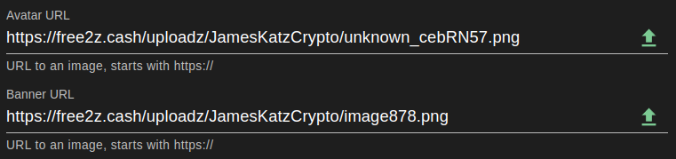

# Free2z : configuration du compte + tutoriel Livestrem
## Introduction
Free2Z est une plateforme permettant aux créateurs et aux supporters de se connecter et d'atteindre leurs objectifs. Free2Z fournit des outils permettant aux créateurs de mettre en valeur leurs talents et de collecter des fonds pour leurs projets sans compromettre la confidentialité. Les sympathisants peuvent trouver et soutenir des causes auxquelles ils croient.

## Créez votre compte
Actuellement, il existe deux manières de créer votre compte sur Free2Z :
1. Choisissez un nom d'utilisateur et un mot de passe.
2. Connectez votre compte Twitter.

Pour créer un compte ou vous connecter, visitez https://free2z.cash/ et cliquez sur le bouton "CRÉER".

Le formulaire de connexion/inscription apparaîtra dans votre navigateur. Choisissez votre nom d'utilisateur et un mot de passe fort - ce seront vos informations de connexion. Résolvez le captcha et cliquez sur le bouton "Entrer" pour créer votre compte.

Alternativement, vous pouvez créer un compte Free2Z en connectant votre compte Twitter. Pour ce faire, cliquez sur le logo Twitter à côté de "Connexion avec", et il vous sera demandé de connecter votre compte Twitter."

Cliquez sur "Autoriser l'application" pour connecter votre compte Twitter à free2z.

## Personnalisez votre profil
Une fois votre compte créé, vous serez redirigé vers votre page de profil Free2Z. Si vous avez créé votre compte en connectant votre Twitter, la plupart des champs seront remplis automatiquement. Si vous avez créé un compte en saisissant un nom d'utilisateur et un mot de passe, vous devez saisir vos informations ici. Vous pouvez utiliser un pseudonyme au lieu de votre vrai nom.

C'est assez ennuyeux en ce moment, alors rendons-le plus intéressant en configurant un avatar et une bannière. L'interface Free2Z rend cette étape très facile en utilisant le bouton de téléchargement (la flèche vers le haut à droite).

Vous pouvez voir le résultat en haut de la page.

Ah, bien mieux ! Si vous avez des compétences artistiques, vous pouvez rendre votre page de profil Free2Z incroyable !

Rédigez une belle description pour votre page. Vous pouvez parler de vous ou décrire le type de contenu que les autres peuvent attendre de vous. (Astuce : utilisez la syntaxe Markdown pour personnaliser votre description !)

N'oubliez pas de fournir votre adresse protégée Zcash, afin que les supporters puissent vous faire un don directement !

La dernière étape pour terminer la configuration de votre page consiste à définir un "prix membre". C'est le prix en 2Zs (Tuzies) que les autres utilisateurs paieront pour s'abonner à votre page ! (Plus d'informations sur 2Z plus tard).

Enfin, cliquez sur le bouton "Mettre à jour le profil" pour finaliser la configuration de votre profil !

## Abonnements et 2sz
Free2Z permet aux utilisateurs de s'abonner à leurs créateurs préférés et d'accéder à des fonctionnalités exclusives et à du contenu réservé aux membres. Le créateur doit configurer un montant minimum de 2Z pour un abonnement.
Les 2Z ou Tuzies sont des crédits numériques intégrés à l'application utilisés dans Free2Z à de nombreuses fins, notamment :
1. S'abonner aux créateurs
2. Booster la visibilité d'une page Free2Z
3. Faire des dons aux créateurs

Vous pouvez voir vos crédits 2Zs dans l'en-tête de votre page de profil.

Vous pouvez acheter plus de 2Z avec Zcash en cliquant sur votre solde de 2Z. Le montant minimum pour acheter est de 0,05 ZEC et le taux de conversion actuel est de 0,05 ZEC = 10 2Zs.

## Faire un don et s'abonner
Une fois que vous avez trouvé un créateur que vous aimez, vous pouvez montrer votre appréciation en faisant un don et en vous abonnant. Tous les dons vont directement dans le porte-monnaie du créateur.

A titre d'exemple, abonnez-vous à [la propre page de Free2Z](https://free2z.cash/free2z).

Pour vous abonner à une page, il vous suffit de cliquer sur l'icône d'abonnement dans l'en-tête de la page.

Vous verrez le montant minimum pour souscrire. Vérifiez si vous avez suffisamment de 2Z et cliquez sur "S'abonner".

### Faites un don en utilisant 2zs ou Zcash.
Vous pouvez faire un don directement sur leur page, en cliquant sur l'icône « Créateur de fonds ».

Ou, depuis l'intérieur d'un message, recherchez le bouton flottant "plus". À partir de là, vous pouvez faire un don au créateur ou promouvoir la publication sur Free2Z.

## Free2z en direct
La plate-forme Free2z offre une fonctionnalité impressionnante appelée Free2z Live. Avec cet outil, les créateurs peuvent lancer des diffusions en direct pour les membres abonnés. Certaines fonctionnalités clés de Free2z Live incluent :
- Audio et vidéo
- Partage d'écran
- Édition collaborative de code
- Discuter
- Tableau blanc
- Et beaucoup plus!

### Que pouvez-vous faire avec Free2z Live
Free2z Live est un outil puissant, permettant aux créateurs de diffuser tout type de contenu. Voici quelques exemples du type de contenu que vous pouvez diffuser avec Free2z Live :
- Tutoriels et démonstrations
- Spectacles et événements
- Projets collaboratifs
- Reportage en direct et journalisme
- Votre créativité est la limite !

### Comment passer en direct
C'est très facile de démarrer une diffusion en direct avec Free2z Live. Mais il y a quelques exigences avant de pouvoir commencer votre stream.
1. Le créateur **doit** avoir un "prix membre" minimum de 10 2zs.
2. Le créateur **doit** avoir un solde d'au moins 150 2zs sur son compte.
Si le créateur remplit **les deux** conditions ci-dessus, une icône nommée "Go Live" sera disponible sur sa page de profil.

Pour démarrer une diffusion en direct, cliquez simplement sur le bouton "Go Live", et l'application Free2z vous demandera la permission d'utiliser votre microphone et votre webcam (si vous en avez une). Après avoir accordé les autorisations nécessaires, Free2z vous demandera d'entrer un surnom que vous souhaitez utiliser pendant la diffusion en direct. Une fois que vous avez sélectionné un surnom, cliquez sur "Rejoindre" pour démarrer votre diffusion en direct.

Et.. Voila! Lorsque vous démarrez une diffusion en direct, votre profil affiche une icône indiquant que vous êtes en direct, afin que vos abonnés puissent rejoindre la diffusion en direct.

Lorsque les gens rejoignent le flux en direct, ils peuvent discuter, demander à rejoindre la scène, interagir en votant dans des sondages, et plus encore.

_(Exemple de session Free2z Live)_

Free2z Live est polyvalent et puissant. Dans la section suivante, je donnerai un aperçu de ses fonctionnalités et de ses outils.

### Explorer Free2z en direct
Ce wiki-doc n'est pas destiné à être un guide détaillé de Free2z ou Free2z Live. Mais voici un aperçu général de ses outils.

En bas à gauche de l'écran, on voit quelques boutons.

Une fonction intéressante ici est la possibilité de partager votre écran afin que d'autres utilisateurs puissent voir ce que vous faites.

En bas, nous pouvons trouver les options de diffusion en direct.

Certaines des options clés ici sont:
- Couper/réactiver le microphone
- Activer / désactiver la webcam
- Quitter la scène
- Couper tous les haut-parleurs
- Quitter - Pour mettre fin à une diffusion en direct, vous devez cliquer sur le bouton « Quitter », puis sur « Finir la réunion pour tous » pour arrêter la réunion pour tous les participants.

Les boutons en bas à droite contiennent des fonctions liées à l'interaction du flux en direct, telles que :
- Chat : cela permet aux participants de discuter entre eux et avec l'hôte pendant le flux en direct.
- Sondages : cela permet à l'hôte de créer des sondages et de recueillir les commentaires des participants.
- Liste des participants : affiche la liste des participants au flux en direct.
- Plugins : cela permet à l'hôte d'ajouter des plugins et des extensions pour améliorer l'expérience de diffusion en direct.

Free2z Live est déjà un outil génial en soi, mais les plugins amènent le flux en direct à un tout autre niveau.

Ce n'est pas le but de ce wiki-doc d'expliquer tous les plugins, mais je vous encourage vraiment à essayer chacun, car ils offrent tous une grande valeur d'interaction entre les créateurs et les spectateurs. Pour lancer un plugin, cliquez simplement sur le bouton "fusée" à droite.

## Conclusion
En conclusion, Free2z est une plate-forme polyvalente permettant aux créateurs de mettre en valeur leurs capacités, de partager leurs connaissances et de collecter des fonds pour leurs projets, et de dialoguer avec leurs supporters grâce au puissant outil de Free2z Live.

----

### Ressources
[Free2z](https://free2z.cash/)

[Documentation Free2z](https://free2z.cash/docs/)

[Aperçu 2Z](https://free2z.cash/docs/2Zs/)

[Créer un profil](https://free2z.cash/docs/creators/creating-a-profile)

[Qu'est-ce que Free2z Live ?](https://free2z.cash/docs/creators/free2z-live)

[Free2z pour les supporters](https://free2z.cash/docs/category/for-supporters)

---
_Écrit par James Katz pour Zechub._

