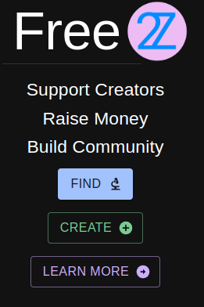
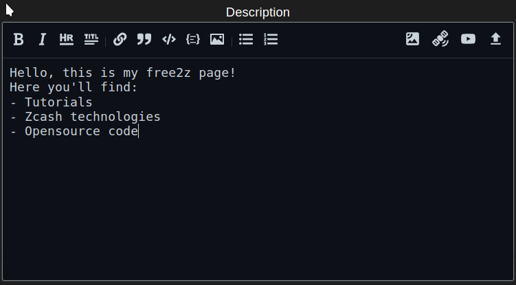
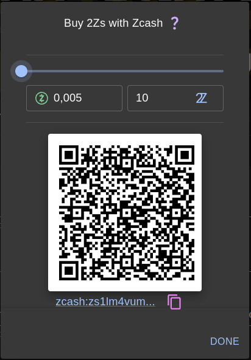
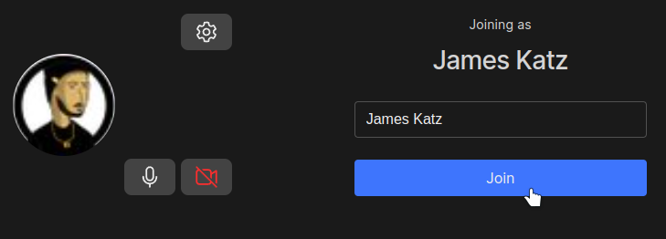
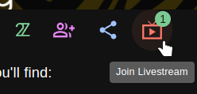
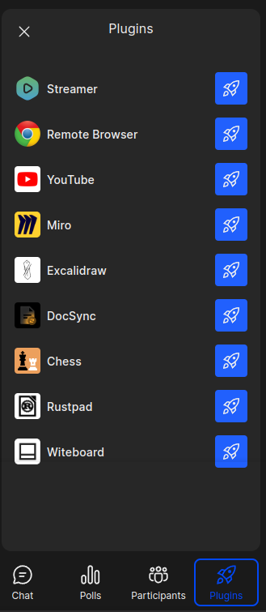

# Free2z: Configurazione dell'account + Tutorial Livestream
## Introduzione
Free2Z è una piattaforma per creatori e sostenitori per connettersi e raggiungere i loro obiettivi. Free2Z fornisce strumenti ai creatori per mostrare i loro talenti e raccogliere fondi per i loro progetti senza compromettere la privacy. I sostenitori possono trovare e sostenere le cause in cui credono.

## Crea il tuo account
Attualmente, ci sono due modi per creare il tuo account su Free2Z:
1. Scegli un nome utente e una password.
2. Connetti il tuo account Twitter.

Per creare un account o accedere, visita https://free2z.cash/ e clicca sul pulsante 'CREA'.

Il modulo di accesso/registrazione apparirà nel tuo browser. Scegli il tuo nome utente e una password sicura: queste saranno le tue informazioni di accesso. Risolvi il captcha e clicca il pulsante 'Entra' per creare il tuo account.

In alternativa, è possibile creare un account Free2Z connettendo il proprio account Twitter. Per farlo, clicca sul logo di Twitter accanto a 'Accedi con' e ti verrà chiesto di connettere il tuo account Twitter.

Clicca su 'Autorizza app' per connettere il tuo account Twitter a Free2Z.

## Personalizza il tuo profilo
Dopo aver creato il tuo account, verrai reindirizzato alla tua pagina del profilo Free2Z. Se hai creato il tuo account collegando il tuo account Twitter, la maggior parte dei campi verranno automaticamente compilati. Se hai creato un account inserendo un nome utente e una password, dovresti inserire qui le tue informazioni. Puoi utilizzare uno pseudonimo al posto del tuo vero nome.

Attualmente è abbastanza noioso, quindi rendiamolo più interessante impostando un avatar e un banner. L'interfaccia di Free2Z semplifica molto questo passaggio utilizzando il pulsante di caricamento (la freccia verso l'alto sulla destra).

Potrai vedere il risultato nella parte superiore della pagina.

Ah, molto meglio! Se hai qualche abilità artistica, puoi rendere la tua pagina del profilo Free2Z incredibile!

Scrivi una bella descrizione per la tua pagina. Puoi parlare di te stesso o descrivere il tipo di contenuto che gli altri possono aspettarsi da te. (Suggerimento: usa la sintassi markdown per personalizzare la tua descrizione!)

Non dimenticare di fornire il tuo indirizzo schermato di Zcash, in modo che i sostenitori possano donare direttamente a te!

L'ultimo passaggio per completare la configurazione della tua pagina è quello di impostare un "Prezzo per membri". Questo è il prezzo in 2Zs (Tuzies) che gli altri utenti pagheranno per abbonarsi alla tua pagina! (Più avanti parleremo di 2Zs).

Infine, clicca il pulsante 'Aggiorna profilo' per finalizzare la configurazione del tuo profilo!

## Abbonamenti e 2sz
Free2Z consente agli utenti di abbonarsi ai propri creatori preferiti e accedere a funzionalità esclusive e contenuti riservati ai membri. Il creatore dovrebbe configurare un importo minimo di 2Zs per un abbonamento.
2Zs o Tuzies sono crediti digitali in-app utilizzati in Free2Z per molti scopi, tra cui:
1. Abbonarsi ai creatori
2. Aumentare la visibilità di una pagina Free2Z
3. Fare donazioni ai creator

Puoi vedere i tuoi crediti 2Zs nell'intestazione della tua pagina del profilo.

Puoi acquistare altri 2Zs con Zcash cliccando sul tuo saldo 2Zs. L'importo minimo per l'acquisto è di 0,05 ZEC, e il tasso di conversione attuale è di 0,05 ZEC = 10 2Zs.

## Donazioni e abbonamenti
Una volta trovato un creatore che ti piace, puoi dimostrare la tua apprezzamento donando e abbonandoti a lui/lei. Tutte le donazioni vanno direttamente al portafoglio del creatore.

Come esempio, abboniamoci alla [pagina di Free2Z's](https://free2z.cash/free2z) stessa.

Per abbonarti a una pagina, tutto ciò che devi fare è cliccare sull'icona di abbonamento nell'intestazione della pagina.

Vedrai il prezzo minimo per l'abbonamento. Verifica se hai abbastanza 2Zs e clicca su "sottoscrivi".

### Dona utilizzando 2zs o Zcash.
Puoi effettuare una donazione direttamente sulla loro pagina, cliccando sull'icona "Finanzia il creatore".

Oppure, all'interno di un post, cerca il pulsante 'di più'. Da qui, puoi donare al creatore o promuovere il post su Free2Z.

## Free2z Live
La piattaforma Free2z offre un'ottima funzione chiamata Free2z Live. Con questo strumento, i creatori possono avviare trasmissioni in diretta per i membri abbonati. Alcune delle principali caratteristiche di Free2z Live includono:
- Audio e video
- Condivisione schermo
- Modifica condivisa del codice
- Chat
- Whiteboarding
- E molto altro!

### Cosa puoi fare con Free2z Live?
Free2z Live è uno strumento potente che consente ai creatori di trasmettere qualsiasi tipo di contenuto. Ecco alcuni esempi di contenuti che è possibile trasmettere con Free2z Live:
- Tutorial e dimostrazioni
- Spettacoli ed eventi
- Progetti collaborativi
- Reportage in diretta e giornalismo
- Solo la tua creatività è il limite!

### Come iniziare una trasmissione in diretta
È molto facile avviare una trasmissione in diretta con Free2z Live. Tuttavia, ci sono alcune requisiti da soddisfare prima di poter avviare la tua trasmissione.
1. Il creatore **deve** avere un prezzo minimo di 'membro' di 10 2zs.
2. Il creatore **deve** avere un saldo di almeno 150 2zs sul loro account.
Se il creatore soddisfa **entrambe** le condizioni sopra, un'icona chiamata 'Go Live' sarà disponibile per loro sulla loro pagina del profilo.

Per avviare una trasmissione in diretta, basta cliccare sul pulsante 'Go Live', e l'app di Free2z chiederà il permesso di utilizzare il microfono e la webcam (se disponibili). Dopo aver concesso i permessi necessari, Free2z ti chiederà di inserire un nickname che vuoi usare durante la trasmissione in diretta. Una volta selezionato un nickname, clicca su 'Join' per avviare la tua trasmissione in diretta.

E fatto! Quando avvii uno streaming in diretta, il tuo profilo mostrerà un'icona che indica che sei in diretta, così i tuoi iscritti possono unirsi alla diretta.

Quando le persone si uniscono alla diretta, possono chattare, chiedere di unirsi al palco, interagire votando nei sondaggi e molto altro.

_(Esempio di una sessione Free2z Live)_

Free2z Live è versatile e potente. Nella prossima sezione, fornirò una panoramica delle sue funzionalità e degli strumenti disponibili.

### Esplorazione di Free2z Live
Questo documento wiki non intende essere una guida approfondita a Free2z o Free2z Live. Ma ecco una panoramica generale dei suoi strumenti.

Nella parte inferiore sinistra dello schermo, vediamo alcuni pulsanti.

Una bella funzione qui è la possibilità di condividere lo schermo in modo che gli altri utenti possano vedere quello che stai facendo.

In basso possiamo trovare le opzioni di live stream.

Alcune delle principali opzioni qui sono:
- Attiva / disattiva microfono
- Attiva / disattiva webcam
- Abbandona la diretta
- Silenzia tutti gli speaker
- Abbandona - Per terminare una diretta, devi cliccare sul pulsante "Abbandona" e poi cliccare su "Termina la riunione per tutti" per interrompere la riunione per tutti i partecipanti.

I pulsanti in basso a destra contengono funzioni relative all'interazione durante la diretta, come ad esempio:
- Chat: permette ai partecipanti di chattare tra di loro e con l'host durante la diretta.
- Sondaggi: permette all'host di creare sondaggi e raccogliere feedback dai partecipanti.
- Lista dei partecipanti: mostra l'elenco dei partecipanti alla diretta.
- Plugin: permette all'host di aggiungere plugin ed estensioni per migliorare l'esperienza della diretta.

Free2z Live è già uno strumento fantastico di per sé, ma i plugin portano la diretta ad un altro livello.

Non è lo scopo di questo documento wiki di spiegare tutti i plugin, ma ti incoraggio vivamente a provarli tutti, poiché offrono tutti un grande valore di interazione tra creatori e spettatori. Per avviare un plugin, basta fare clic sul pulsante 'rocket' sulla destra.

## Conclusioni
In conclusione, Free2z è una piattaforma versatile per i creatori che desiderano mostrare le proprie abilità, condividere conoscenze e raccogliere fondi per i loro progetti, e coinvolgere i loro sostenitori attraverso lo strumento potente di Free2z Live.

----

### Risorse
[Free2z](https://free2z.cash/)

[Free2z documentatione](https://free2z.cash/docs/)

[Panoramica su 2Z](https://free2z.cash/docs/2Zs/)

[Creazione di un profilo](https://free2z.cash/docs/creators/creating-a-profile)

[Cos'è Free2z Live?](https://free2z.cash/docs/creators/free2z-live)

[Free2z per i sostenitori](https://free2z.cash/docs/category/for-supporters)

---
_Scritto da James Katz per Zechub._