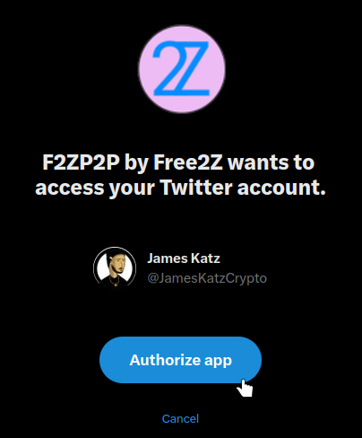

# Free2z: Настройка аккаунта + туториал Livestream
## Введение
Free2Z — это платформа, на которой создатели и сторонники могут общаться и достигать своих целей. Free2Z предоставляет создателям инструменты для демонстрации своих талантов и сбора средств для своих проектов без ущерба для конфиденциальности. Сторонники могут найти и поддержать дела, в которые они верят.

## Создать аккаунт
В настоящее время существует два способа создать учетную запись на Free2Z:
1. Выберите имя пользователя и пароль.
2. Подключите свою учетную запись Twitter.

Чтобы создать учетную запись или войти в систему, посетите https://free2z.cash/ и нажмите кнопку «СОЗДАТЬ».

В вашем браузере появится форма входа/регистрации. Выберите свое имя пользователя и надежный пароль — это будет ваша информация для входа. Решите капчу и нажмите кнопку «Ввод», чтобы создать учетную запись.

Кроме того, вы можете создать учетную запись Free2Z, подключив свою учетную запись Twitter. Для этого нажмите на логотип Twitter рядом с «Войти с помощью», и вам будет предложено подключить свою учетную запись Twitter».

Нажмите «Авторизовать приложение», чтобы подключить свою учетную запись Twitter к free2z.

## Персонализируйте свой профиль
После создания учетной записи вы будете перенаправлены на страницу своего профиля Free2Z. Если вы создали свою учетную запись, подключив свой Twitter, большинство полей будут заполнены автоматически. Если вы создали учетную запись, введя имя пользователя и пароль, вы должны ввести свою информацию здесь. Вы можете использовать псевдоним вместо своего настоящего имени.

Сейчас это довольно скучно, так что давайте сделаем его интереснее, настроив аватарку и баннер. Интерфейс Free2Z упрощает этот шаг с помощью кнопки загрузки (стрелка вверх справа).

Результат вы можете увидеть вверху страницы.

Ах, намного лучше! Если у вас есть художественные навыки, вы можете сделать свою страницу профиля Free2Z потрясающей!

Напишите красивое описание для вашей страницы. Вы можете рассказать о себе или описать тип контента, который другие могут ожидать от вас. (Совет: используйте синтаксис уценки, чтобы персонализировать свое описание!)

Не забудьте указать свой защищенный адрес Zcash, чтобы сторонники могли делать пожертвования непосредственно вам!

Последним шагом для завершения настройки вашей страницы является установка «Цены для участников». Это цена в 2Z (Tuzies), которую другие пользователи будут платить за подписку на вашу страницу! (Подробнее о 2Z позже).

Наконец, нажмите кнопку «Обновить профиль», чтобы завершить настройку профиля!

## Подписки и 2sz
Free2Z позволяет пользователям подписываться на своих любимых создателей и получать доступ к эксклюзивным функциям и контенту только для участников. Создатель должен настроить минимальное количество 2Zs для подписки.
2Z или Tuzies — это цифровые кредиты в приложении, используемые в Free2Z для многих целей, в том числе:
1. Подписка на авторов
2. Повышение видимости страницы Free2Z
3. Делать пожертвования создателям

Вы можете увидеть свои кредиты 2Zs в заголовке страницы своего профиля.

Вы можете купить больше 2Z за Zcash, нажав на свой баланс 2Z. Минимальная сумма для покупки — 0,05 ZEC, а текущий курс конвертации — 0,05 ZEC = 10 2Zs.

## Пожертвование и подписка
Как только вы найдете автора, который вам нравится, вы можете выразить свою признательность, сделав пожертвование и подписавшись на него. Все пожертвования идут прямо на кошелек создателя.

В качестве примера давайте подпишемся на [собственную страницу Free2Z](https://free2z.cash/free2z).

Чтобы подписаться на страницу, все, что вам нужно сделать, это нажать на значок подписки в заголовке страницы.

Вы увидите минимальную сумму для подписки. Проверьте, достаточно ли у вас 2Z, и нажмите «подписаться».

### Пожертвуйте с помощью 2zs или Zcash.
Вы можете сделать пожертвование прямо на их странице, щелкнув значок «Создатель фонда».

Или внутри поста найдите плавающую кнопку «плюс». Отсюда вы можете сделать пожертвование создателю или продвигать публикацию на Free2Z.

## Free2z Live
Платформа Free2z предлагает замечательную функцию под названием Free2z Live. С помощью этого инструмента создатели могут запускать прямые трансляции для подписанных участников. Некоторые ключевые особенности Free2z Live включают в себя:
- Аудио и видео
- Демонстрация экрана
- Совместное редактирование кода
- Чат
- Белая доска
- И многое другое!

### Что вы можете сделать с Free2z Live
Free2z Live — это мощный инструмент, позволяющий создателям транслировать контент любого типа. Вот несколько примеров контента, который вы можете транслировать с помощью Free2z Live:
- Учебники и демонстрации
- Спектакли и мероприятия
- Совместные проекты
- Живые репортажи и журналистика
- Ваш творческий потенциал - это предел!

### Как выйти в эфир
Начать прямую трансляцию с Free2z Live очень просто. Но есть несколько требований, прежде чем вы сможете начать трансляцию.
1. Создатель **должен** иметь минимальную «цену участника» 10 2zs.
2. Создатель **должен** иметь на своем счету не менее 150 2zs.
Если создатель соответствует **обоим** вышеперечисленным условиям, ему будет доступна иконка «Go Live» на странице его профиля.

Чтобы начать прямую трансляцию, просто нажмите кнопку «Начать трансляцию», и приложение Free2z запросит разрешение на использование вашего микрофона и веб-камеры (если она у вас есть). После того, как вы предоставите необходимые разрешения, Free2z попросит вас ввести псевдоним, который вы хотите использовать во время прямой трансляции. После того, как вы выбрали псевдоним, нажмите «Присоединиться», чтобы начать прямую трансляцию.

Готово! Когда вы начинаете прямую трансляцию, в вашем профиле отображается значок, указывающий, что вы в прямом эфире, чтобы ваши подписчики могли присоединиться к прямой трансляции.

Когда люди присоединяются к прямой трансляции, они могут общаться в чате, просить присоединиться к сцене, взаимодействовать, голосуя в опросах и т. д.

_(Пример сеанса Free2z Live)_

Free2z Live универсален и мощен. В следующем разделе я представлю обзор его функций и инструментов.

### Изучение Free2z Live
Этот вики-документ не предназначен для использования в качестве подробного руководства по Free2z или Free2z Live. Но вот общий обзор его инструментов.

В левом нижнем углу экрана мы видим несколько кнопок.

Приятной функцией здесь является возможность поделиться своим экраном, чтобы другие пользователи могли видеть, что вы делаете.

Внизу мы можем найти параметры прямой трансляции.

Вот некоторые из ключевых вариантов:
- Отключение/включение микрофона
- Включить / отключить веб-камеру
- Покиньте сцену
- Отключить все динамики
- Выйти. Чтобы завершить прямую трансляцию, нажмите кнопку «Выйти», а затем нажмите «Завершить собрание для всех», чтобы остановить собрание для всех участников.

Правые нижние кнопки содержат функции, связанные с взаимодействием в прямом эфире, например:
- Чат: это позволяет участникам общаться друг с другом и ведущим во время прямой трансляции.
- Опросы: это позволяет организатору создавать опросы и собирать отзывы от участников.
- Список участников: показывает список участников прямого эфира.
- Плагины: это позволяет хосту добавлять плагины и расширения для улучшения работы в прямом эфире.

Free2z Live сам по себе является отличным инструментом, но плагины выводят прямой эфир на совершенно другой уровень.

Цель этого вики-документа не в том, чтобы объяснять все плагины, но я настоятельно рекомендую вам попробовать каждый из них, поскольку все они обеспечивают большую ценность взаимодействия между создателями и зрителями. Чтобы запустить плагин, просто нажмите кнопку «ракета» справа.

## Заключение
В заключение хочу сказать, что Free2z — это универсальная платформа для авторов, позволяющая демонстрировать свои способности, делиться знаниями и собирать средства для своих проектов, а также взаимодействовать со своими сторонниками с помощью мощного инструмента Free2z Live.

----

### Ресурсы
[Free2z](https://free2z.cash/)

[Документация Free2z](https://free2z.cash/docs/)

[Обзор 2Z](https://free2z.cash/docs/2Zs/)

[Создание профиля](https://free2z.cash/docs/creators/creating-a-profile)

[Что такое Free2z Live?](https://free2z.cash/docs/creators/free2z-live)

[Free2z для сторонников](https://free2z.cash/docs/category/for-supporters)

---
_Написано Джеймсом Кацем для Zechub._

