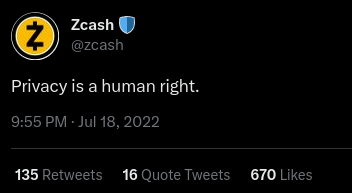
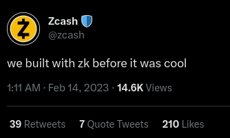

# ZecHub Tweets Style Guide

> ZecHub style is simple and approachable. We welcome everyone and focus on the Zcash community.

This style guide is for tweets or short statements released by ZecHub. There are several types of tweets:

## Evergreen

Use proper sentence format and punctuation in authoritative evergreen tweets. Evergreen tweets are relevant for everyone and lasting over time. Example:

## Shitpost

Use lowercase letters and abbreviation to show expertise in a subject matter for evergreen shitposts. Shitposts are confident and give off a cool vibe. Example:

---

<small>
ZecHub tweets style guide is adapted from <a href="https://twitter.com/zcash">@zcash</a>  tweets style guide with modifications. Consult @zcash when you need inspirations.
</small>